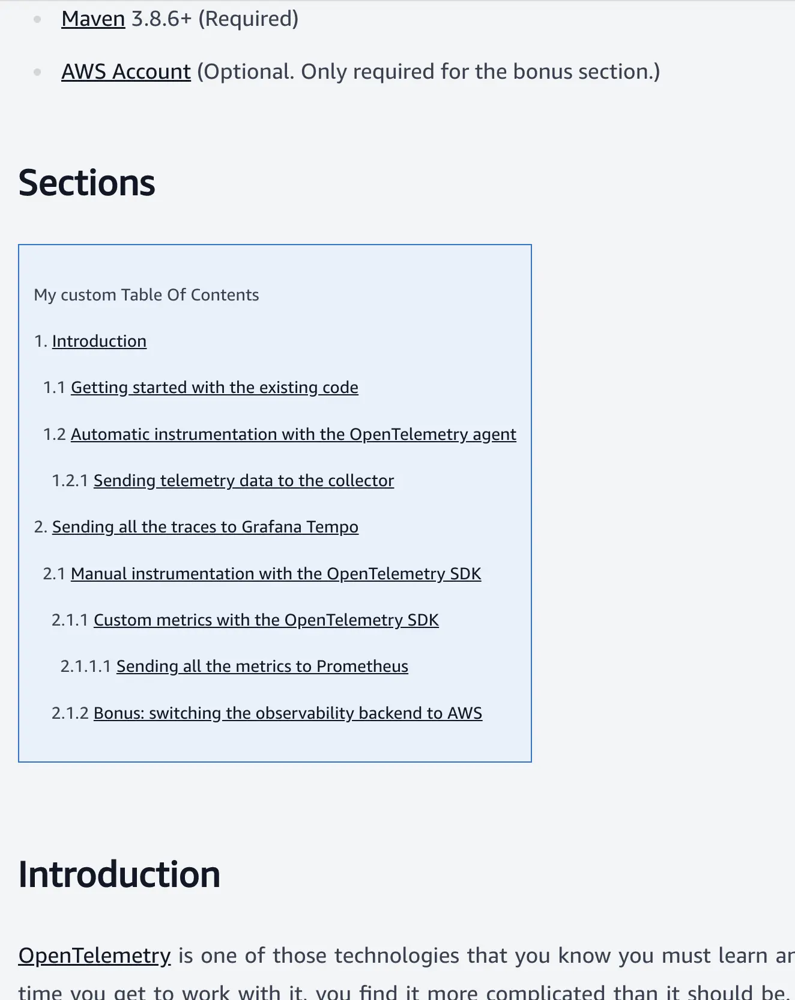
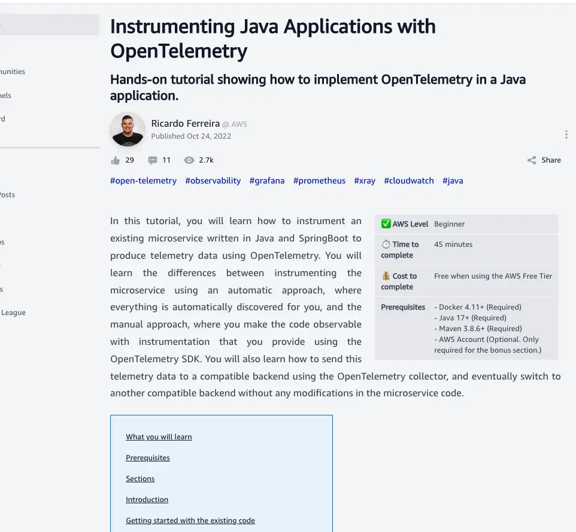
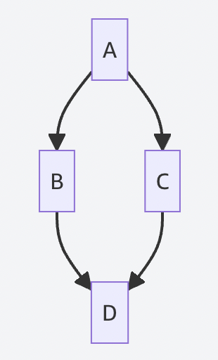

# Frequently Asked Questions

* [Markdown Syntax](#markdown-syntax)
  * [Where do I find the general Markdown syntax guide?](#where-do-i-find-the-general-markdown-syntax-guide)
  * [I have a series of posts. How do I link them together?](#i-have-a-series-of-posts-how-do-i-link-them-together)
  * [How do I link to other posts in my series or other posts on the BuildOn.AWS site?](#how-do-i-link-to-other-posts-in-my-series-or-other-posts-on-the-buildonaws-site)
  * [How do I create a Table of Contents for my post?](#how-do-i-create-a-table-of-contents-for-my-post)
  * [How do I specify article attributes, such as the time to read it, complexity, prerequisites, etc?](#how-do-i-specify-article-attributes-such-as-the-time-to-read-it-complexity-prerequisites-etc)
  * [How do I show images in my post?](#how-do-i-show-images-in-my-post)
  * [How do I show videos in my post?](#how-do-i-show-videos-in-my-post)
  * [How do I get syntax highlighting in my code snippets?](#how-do-i-get-syntax-highlighting-in-my-code-snippets)
  * [What languages does syntax highlighting support?](#what-languages-does-syntax-highlighting-support)
  * [How do I write the same code snippet in different languages?](#how-do-i-write-the-same-code-snippet-in-different-languages)
  * [How do I embed a Mermaid diagram in my article?](#how-do-i-embed-a-mermaid-diagram-in-my-article)
  * [How do I embed mathematical formulas or equations in my articles?](#how-do-i-embed-mathematical-formulas-or-equations-in-my-articles)
  * [How do I show content under tabs?](#how-do-i-show-content-under-tabs)
  * [How do I show content in multiple columns?](#how-do-i-show-content-in-multiple-columns)
  * [How do I create an external post?](#how-do-i-create-an-external-post)
  * [How do I create a series of posts?](#how-do-i-create-a-series-of-posts)
  * [How do I configure post images?](#how-do-i-configure-post-images )
  * [How do I show tweets in my post?](#how-do-i-show-tweets-in-my-post)
  * [How do I add multiple authors in my post?](#how-do-i-add-multiple-authors-in-my-post)
  * [How do I add customized contents for smart tag pages?](#how-do-i-add-customized-contents-for-smart-tag-pages)
  * [How do I add customized contents for extra space pages?](#how-do-i-add-customized-contents-for-extra-space-pages)
* [Miscellaneous](#miscellaneous)
  * [Why was my content proposal not accepted? Do you have feedback for me?](#why-was-my-content-proposal-not-accepted-do-you-have-feedback-for-me)

## Markdown Syntax

### Where do I find the general Markdown syntax guide?

👉 [https://www.markdownguide.org/basic-syntax/](https://www.markdownguide.org/basic-syntax/)

### I have a series of posts. How do I link them together?

Currently, there is no built-in support for a series of posts, however you can accomplish this using simple [Markdown](https://www.markdownguide.org/basic-syntax/). Example:

```text
This is a 3-part series:
1. What is broken access control? (this post)
1. [What is a cryptographic failure?](/posts/owasp-top-10-defined/02-what-is-a-cryptographic-failure/)
1. [What is an injection attack?](/posts/owasp-top-10-defined/03-what-is-an-injection-attack/)
```

_Note: Add a trailing slash at the end._

You can then structure the layout of your files like this:

```text
posts
├── owasp-top-10-defined
│   ├── 01-what-is-broken-access-control
│   │   ├── index.md
│   │   ├── images
│   │   │   ├── broken-access-control.png
│   ├── 02-what-is-a-cryptographic-failure
│   │   ├── index.md
│   │   ├── images
│   │   │   ├── cryptographic-failure.png
│   ├── 03-what-is-an-injection-attack
│   │   ├── index.md
│   │   ├── images
│   │   │   ├── what-is-an-injection-attack.png
```

Where `posts/owasp-top-10-defined/01-what-is-broken-access-control/index.md` is part 1, `posts/owasp-top-10-defined/02-what-is-a-cryptographic-failure/index.md` is part 2, and `posts/owasp-top-10-defined/03-what-is-an-injection-attack/index.md` is part 3.

The resulting URL mapping will be:

* https://buildon.aws/posts/owasp-top-10-defined/01-what-is-broken-access-control/
* https://buildon.aws/posts/owasp-top-10-defined/02-what-is-a-cryptographic-failure/
* https://buildon.aws/posts/owasp-top-10-defined/03-what-is-an-injection-attack/

You can see an example of this in the repo [here](/posts/owasp-top-10-defined).

### How do I link to other posts in my series or other posts on the BuildOn.AWS site?

You can reference them using absolute paths like this, but **omit the `.md`** as we turn the markdown into an HTML document:

* `[What is a cryptographic failure?](/posts/owasp-top-10-defined/02-what-is-a-cryptographic-failure/)`
* `[A cool tutorial](/tutorials/a-cool-tutorial/)`

_**Note:** Please do not hard code the full URL in the post_

### How do I create a Table of Contents for my post?

If your post contains several chapters and they have titles, you can embed a table of contents which will dynamically display and link to the existing titles. Simply insert a markdown table with one column, make the first row of the table a title and place the word "ToC" in the first cell. Notice the capitalization of the keyword ToC, which has to be respected.

````markdown
| ToC |
|-----|
````

The Table of Contents can be placed anywhere in the article, and will render links to any titles found after its own position. So, it is possible to place it at the very beginning of the post, or perhaps in some cases there are some introductory paragraphs and the ToC goes right after, linking to the rest of the article. Both options are possible. You can also specify your own content manually for the ToC, simply adding rows to the ToC table. It will render them instead of the autodetected titles:

````markdown
| ToC                                                                                                                          |
|------------------------------------------------------------------------------------------------------------------------------|
| My custom Table Of Contents                                                                                                  | 
| 1. [Introduction](#introduction)                                                                                             |
| &nbsp; 1.1 [Getting started with the existing code](#getting-started-with-the-existing-code)                                 |
| &nbsp; 1.2 [Automatic instrumentation with the OpenTelemetry agent](#automatic-instrumentation-with-the-opentelemetry-agent) |
| &nbsp; &nbsp; 1.2.1 [Sending telemetry data to the collector](#sending-telemetry-data-to-the-collector)                      |
| 2. [Sending all the traces to Grafana Tempo](#sending-all-the-traces-to-grafana-tempo)                                       |
| &nbsp; 2.1 [Manual instrumentation with the OpenTelemetry SDK](#manual-instrumentation-with-the-opentelemetry-sdk)           |
| &nbsp; &nbsp; 2.1.1 [Custom metrics with the OpenTelemetry SDK](#custom-metrics-with-the-opentelemetry-sdk)                  |
| &nbsp; &nbsp; &nbsp; 2.1.1.1 [Sending all the metrics to Prometheus](#sending-all-the-metrics-to-prometheus)                 |
| &nbsp; &nbsp; 2.1.2 [Bonus: switching the observability backend to AWS](#bonus-switching-the-observability-backend-to-aws)   |
 ````

Notice that standard Markdown syntax only allows text, links, and simple formatting inside a table, not complex structures such as lists. In this example we use `&nbsp;` (a whitespace character in HTML) to emulate indentation for the custom ToC content.

This is how this table of contents may look like when inserted in an article:



### How do I specify article attributes, such as the time to read it, complexity, prerequisites, etc?

Insert a table with two columns, and make the first row in the header contain the word "Attributes" in the first cell and leave the second cell empty. Then specify attribute names and values in the body of the table. For example, you can copy this table as a template (if you need to provide multiple items in a cell, take a look at the `Requires` value column for how to do this):

```markdown
| Attributes             |                                                        |
|------------------------|--------------------------------------------------------|
| ✅ AWS experience       | Beginner                                               |
| ⏱ Time to complete     | 10 minutes                                             |
| 💰 Cost to complete    | Free tier eligible                                      |
| 🧩 Requires            | - [Docker](https://www.docker.com/get-started) 4.11+ (Required)<br>- [Java](https://openjdk.org/install) 17+ (Required)<br>- [Maven](https://maven.apache.org/download.cgi) 3.8.6+ |
| &#x1F4BE; Code         | [Download here the full guide](https://github.com/build-on-aws/instrumenting-java-apps-using-opentelemetry) |
| &#x270F;  Last updated | July 14, 2022                                          |
```

Table cells can contain simple texts with basic formatting (such as bold or italic), links, emojis (either directly or using their unicode representation), etc.

This table can be placed anywhere in the article, although it usually makes more sense to have it at the very beginning. There could be cases where it fits better after some introductory content.

This is how the attributes table renders on a desktop browser in an article. At the bottom, you can see an auto-generated Table of Contents placed after some introductory paragraph.



### How do I show images in my post?

Store your images (jpg, png, webp, svg, gif) in an `images` subdirectory of your post.

```text
posts
├── what-happens-when-you-type-a-url-in-your-browser
│   ├── index.md
│   ├── images
│   │   ├── the-internet.jpg
```

_**Note:** Do not share images across posts or even posts in a series._

To show images in your post, you'll link to them using a relative path:

``

The caption will appear underneath the image and also on mouse over.

### How do I show videos in my post?

At the moment, only YouTube videos are supported. Simply place the URL of the video in a separate line, for example:

```text
Lorem ipsum dolor sit amet, consectetur adipiscing elit, sed do eiusmod tempor. 

https://www.youtube.com/watch?v=dQw4w9WgXcQ

Lorem ipsum dolor sit amet, consectetur adipiscing elit, sed do eiusmod tempor.
```

The video will be embedded in the article with a responsive layout that adjusts to the available width.


It works with the domains `youtube.com`, `youtu.be` or `youtube-nocookie.com`.

### How do I get syntax highlighting in my code snippets?

Use standard markdown code blocks, and specify the language, for example:

````markdown
   ```javascript
   console.log("Hello World!");
   ```
````

This will render something like:


If you do not specify a language, autodetection takes place. Although it works reasonably in many cases, this system is not perfect, so we recommend explicitly indicating the language in order to get consistent results. If you want to disable language autodetection in a code snippet, simply specify "text" or "plaintext" language. This is particularly useful for embedding the output of some command.

### What languages does syntax highlighting support?

Currently, the following languages are supported:

* bash (or sh)
* clojure
* cpp (or c++)
* csharp (or c#)
* css
* dockerfile (or docker)
* fsharp (or f#)
* go
* java
* javascript
* json
* kotlin
* php
* plaintext
* powershell
* python
* ruby
* shell
* swift
* terraform (or hcl or tf)
* typescript
* xml
* yaml (or yml)
* html
* sh
* text (or plaintext). This one actually disables highlighting preventing incorrect guessing.

### How do I write the same code snippet in different languages?

If you want embed the same code snippet in different languages, for example, explaining how to do some algorithm in Java, Python, Javascript, etc., put them in a list. The list must contain in all its elements a small piece of text (the title) and a code snippet, for example:

````markdown
* Javascript
    ```javascript
    console.log("Hello world");
    ```
* Java
    ```java
    System.out.println("Hello world");
    ```
* Python
    ```python
    print("Hello world")
    ```
* Linux bash
    ```sh
    echo "Hello world"
    ```
````

This will be rendered as one single code block with different tabs on the top for the different code snippets. The title of each tab will be the text in every list item. Notice that if any of the list elements does not respect this format, the whole list will be rendered as a normal list.


If you don't want a list of code snippets to be rendered as tabs, simply separate with an empty line every list element. Actually, if any of the list elements contains anything different to a text + a code snippet (like in the example above), it will not be rendered with tabs.

### How do I embed a Mermaid diagram in my article?

Simply use a code snippet specifying the language as _mermaid_. For example:

````markdown  
```mermaid
graph TD;
    A-->B;
    A-->C;
    B-->D;
    C-->D;
```
````

will render something like:



Refer to the [mermaid page](https://mermaid-js.github.io/mermaid/#/) for examples and language syntax.

### How do I embed mathematical formulas or equations in my articles?

You can embed inline formulas inside a paragraph by escaping it with `$...$`. For blocks that display standalone, centered in the screen, either enclose them with `$$...$$` or use a regular code snippet with language _math_.

For example, a content like this:

````markdown
To evaluate a model we use an error measure that uses some topological distance mechanism on the output manifold to measure distance of a prediction to an observed value or $\mathcal{E} = \lVert p-o \rVert$, where $p$ is a predicted value and $o$ is an observed value. For instance RMSE (Root Mean Square Error) is a type of distance in a multi-dimensional space.

$$RMSE = \sqrt{{\frac{1}{n}} \sum_{i=1}^n(y_i-x_i)^2 }$$
````

will render something like this:


Refer to the [MathJax basic tutorial](https://math.meta.stackexchange.com/questions/5020/mathjax-basic-tutorial-and-quick-reference) for details on the syntax to write your formulas.

### How do I show content under tabs?
Code snippets in different languages can be grouped under tabs, like we saw above. But it is not the only content that can be displayed under tabs. Other possible elements include:
* Mermaid diagrams (which are a type of code snippet with language `mermaid`).
* Math formulas (when they are represented as code snippets with language `math`).
* Images. Notice in this case images do not support captions.

Mermaid diagrams and math formulas use the same syntax as code snippets in different languages ([see above](#how-do-i-write-the-same-code-snippet-in-different-languages)), since they are a particular type of code snippet.
Images inside tabs use a similar syntax. You just need to create a markdown list where each element consists on a text (which will be used for the tab title) followed by an image, for example:

````markdown 
* Image 1
  
* Image 2
  
* Image 3
  
````

### How do I show content in multiple columns?

Start a column by writing the symbol `_||` in a separate line. Write the content for this first column next. Start another column writing the symbol `_||` in a separate line again, then write the content for the second column.
End the multiple-columns mode by writing the symbol `_==` in a separate line (or by reaching the end of the file).

For example:

````markdown
Normal paragraph not in columns.

_||

Content of column 1

_|| 

Content of column 2

_==

Another normal paragraph not in columns.
````

Notice the maximum number of columns supported is 4, and in smaller screens (like mobile devices) column rendering is disabled and the content will be shown vertically.

### How do I create an external post?

An external post does not contain content but instead, links to content in an external website. Create it just like any other post, but:
* Do not add a markdown body in the index.md (it would not be rendered anyway)
* Add an attribute in the FrontMatter header named "externalUrl" with the URL of the remote content you want to link to. For example:
  ````yml
      externalUrl: https://dzone.com/articles/demystifying-transition-to-microservices
  ````
* External posts support the same fields as regular posts (such as title, description, date, images, author(s), etc.).

### How do I create a series of posts?

A series of posts is a sequential collection of posts about a topic, intended to be read in order. If a post is very large, it may be a candidate to be split into a series of posts.
Start by creating a folder that will contain your series, and one folder for every post inside the series. Choose folder names carefully, since the public URL will be based on the folder names. You do not need to include numbers to enforce the order of the posts.
Create a file named series.md in the root of your series folder. For example, your folders structure may look like this:

````
/posts/my-series/series.md
/posts/my-series/introduction/index.md
/posts/my-series/first-article/index.md
/posts/my-series/second-article/index.md
/posts/my-series/third-article/index.md
/posts/my-series/conclusion/index.md
````

In the series.md, include a content similar to a post, with a FrontMatter header and an optional body. The supported fields in the header are:

````markdown
---
title: "Title of the series"
description: "Description of the series"
navigationBars: [Optional. One of: top, bottom, both, none]
posts:
  - introduction
  - first-article
  - second-article
  - third-article
  - conclusion
--- 
[OPTIONAL MARKDOWN CONTENT]
````
The `posts` field determines the order of the posts in the series, which must be direct children of the folder where the series.md file is located (just like the example above).

By creating this series.md file and folder structure, BuildOn.AWS will provide the following features:
* A series landing page, in the URL based on the folder where the series.md is located. In our example, it would be /posts/my-series. This landing page displays the title of the series, the authors of the posts, the tags of the posts, and the markdown content of the series.md if it was provided.
* Navigation controls. Every post in the series will display at the top and at the bottom links to navigate to the next and previous post in the series. You can customize this behaviour using the attribute `navigationBars` in the FrontMatter header, with possible values:
  * top. Navigation controls display only at the top of the page
  * bottom. Navigation controls display only at the bottom of the page
  * both. Navigation controls display both at the top and bottom of the page (this is the default)
  * none. Hide navigation controls.
* A Series Table Of Content component that can be included in the markdown both in the series.md file and also in every post of the series, and renders a table with links to the posts in the series, based on their titles. When this component is included inside a post in a series, it highlights the current article.
  In order to use this Series Table Of Content component, just add to the markdown the following snippet, in the desired position:
  ````
  
  | SeriesToC |
  |-----------|
  
  ````
  
This is how these controls look like:
* Navigation controls for a series at the bottom of a post
  
* Series Table Of Contents inside a post in the series 
  

### How do I configure post images?

You can configure extra images for posts in the post FrontMatter header.

````yml
---
images:
  background: [image URL]
  banner: [image URL]
  thumbnail: [image URL]
--- 
````
There are three types of images here:
* background. This image will be used as a background when the post is displayed in a carousel of highlighted posts. 
  This image should have a 1.91:1 aspect ratio. 
* banner. This image is used when the post is displayed in a carousel of posts in a space. This image should have a 1.91:1 aspect ratio.
* thumbnail. This image is displayed next to the title and description of a post when shown in a feed. It should be a square image.

Additionally, these images may be used to create a preview when a post is shared in social media. The banner image is preferred, if there is none then the background image, and if not, the thumbnail image.
Notice that images should be optimized for the web, using compressed modern formats such as webp, and avoiding large high-resolution images. Some social media (for example, Twitter) refuse to use large images and may fall back to other images found in the page.

### How do I show tweets in my post?

Simply place the URL of the tweet in a separate line, for example:

```text
Lorem ipsum dolor sit amet, consectetur adipiscing elit, sed do eiusmod tempor. 

https://twitter.com/CoolViews_/status/1624449857397092354?s=20
```

### How do I add multiple authors in my post?

Add `additionalAuthors` in meta data

```text
authorGithubAlias: mainAuthorGithubAlias
authorName: mainAuthorName
additionalAuthors:
  - authorGithubAlias: additionalAuthorGithubAlias1
    authorName: additionalAuthorName1
  - authorGithubAlias: additionalAuthorGithubAlias2
    authorName: additionalAuthorName2
```
### How do I add customized contents for smart tag pages?

In `tags` folder, add a folder with smart tag name, add `top.md`, `right-top.md` and `right-bottom.md` to provide customized contents for top, right top and right bottom of the page correspondingly. All Markdown syntax for posts is also supported in the markdown file. You can use `hasBorder` meta data to customize the section has border or not.

For example, to add a customized top content for `aws` tag page, add a `top.md` in folder `/tags/aws`.

```
---
hasBorder: false
---

https://www.youtube.com/watch?v=a9__D53WsUs
```

### How do I add customized contents for extra space pages?

In `spaces` folder, add a folder with the space name, add `top.md`, `right-top.md` and `right-bottom.md` to provide customized contents for top, right top and right bottom of the page correspondingly. All Markdown syntax for posts is also supported in the markdown file. You can use `hasBorder` meta data to customize the section has border or not.

For example, to add a customized top content for `devops` tag page, add a `top.md` in folder `/spaces/devops`.

```
---
hasBorder: false
---

https://www.youtube.com/watch?v=a9__D53WsUs
```

## Miscellaneous

### Why was my content proposal not accepted? Do you have feedback for me?

We will add feedback to your content proposal issue if we have suggestions for improvements. In many cases, the content is not a good fit for this platform and that is why it was not accepted.
