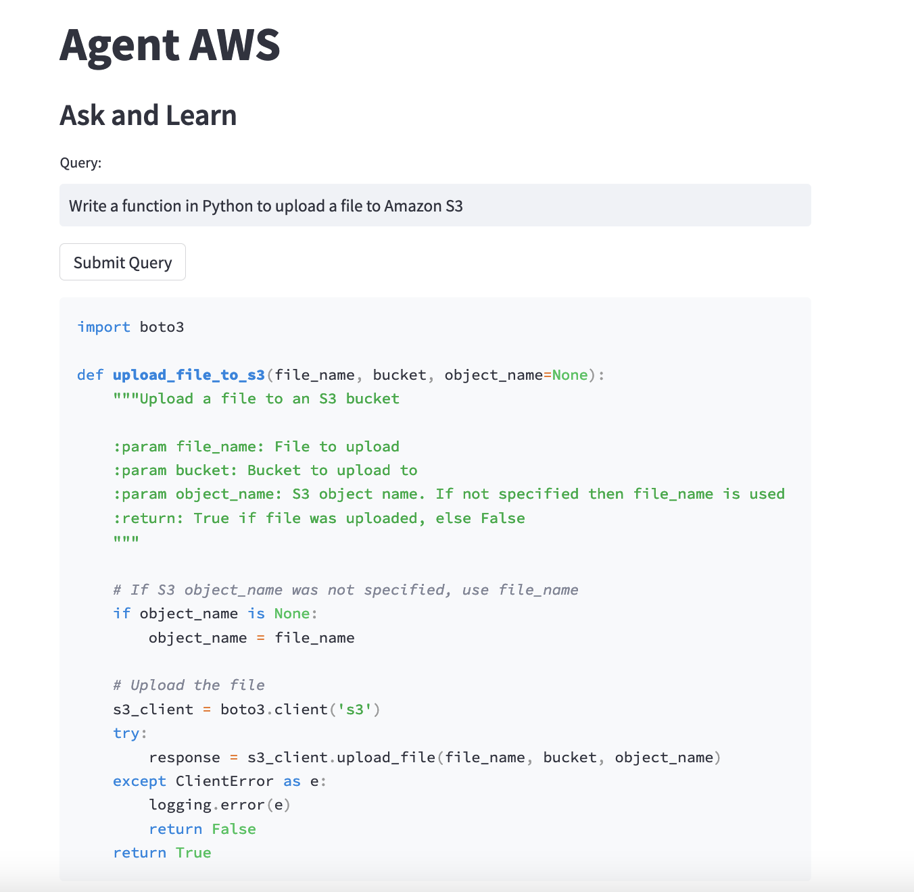
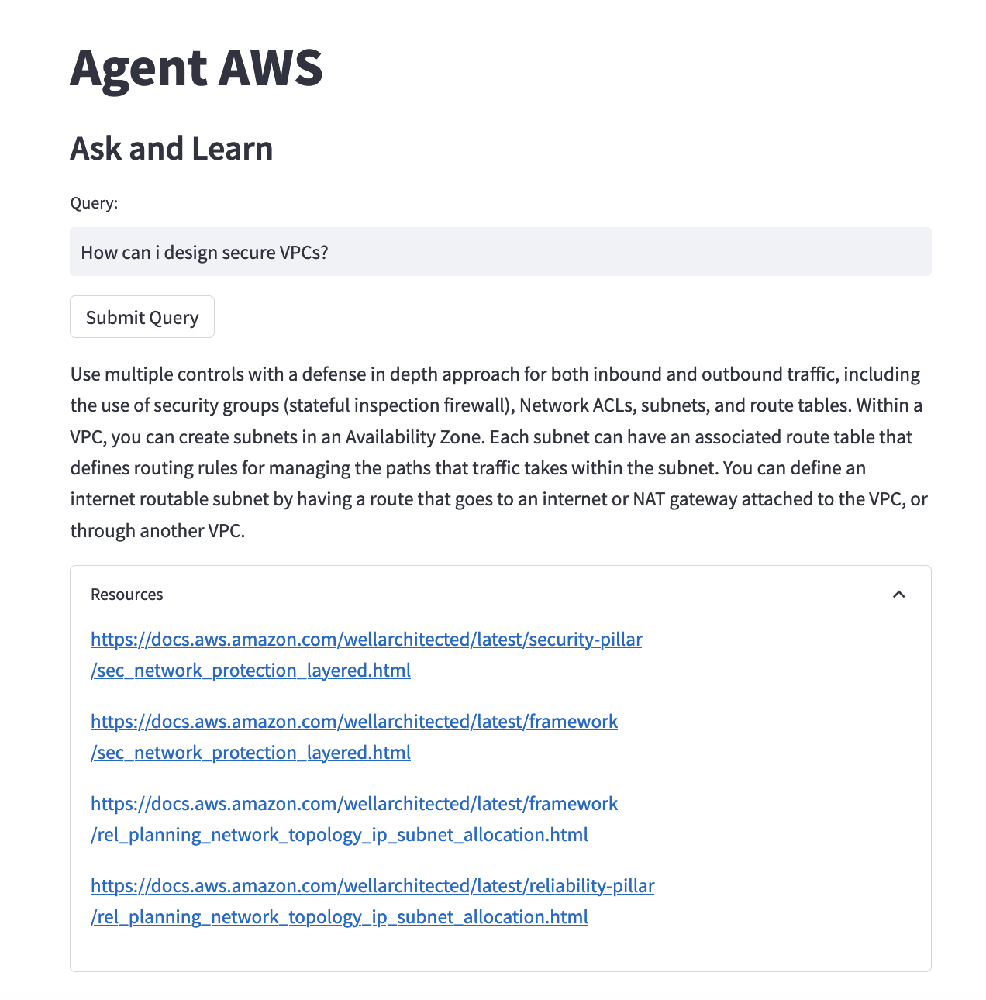

Generative AI has ushered in a new era of automation and efficiency, revolutionizing how we tackle a wide array of tasks. This technology empowers us, the builders, to architect intelligent tools capable of streamlining workflows, automating routine tasks, and delivering sophisticated results in real-time.

Within the dynamic landscape of cloud computing, builders harness many services on AWS to craft innovative solutions. However, effectively navigating this extensive ecosystem and utilizing its offerings to their fullest potential can present its own set of challenges.

Here, the role of a Solution Architect becomes pivotal. They are the bridge between business problems and technology solutions, adept at understanding the nuanced requirements of a project and designing robust, scalable, and cost-effective systems on AWS.

However, this role brings its own set of challenges. A Solution Architect needs to stay abreast of the latest AWS services, comprehend best practices, write code, and create intricate architectural diagrams. Furthermore, translating complex architectural concepts into digestible advice for stakeholders is no easy task.

What if we could leverage the power of Generative AI to alleviate these burdens? What if we could build a 'virtual Solution Architect' to assist us, augment our abilities, and guide us through these challenges? 

This blog post is about precisely that journey - constructing an AI-powered AWS Solution Architect Agent dubbed "Agent AWS".

## Agent AWS

Agent AWS is an automated, AI-powered agent that uses [HuggingFace Transformers](https://huggingface.co/docs/transformers/en/transformers_agents) paired with numerous different [foundation models](https://docs.aws.amazon.com/sagemaker/latest/dg/jumpstart-foundation-models.html?sc_channel=el&sc_campaign=datamlwave&sc_geo=mult&sc_country=mult&sc_outcome=acq&sc_content=agent-aws).

The "agent" is essentially a Large Language Model (LLM) with a predefined prompt and access to a specific set of “tools”, which are self-contained functions designed to perform a specific task. For instance, these tools could include a text summarizer or an image generator. Agent AWS leverages custom built tools to query AWS documentation, generate code, and create architectural diagrams.



## Building Agent AWS

The following sections elaborates on how Agent AWS was built, focusing on the design process of the agent and tools. It shows how you can harness the potential of Generative AI for developing custom agents.

The GitHub repository with the code can be found [here](https://github.com/aws-banjo/building-aws-agent).

## Agent Prompt

The language model underlying the agent is based on a detailed prompt provided by the user. This prompt helps the model generate suitable responses to user requests.

### Structure of the Prompt

The prompt is structured broadly into two parts.
1. Role: How the agent should behave, explanation of the concept of tools.
2. Instructions: Provides examples of tasks and their solutions

### Role

To start, the agent is assigned a role to play. In this case the agent is portrayed as an expert AWS Certified Solutions Architect equipped with tools to solve customer problems effectively. The role description is followed by the token <<all_tools>>, which is replaced at runtime with the tools specified by the user.

Here is the full role prompt:

```text
You are an expert AWS Certified Solutions Architect. Your role is to help customers understand best practices on building on AWS. You will generate Python commands using available tools to help will customers solve their problem effectively.

To assist you, you have access to three tools. Each tool has a description that explains its functionality, the inputs it takes, and the outputs it provides.

First, you should explain which tool you'll use to perform the task and why. Then, you'll generate Python code. Python instructions should be simple assignment operations. You can print intermediate results if it's beneficial.
Tools:
<<all_tools>>
```

### Instructions

The Instructions segment begins with a task, which lays out what the agent intends to accomplish. This task effectively acts as a "wrapper" for the underlying functionality of the tools, providing a context-rich, user-friendly interface for the more complex operations happening beneath the surface.

Following the task, the agent's response details how it will utilize the available tools to address the customer's request. The response encapsulates the function call to the appropriate tool - in this case, the AWS Well-Architected Framework Query Tool. This tool is selected because it provides direct access to the AWS Well-Architected Framework, enabling the extraction of valuable information relevant to the task at hand.

Finally, we demonstrate the Python code that the agent will execute to fulfill the user's query. This code makes use of Python's f-string formatting, a feature that allows for embedding expressions inside string literals, using curly braces {}. The variable 'response' is placed within these braces, meaning its value will be inserted into the string when it's printed.

```text
Task: "Help customers understand best practices on building on AWS by using relevant context from the AWS Well-Architected Framework."
I will use the AWS Well-Architected Framework Query Tool because it provides direct access to AWS Well-Architected Framework to extract information.
Answer:
"""py
response = well_architected_tool(query="How can I design secure VPCs?")
print(f"{response}.")
"""

Task: "<<prompt>>"
I will use the following
```

The last example employs the <<prompt>> directive, a placeholder that instructs the model on how to respond to a new, user-supplied prompt, thereby demonstrating the flexibility and adaptability of our Agent.

You can view the full prompt [here](https://github.com/aws-banjo/building-aws-agent/blob/main/agent_setup.py#L20-L63).

## Tools

Now that we have defined our agent, the next step is to create the tools for the agent to use. Tools consist of single function, with a name and a description. The descriptions are used to prompt the agent to complete tasks.

## Creating Custom Tools 

For Agent AWS we will create 3 custom tools to respond to customer requests.

1. **AWS Well-Architected Framework Query Tool:** This tool will allow your agent to interact directly with the AWS Well-Architected Framework, extracting valuable data to inform architectural decisions.
2. **Code Generation Tool:** This tool will generate code from AWS CloudFormation scripts to Python code.
3. **Diagram Creation Tool:** This tool will create AWS diagrams.

The process of creating tools is a uniform experience. I will go over how I created the AWS Well-Architected Framework tool in this post. You can view the full code for all the tools [here](https://github.com/aws-banjo/building-aws-agent/blob/main/agent_setup.py#L66-L290).

## Querying the AWS Well-Architected Framework

The first tool we've developed is designed to query the AWS Well-Architected Framework. This tool leverages a vector database to deliver relevant answers to user queries. Understanding the inner workings of vector databases isn't essential to appreciate the rest of this blog post. However, if you're interested in exploring how these databases can be constructed and used in detail, feel free to read my post on [creating an AWS Well Architected chatbot](https://www.buildon.aws/posts/well-arch-chatbot), which dives deep into this topic. 

For the purpose of our current journey of building an AWS Solution Architect Agent, we'll focus more on the application of this tool within the agent's workflow.

Creating a tool for our agent begins by establishing a class that inherits from the superclass Tool:

```python
from transformers import Tool

class AWSWellArchTool (Tool):
    pass
```

This class necessitates the following attributes:

1. **name**: This is the name of the tool.
2. **description**: This will be used to populate the prompt of the agent.
3. **inputs and outputs**: These aid the interpreter in making informed decisions regarding data types. They both consist of a list of possible values which could be text, image, or audio.
    * 'text': This type would be used when the input or output is a string of words, like a question to the tool or an answer from it.
    * 'image': This would be chosen if the input or output is a picture or diagram. For example, if the user wanted to analyze an architectural diagram or if the tool needed to output a diagram to illustrate its answer.
    * 'audio': This type would be selected when the input or output is a sound or speech, which might be useful for voice-based interaction scenarios.
4. **A call method**: This contains the inference code.

With these attributes, our class will look like this:

```python
from transformers import Tool

class AWSWellArchTool(Tool):
    name = "well_architected_tool"
    description = "Use this tool for any AWS related question to help customers understand best practices on building on AWS. It will use the relevant context from the AWS Well-Architected Framework to answer the customer's query. The input is the customer's question. The tool returns an answer for the customer using the relevant context."
    inputs = ["text"]
    outputs = ["text"]

    def __call__(self):
        pass 
```

The call method is then filled with the code to do the relevant document search. When the tool is completed, it can be invoked without an agent.

```python
query = "How can I design secure VPCs?"
well_arch_tool = AWSWellArchTool()
well_arch_tool(query)
```



## Exploring the Agent in Action

Upon the configuration of tools and the prompt, we can proceed to explore the capabilities of Agent AWS. To initialize the agent, we select a particular LLM to use (we'll use [StarcoderBase](https://huggingface.co/bigcode/starcoderbase) for this example). We also specify our custom prompt and any additional tools. To ensure that the agent relies solely on the custom tools, we also remove the default tools.

```python
import transformers
from transformers import Tool
from transformers.tools import HfAgent

# This is where you insert your custom prompt
sa_prompt = PROMPT 

# Initialize the agent with the chosen LLM, your custom prompt, and the additional tools.
agent = HfAgent("https://api-inference.huggingface.co/models/bigcode/starcoderbase", run_prompt_template=sa_prompt,additional_tools=[code_gen_tool,well_arch_tool])

# List of default tools
default_tools = ['document_qa', 'image_captioner', 'image_qa', 'image_segmenter', 'transcriber', 'summarizer', 'text_classifier', 'text_qa', 'text_reader', 'translator', 'image_transformer', 'text_downloader', 'image_generator', 'video_generator',]

# Remove default tools from the agent's toolbox
for tool in default_tools:
    try:
        del agent.toolbox[tool]
    except:
        continue
```

Now that the agent is set up, it can execute commands invoking the custom tools. Let's consider an example command:

```python
agent.run("A diagram that shows an s3 bucket connected to a lambda function")
```

The agent will engage the custom tool designed to handle such a request and generate an image as a response.

```python
==Explanation from the agent==
I will use the following
==Code generated by the agent==
architecture_diagram = diagram_creation_tool(query=" A diagram that shows an s3 bucket connected to a lambda function")
==Result==
<class 'PIL.PngImagePlugin.PngImageFile'>
```

In this output, the agent explains the tool it plans to use, generates the code to create the requested architectural diagram, and finally returns the result — in this case, an image.


The code for the app is [here](https://github.com/aws-banjo/building-aws-agent/blob/main/agent_aws_st.py).

## Conclusion

Throughout this blog post, we've embarked on an exciting journey: harnessing the power of Generative AI to construct an AWS Solution Architect Agent. Employing HuggingFace Transformers and an array of foundational models, we've created purpose-built tools that have shaped a virtual Solution Architect named "Agent AWS".

However, it's crucial to note that this doesn't replace the role of a Solution Architect. Instead, it equips builders with an invaluable tool that can help streamline workflows.

The potential of Generative AI Agents, as demonstrated by our Agent AWS, is vast, and we've merely begun to explore its capabilities. This exploration is our opening act, a stepping stone into an exciting era where AI-driven tools augment our abilities and revolutionize how [we build solutions](https://dzone.com/articles/chataws-deploy-aws-resources-seamlessly-chatgpt).

If you are interested in learning more check out the documentation from [HuggingFace on custom tools](https://huggingface.co/docs/transformers/en/custom_tools#creating-a-new-tool) and their [foundation model leaderboard](https://huggingface.co/spaces/HuggingFaceH4/open_llm_leaderboard).

Remember, this is not an endpoint but a launchpad. The agent/tool framework is a wellspring of opportunities waiting to be tapped. Equipped with this knowledge, let's embrace this thrilling journey. There's a lot more we can achieve. Now go build!

## About the Author

Banjo is a Senior Developer Advocate at AWS, where he helps builders get excited about using AWS. Banjo is passionate about operationalizing data and has started a podcast, a meetup, and open-source projects around utilizing data. When not building the next big thing, Banjo likes to relax by playing video games, especially JRPGs, and exploring events happening around him.
