---  
title: "Using Java, Amazon Corretto, Ukulele and Fast Fourier Transform to detect musical notes and command IoT devices"  
description: This step-by-step tutorial will show you how to use Fast Fourier Transform to detect musical notes and command IoT devices.  
tags:  
- cloud
- iot
- java
authorGithubAlias: vsenger  
authorName: Vinicius Senger  
date: 2023-04-10  
---

Fourier Transform algorithms are -everywhere- in many applications: image recognition, instrument tuners, signal processing in complex medical devices, inside machine learning algorithms, cryptography, and more.


To learn about Fourier Transform in a practical and funny way, we will build an application that uses a Fast Fourier Transform (FFT) algorithm to detect musical notes using laptop mic and send as IoT messages to the cloud that can command devices, games or anything you imagine!

Let's learn little more about this famous mathematician and his formula, and then go build!

## Fourier and Fourier Transform

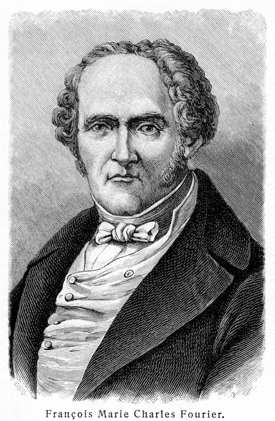

Joseph Fourier has born in 1768 and was a French mathematician who lived in the 19th century. He was a brilliant mathematician and physicist, and he is known for his work in the field of mathematics, especially in the field of Fourier analysis. 

Fourier analysis is a branch of mathematics that deals with the study of functions and their properties in the frequency domain. The Fast Fourier Transform (FFT) is a mathematical technique used to analyze and transform signals from one domain to another. In simpler terms, it's a way to take a signal, which is essentially a set of numbers representing something like sound, light, or even stock market data, and break it down into its individual frequencies.

Think of it like taking apart a puzzle. Just as you might sort out the different colored pieces of a puzzle to put it together, the FFT sorts out the different frequencies that make up a signal. By doing so, it can help identify patterns, trends, and other important characteristics of the signal.

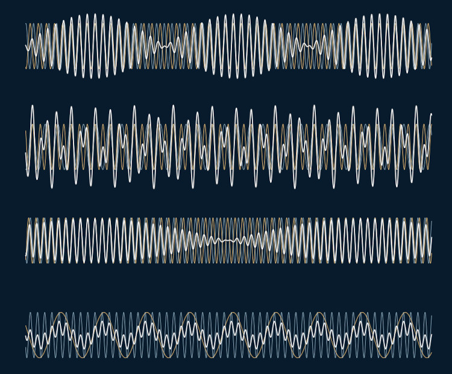

The FFT is particularly useful in fields like audio and signal processing, where it's often used to filter out unwanted noise, compress data, and perform other important tasks. While it may seem like a complex mathematical concept, the FFT is actually a widely used and very practical tool for understanding and manipulating signals in a variety of fields.

## Let's build on!  
The architecture of our solution is simple and for now we are using just AWS IoT Core service to manage messages that we will be able to react later:


1. The first component is your laptop with microphone running Processing.org with notes detection script
2. Once it detects a note, it will send the note name to "control/sound" IoT topic
3. From the AWS IoT Core we can forward the message to other topics, for example I could say that if the note is a G, turn on a lamp in some IoT device by sending a MQTT message
4. We can also trigger other services like AWS DynamoDB for storing the message data without one line of coding or we could call an AWS Lambda function: sound oriented functions! :)

The main steps to build our application is:
1. Install Processing.org: a Java based programming language and development environment that is used to create visualizations, games, and other interactive media. It has a library for FFT processing called Minim.
2. Create IoT security credentials and a thing on AWS IoT Core.
3. Create a Processing.org sketch that uses FFT to detect musical notes and send as IoT messages to the cloud.
4. React to messages: the sky is the limit! I will show how I did a cool integration with lamps and Roblox gaming!

## Processing.org

Processing is a flexible software sketchbook and a language for learning how to code within the context of the visual arts. Since 2001, Processing has promoted software literacy within the visual arts and visual literacy within technology. There are tens of thousands of students, artists, designers, researchers, and hobbyists who use Processing to explore code and create works of visual art.

With just a few lines of code, you can make objects appear and move across the screen, interact with your mouse, and much more. Processing is a great way to get started with programming and to learn more about how code works.

The following image was generated by a few lines of code:   

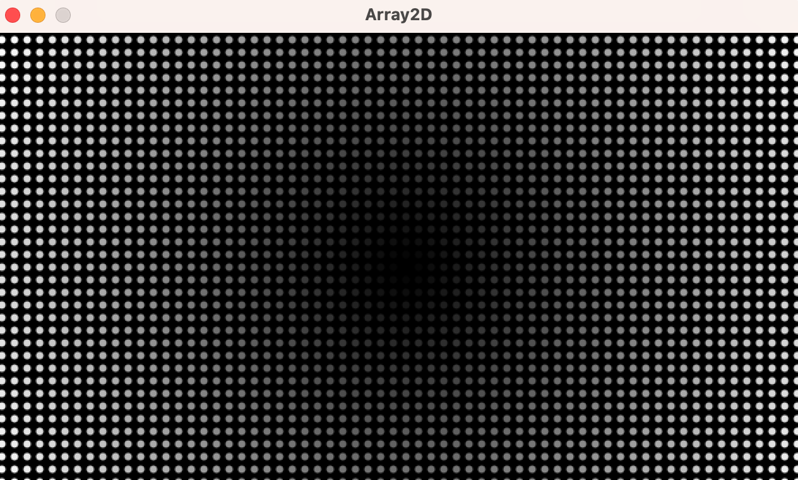

We are not explaining this code here, we just want that just a few lines of code can generate a beautiful image like this. 

```java
float[][] distances;
float maxDistance;
int spacer;

void setup() {
  size(640, 360);
  maxDistance = dist(width/2, height/2, width, height);
  distances = new float[width][height];
  for (int y = 0; y < height; y++) {
    for (int x = 0; x < width; x++) {
      float distance = dist(width/2, height/2, x, y);
      distances[x][y] = distance/maxDistance * 255;
    }
  }
  spacer = 10;
  strokeWeight(6);
  noLoop();  // Run once and stop
}

void draw() {
  background(0);
  for (int y = 0; y < height; y += spacer) {
    for (int x = 0; x < width; x += spacer) {
      stroke(distances[x][y]);
      point(x + spacer/2, y + spacer/2);
    }
  }
}
```

### Installing processing.org

1. Download Processing.org from [here](https://processing.org/download/).
2. Install it and open it.
3. Go to Sketch > Import Library > Manage Libraries > Add Library... and search for Minim. Install it.
image
   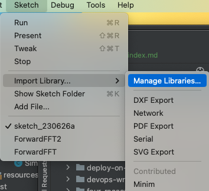
   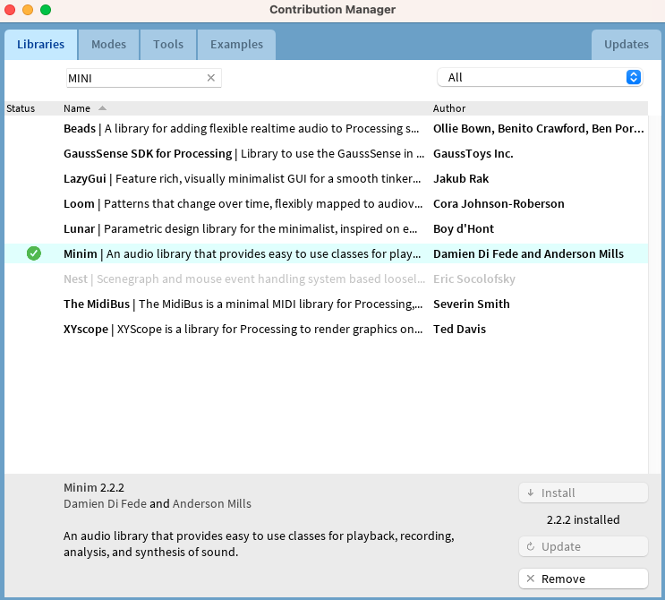

4. Now you can navigate into cool samples that comes with this library, click in File -> Examples and navigate to Contributed Libraries -> Minim
   

5. This is the SoundSpectrum example:
   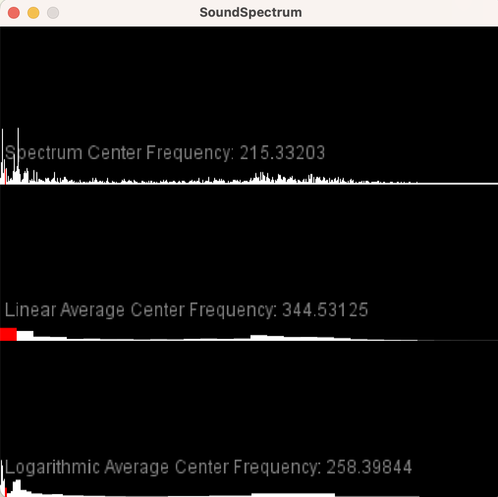

### Configuring AWS IoT Core

Before we move to our Sketch to detect notes we will create a -Thing- in AWS IoT Core service
that will manage the IoT / MQTT messages with security. AWS IoT Core is a message broker that can coordinate delivery of messages between devices with a publish / subscriber architecture: one device can publish a message to hundreds or thousands of subscriber devices!

1. Open you AWS Console and go to AWS IoT Core
2. Click "All Devices" -> "Things" and "Create Things"
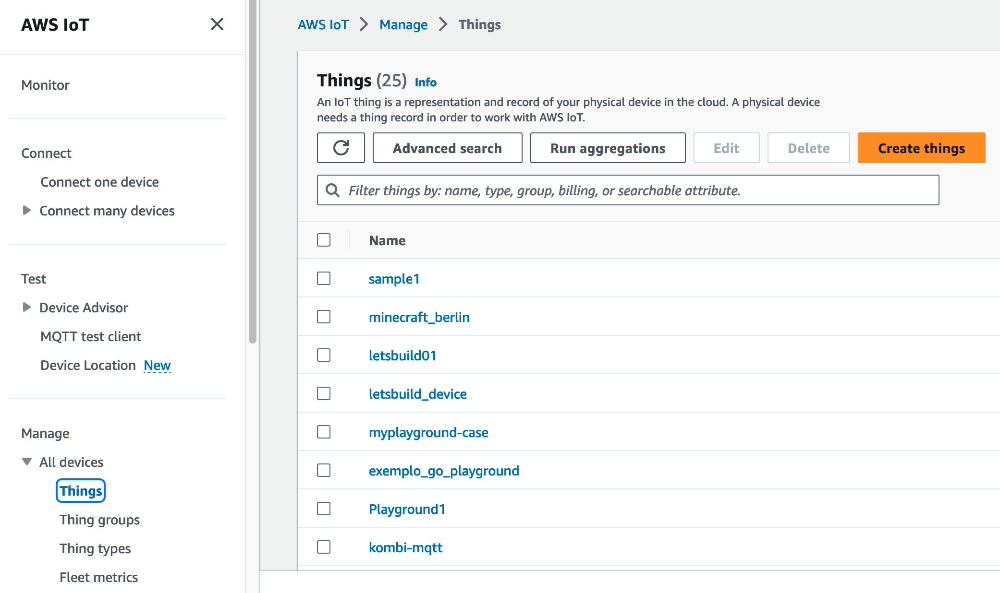
3. Choose "Create single thing"
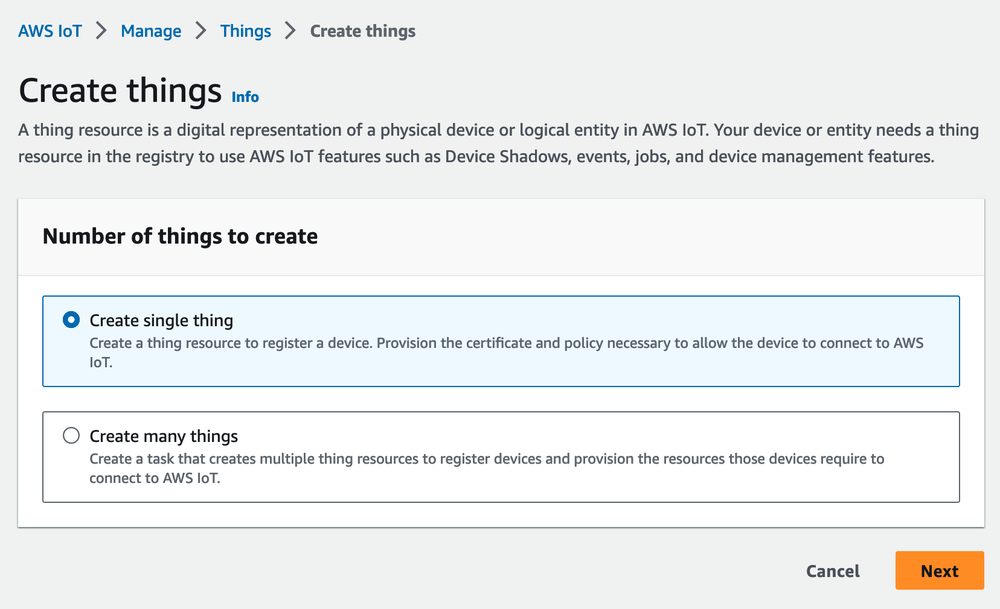
4. Name it as fft_notes and configure with default options

5. Choose "Auto-generate a new certificate"
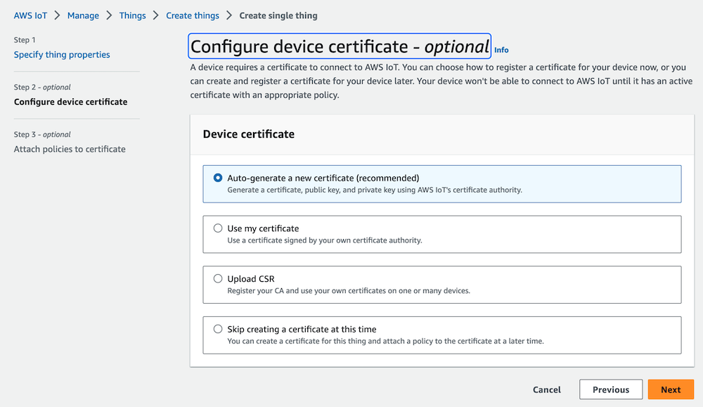
6. Skip the Attach policies
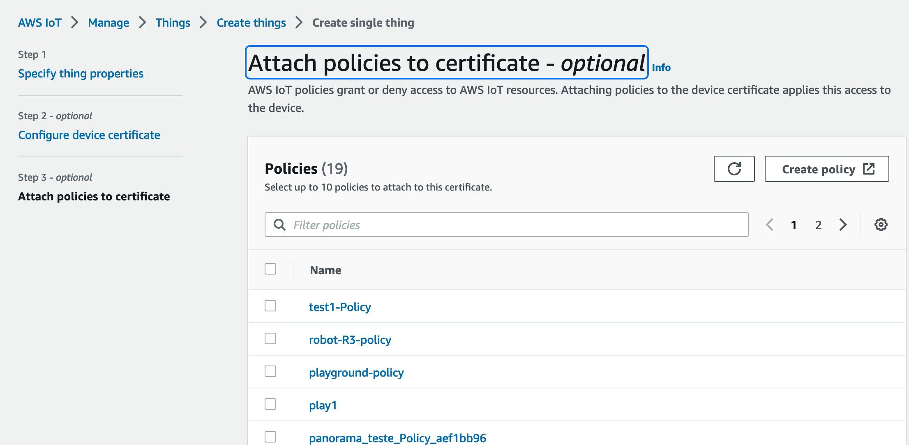
7. Download the device certificate, keys and root CA

8. Now click in the AWS IoT -> Settings in the main AWS IoT Core Console
9. Copy the endpoint address to some place. We will need this information to configure our Processing.org connection to AWS IoT Core
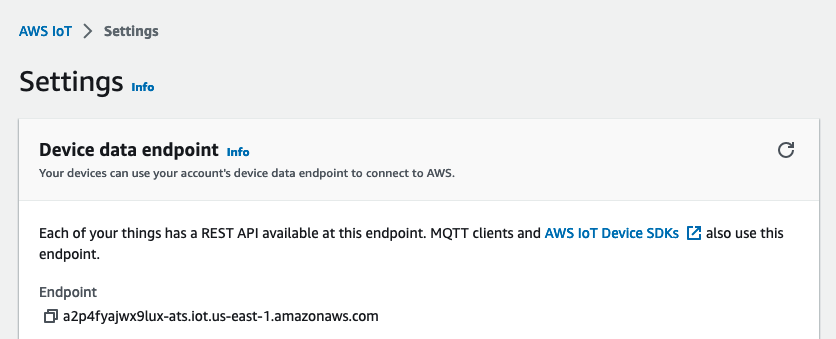

Now we have a representation of our notes thing in the AWS Cloud and also the security keys to communicate using TLS 1.2.

### Detecting Notes Sketch

Now that we have installed Processing.org, Minim library and already have our thing created in AWS IoT Core, let's start to explore the Sketch we did for detecting and converting notes to IoT / MQTT Messages!

Open Processing.org and copy and paste this code that we will explain the details later: 
```java
import ddf.minim.analysis.*;
import ddf.minim.*;
import processing.net.*;
import java.util.Date;
import java.util.Scanner;


import com.amazonaws.services.iot.client.AWSIotMessage;
import com.amazonaws.services.iot.client.AWSIotQos;
import com.amazonaws.services.iot.client.AWSIotTopic;
import play.aws.*;

String data;
Client c;

Minim minim;
AudioPlayer jingle;
FFT fft;
String windowName;
AudioInput in;

void setup()
{  
  size(512, 200);
  minim = new Minim(this);
  in = minim.getLineIn(Minim.MONO, 2048);
  // create an FFT object that has a time-domain buffer the same size as jingle's sample buffer
  // note that this needs to be a power of two and that it means the size of the spectrum
  // will be 512. see the online tutorial for more info.
  fft = new FFT(in.bufferSize(), in.sampleRate());
  textFont(createFont("Arial", 12));
  windowName = "None";
  thread("MQTT");  
}
//this function will initialize the AWS IoT Core communication
//you need to provide:
  //1. AWS IoT Code End point
  //2. Unique Device connection name
  //3. Device certifica
  //4. Private key
void MQTT() {
  MQTTClient.init("<aws endpoint>", 
    "unique-device-name", 
    "/path-to-certificate/your-certificate.pem.crt",
    "/path-to-private-key/your-private-key.pem.key"
    );
}

void draw()
{
  background(0);
  stroke(255);
  // perform a forward FFT on the samples in jingle's left buffer
  // note that if jingle were a MONO file, this would be the same as using jingle.right or jingle.left
  fft.forward(in.mix);
  for(int i = 0; i < fft.specSize(); i++)
  {
    // draw the line for frequency band i, scaling it by 4 so we can see it a bit better
    line(i, height, i, height - fft.getBand(i)*4);
  }
  fill(255);
  
  if(fft.getFreq(82.4)>=9) sendNoteToAWS("E");
  if(fft.getFreq(110.0)>=9) sendNoteToAWS("A");
  if(fft.getFreq(146.8)>=9) sendNoteToAWS("D");
  if(fft.getFreq(196.0)>=9) sendNoteToAWS("G");
  if(fft.getFreq(246.9)>=9) sendNoteToAWS("B");
  if(fft.getFreq(261.6)>=9) sendNoteToAWS("C");
  if(fft.getFreq(329.6)>=9) sendNoteToAWS("e");
  if(fft.getFreq(392.3)>=9) sendNoteToAWS("g");
  if(fft.getFreq(440.0)>=9) sendNoteToAWS("a");
  // keep us informed about the window being used
  text("The window being used is: " + windowName, 5, 20);
}

void keyReleased()
{
  if ( key == 'w' ) 
  {
    // a Hamming window can be used to shape the sample buffer that is passed to the FFT
    // this can reduce the amount of noise in the spectrum
    fft.window(FFT.HAMMING);
    windowName = "Hamming";
  }

  if ( key == 'e' ) 
  {
    fft.window(FFT.NONE);
    windowName = "None";
  }
}

void stop()
{
  minim.stop();
  super.stop();
}

int notePosition(String note) {
  if(note=="E") return 0;
  else if(note=="A") return 1;
  else if(note=="D") return 2;
  else if(note=="G") return 3;
  else if(note=="B") return 4;
  else if(note=="C") return 5;
  else if(note=="e") return 6;
  else if(note=="g") return 7;
  else if(note=="a") return 8;
  else return 9; //to throw exception..

}  
void restartNotes() {
  for(int x=0;x<countNote.length;x++) {
    countNote[x] = 0;
  }
}

int countNote[] = new int[10];

long countMillis = 0;
long MAXMILLIS = 1500;
int  FIRECOUNT = 25;

//this method will "debounce harmonics"
void sendNoteToAWS(String note) {
  if(millis() - countMillis>MAXMILLIS) { //max period expired
    restartNotes();    
  }
  countMillis=millis();  
  countNote[notePosition(note)]++;
  if(countNote[notePosition(note)]==FIRECOUNT) {
    MQTTClient.publish("playground/sound",note);
    countMillis=0;  
    restartNotes();
  }
}  
```
Before running the code we need to install some Java libraries that we developed and also dependencies to make the AWS IoT Core communication. 
[Download the zip here](https://github.com/vsenger/java-fourier/blob/main/ForwardFFT_BO/code/libs.zip):

1. Unzip the file libs.zip in a temporary folder
2. Drag-and-drop each jar file inside your processing.org sketch
3. You can also save your sketch and add the jars inside "code" folder

We are good to detect notes and send it to AWS IoT Core, let's have some fun! Click "Run" button and you will see the frequency graph.

Open AWS IoT Core Console and Click MQTT Test Client -> Subscribe to a topic -> playground/sensors -> Subscribe:


Open your Processing.org sketch and try to make some notes using your voice:


Then you can check the AWS Console:


[Check here the live-demo video!](https://youtu.be/0oavSqRD4wc)

Now you can imagine infinite possibilities: our team already did home automation integration to turn on and off lamps using Ukulele, we make it rain inside Minecraft based on notes and also change Roblox game behavior. Now it's up to you to build on your own stuff using this magic algo: Fast Fourier Transform. Have fun! 