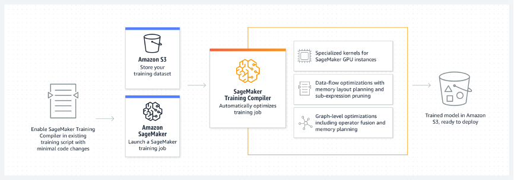
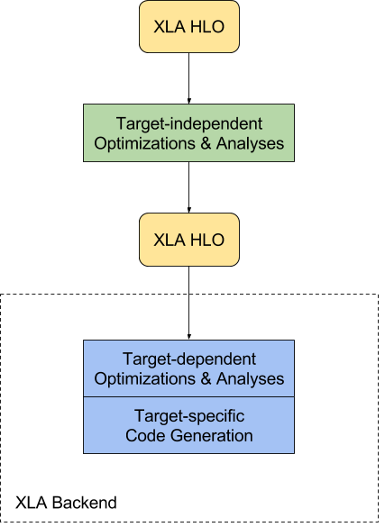
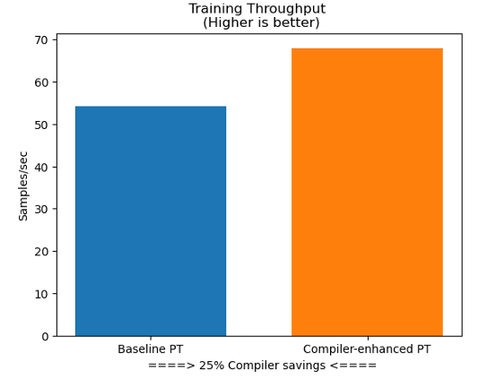
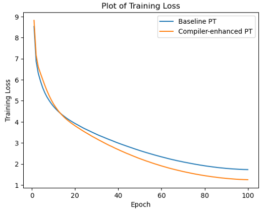

 
LLMs models are essentially composed of complex multi-layer neural networks with over billions of parameters, and may require thousands of GPU hours or more to complete training. Therefore, optimizing such models on the training infrastructure requires extensive knowledge of deep learning and systems engineering. While open-source implementations of some compilers can optimize the training process, they may lack the flexibility to integrate with certain hardware, such as GPU instances. The Amazon SageMaker Training Compiler can transform deep learning models from their high-level language expressions into hardware-optimized instructions, thereby speeding up training and helping reduce overall billing time.
 
In this hands-on demonstration, we'll experience together how to set up an environment in Amazon SageMaker, including permission settings, configuration settings, etc. Next, we'll experience how to train a GPT-2 model on an SST2 dataset using the Amazon SageMaker Training Compiler. The Amazon SageMaker Training Compiler is integrated into Amazon's deep learning containers (DLC), which use these containers to compile and optimize training jobs on GPU instances with minimal code changes.


## 1.	Amazon SageMaker Training Compiler Overview

The Amazon SageMaker Training Compiler is an optimization feature of SageMaker that can help reduce training time on GPU instances, and the compiler accelerates the training process by using GPU instances more efficiently. Amazon SageMaker Training Compiler is offered free of charge in SageMaker and helps reduce overall billing time by speeding up training.

The SageMaker training compiler is integrated into the AWS deep learning container (DLC). Using the AWS DLC that supports the SageMaker training compiler, you can compile and optimize training jobs on GPU instances with minimal code changes.



For more information, see the Amazon SageMaker Training Compiler section in the [Developer Guide](https://docs.aws.amazon.com/sagemaker/latest/dg/training-compiler.html?sc_channel=el&sc_campaign=datamlwave&sc_geo=mult&sc_country=mult&sc_outcome=acq&sc_content=llm-compiler-optimization-gpt2).


## 2.	Prerequisites and Dataset

In this experiment, you'll train a GPT-2 model on the SST2 dataset with Amazon SageMaker Training Compiler using Hugging Face's transformers and dataset library. Note that this notebook will download the SST2 data set from the website (https://huggingface.co/datasets/sst2), where you can view the dataset information and terms. 

First of all, we need to set up the environment through some pre-requisites, such as permissions, configuration, etc.

**Special instructions** 

1) You can run this code on Amazon SageMaker Studio, Amazon SageMaker notebook instance (the way we're using it now), or on your local computer where the AWS CLI is set up. If you use Amazon SageMaker Studio or Amazon SageMaker notebook instance, make sure to select one of the PyTorch-based kernels, namely `PyTorch 3` or `conda_pytorch_p38` respectively.

2) This notebook uses **2 x ml.g4dn.12xlarge** instances with multiple GPUs. If you don't have enough quotas, please refer to the ["Supported Regions and Quotas"](https://docs.aws.amazon.com/sagemaker/latest/dg/regions-quotas.html#service-limit-increase-request-procedure?sc_channel=el&sc_campaign=datamlwave&sc_geo=mult&sc_country=mult&sc_outcome=acq&sc_content=llm-compiler-optimization-gpt2) to request an increase in service quotas for Amazon SageMaker resources.


## 3.	Environment Settings
First of all, you'll need to install the SageMaker Python SDK. This experiment requires installing the SageMaker Python SDK v2.108.0, as shown in the following code:

```
!pip install "sagemaker>=2.108.0" botocore boto3 awscli pandas numpy –upgrade
import botocore
import boto3
import sagemaker
import pandas as pd

print(f"sagemaker: {sagemaker.__version__}")
print(f"boto3: {boto3.__version__}")
print(f"botocore: {botocore.__version__}")
```
Secondly, you need to set up the operating environment for Amazon SageMaker:

```
import sagemaker

sess = sagemaker.Session()

# SageMaker session bucket -> used for uploading data, models and logs
# SageMaker will automatically create this bucket if it does not exist
sagemaker_session_bucket = None
if sagemaker_session_bucket is None and sess is not None:
    # set to default bucket if a bucket name is not given
    sagemaker_session_bucket = sess.default_bucket()

role = sagemaker.get_execution_role()
sess = sagemaker.Session(default_bucket=sagemaker_session_bucket)

print(f"sagemaker role arn: {role}")
print(f"sagemaker bucket: {sess.default_bucket()}")
print(f"sagemaker session region: {sess.boto_region_name}")
```

## 4.	Loading the Dataset

If you are concerned about when the dataset is loaded, you can find the value sst2 of `dataset_config_name` in the notebook code; if you compare it to the `entry_point` file of the HuggingFace estimator (`run_clm.py` is defined in this example), the code in it is written like this:


The explanation in the code comments is very clear. They are listed below for your reference:
“Get the datasets: you can either provide your own CSV/JSON/TXT training and evaluation files (see below) or just provide the name of one of the public datasets available on the hub at https://huggingface.co/datasets/ (the dataset will be downloaded automatically from the datasets Hub) …”

## 5.	Training Jobs Setting

To create an Amazon SageMaker training job, we use an **estimator**. We'll be using the HuggingFace estimator in the Amazon SageMaker Training Compiler. With an estimator, you can use entry_point to define the training script that Amazon SageMaker should execute, the instance type (instance_type) participating in the training, the hyperparameters to be delivered, etc.

When the Amazon SageMaker training job starts, it's responsible for launching and managing all required machine learning instances, selecting the corresponding HuggingFace DLC(Deep learning container), uploading the training script, downloading the data from the S3 bucket (sagemaker_session_bucket) where the specified data set is located to the **/opt/ml/input/data** container.

First, we'll define some basic parameters common to all estimators (for experimental use, it's recommended to turn off the Amazon SageMaker Debugger performance analysis and debugging tools to avoid additional overhead):

```
estimator_args = dict(
    source_dir="scripts",
    entry_point="run_clm.py",
    instance_type="ml.g4dn.12xlarge",
    instance_count=1,
    role=role,
    py_version="py38",
    volume_size=100,
    disable_profiler=True,  # Disabling SageMaker Profiler to avoid overheads during benchmarking
    debugger_hook_config=False,  # Disabling SageMaker Debugger to avoid overheads during benchmarking
    base_job_name="trcomp-pt-example",
    metric_definitions=[
        {"Name": "summary_train_runtime", "Regex": "'train_runtime': ([0-9.]*)"},
        {
            "Name": "summary_train_samples_per_second",
            "Regex": "'train_samples_per_second': ([0-9.]*)",
        },
        {"Name": "summary_train_steps_per_second", "Regex": "'train_steps_per_second': ([0-9.]*)"},
        {"Name": "summary_train_loss", "Regex": "'train_loss': ([0-9.]*)"},
        {"Name": "epoch", "Regex": "'epoch': ([0-9.]*)"},
        {"Name": "train_loss", "Regex": "'loss': ([0-9.]*)"},
        {"Name": "learning_rate", "Regex": "'learning_rate': ([0-9.]*)"},
    ],
)

# Since ml.g4dn.12xlarge instance has 4 GPUs, we set num_gpus_per_instance to 4
num_gpus_per_instance = 4
```

Next, define some parameters to pass to the training script.

```
hyperparameters = {
    "model_type": "gpt2",
    "tokenizer_name": "gpt2",
    "dataset_name": "glue",
    "dataset_config_name": "sst2",
    "do_train": True,
    "do_eval": False,
    "fp16": True,
    "per_device_eval_batch_size": 8,
    "num_train_epochs": 100,
    "block_size": 512,
    "overwrite_output_dir": True,
    "save_strategy": "no",
    "evaluation_strategy": "no",
    "logging_strategy": "epoch",
    "output_dir": "/opt/ml/model",
    "dataloader_drop_last": True,
}
```

## 6.	Model Training Using Native PyTorch Code

The following `per_device_train_batch_size` defines the maximum number of batches that can fit into the **ml.g4dn.12xlarge** instance memory. If you change the model version, instance type, sequence length, or other parameters that affect memory consumption, you'll need to find the corresponding maximum batch size.

Also, notice that this example code sets the way PyTorch data parallelization is set:

```
distribution={"pytorchddp": {"enabled": True}}
```

Setting up the PyTorch data parallel mechanism on Amazon SageMaker is easy. You can learn more on the [“Running PyTorch Lightning and Native PyTorch DDP on Amazon SageMaker Training”](https://aws.amazon.com/cn/blogs/machine-learning/run-pytorch-lightning-and-native-pytorch-ddp-on-amazon-sagemaker-training-featuring-amazon-search/?sc_channel=el&sc_campaign=datamlwave&sc_geo=mult&sc_country=mult&sc_outcome=acq&sc_content=llm-compiler-optimization-gpt2) blog.

Also, this example uses the HuggingFace training script `run_clm.py`, which you can find in the scripts folder.

```
from sagemaker.pytorch import PyTorch

# The original learning rate was set for a batch of 32. Here we scale learning rate linearly with an adjusted batch size
per_device_train_batch_size = 10
global_batch_size = (
    per_device_train_batch_size * num_gpus_per_instance * estimator_args["instance_count"]
)
learning_rate = float("5e-5") / 32 * global_batch_size

# Configure the training job
native_estimator = PyTorch(
    framework_version="1.11",
    hyperparameters=dict(
        **hyperparameters,
        **{
            "per_device_train_batch_size": per_device_train_batch_size,
            "learning_rate": learning_rate,
        },
    ),
    distribution={"pytorchddp": {"enabled": True}},
    **estimator_args,
)

# Start the training job
native_estimator.fit(wait=False)

native_estimator.latest_training_job.name
```

## 7.	Model Training Using Compile-optimized PyTorch Code

The **Amazon SageMaker Training Compiler** can perform some optimization to reduce training time on GPU instances. The compiler optimizes DL models to accelerate training by using SageMaker machine learning (ML) GPU instances more efficiently. Amazon SageMaker Training Compiler allows you to use SageMaker at no additional cost, which helps reduce overall billing time by speeding up training.

The following code shows how to use the distribution mechanism **pytorchxla**, a distributed training method that recognizes compilers.

**XLA (Accelerated Linear Algebra)** is a compiler-based linear algebra execution engine. The input language to XLA is called "HLO IR", or just HLO (High Level Operations). XLA takes graphs ("computations") defined in HLO and compiles them into machine instructions for various architectures. The following diagram shows the compilation process in XLA:



source: [XLA Architecture](https://www.tensorflow.org/xla/architecture)

**PyTorch/XLA** is a Python package built on top of the [XLA deep learning compiler](https://www.tensorflow.org/xla), a domain-specific compiler for linear algebra that can accelerate TensorFlow and PyTorch models. The PyTorch/XLA package is used for connecting the PyTorch framework with CPUs, GPUs, TPUs and [AWS Trainium](https://repost.aws/articles/ARHyFz-RpBR1OiGekJzkg2aw/train-large-language-model-using-hugging-face-and-aws-trainium).

Compiling with the Amazon SageMaker Training Compiler changes the model's memory usage. Most commonly, this is expressed as a decrease in memory utilization, followed by an increase in the maximum batch size that can accommodate the GPU. Note that to change the batch size, the learning rate must be adjusted appropriately. The following code shows how to linearly adjust the learning rate as the batch size increases.

```
from sagemaker.huggingface import HuggingFace, TrainingCompilerConfig

new_per_device_train_batch_size = 20
global_batch_size = (
    new_per_device_train_batch_size * num_gpus_per_instance * estimator_args["instance_count"]
)
learning_rate = float("5e-5") / 32 * global_batch_size

# Configure the training job
optimized_estimator = HuggingFace(
    compiler_config=TrainingCompilerConfig(),
    transformers_version="4.21",
    pytorch_version="1.11",
    hyperparameters=dict(
        **hyperparameters,
        **{
            "per_device_train_batch_size": new_per_device_train_batch_size,
            "learning_rate": learning_rate,
        },
    ),
    distribution={"pytorchxla": {"enabled": True}},
    **estimator_args,
)

# Start the training job
optimized_estimator.fit(wait=False)

optimized_estimator.latest_training_job.name
```

## 8.	Comparative analysis of experimental results

Let's compare the various training metrics with and without the Amazon SageMaker Training Compiler. These include: training data throughput comparison, training loss convergence comparison, training time comparison, training cost comparison, etc.




Training data throughput: without Training Compiler vs. with Training Compiler



Training loss convergence: without Training Compiler vs. with Training Compiler


Training time: without Training Compiler vs. with Training Compiler


Training cost (billable seconds): without Training Compiler vs. with Training Compiler


## 9.	References

1/ [Amazon SageMaker Training Compiler reference document](https://docs.aws.amazon.com/sagemaker/latest/dg/training-compiler.html?sc_channel=el&sc_campaign=datamlwave&sc_geo=mult&sc_country=mult&sc_outcome=acq&sc_content=llm-compiler-optimization-gpt2)

2/ [SageMaker Training Compiler Best Practices and Considerations](https://docs.aws.amazon.com/sagemaker/latest/dg/training-compiler-tips-pitfalls.html?sc_channel=el&sc_campaign=datamlwave&sc_geo=mult&sc_country=mult&sc_outcome=acq&sc_content=llm-compiler-optimization-gpt2)

3/ [PyTorch on XLA Devices](https://pytorch.org/xla/release/2.0/index.html#)

4/ [Understanding LazyTensor System Performance with PyTorch/XLA on Cloud TPU](https://pytorch.org/blog/understanding-lazytensor-system-performance-with-pytorch-xla-on-cloud-tpu/)

5/ [Train large language model using Hugging Face and AWS Trainium](https://repost.aws/articles/ARHyFz-RpBR1OiGekJzkg2aw/train-large-language-model-using-hugging-face-and-aws-trainium)

6/ [Code for this demonstration](https://github.com/build-on-aws/compilation-optimization-of-sagemaker)


## Conclusion

As can be seen from the comparison of experimental data from multiple dimensions, the **Amazon SageMaker Training Compiler** can increase training throughput, which means the total training time will be reduced. Also, the reduction in total training time reduces the number of seconds Amazon SageMaker charges, thereby helping developers and customers save on the costs required for machine learning training.

If you want to learn more about training open source LLMs, check out [SageMaker Training Compiler Best Practices and Considerations](https://docs.aws.amazon.com/sagemaker/latest/dg/training-compiler-tips-pitfalls.html?sc_channel=el&sc_campaign=datamlwave&sc_geo=mult&sc_country=mult&sc_outcome=acq&sc_content=llm-compiler-optimization-gpt2). Or, for more information about Amazon SageMaker Training Compiler, read [Amazon SageMaker Training Compiler reference document](https://docs.aws.amazon.com/sagemaker/latest/dg/training-compiler.html?sc_channel=el&sc_campaign=datamlwave&sc_geo=mult&sc_country=mult&sc_outcome=acq&sc_content=llm-compiler-optimization-gpt2).

Also, recently we've seen that some advanced open source LLMs are still hot topics of discussion, such as the Falcon-40B model, the Llama-v2-70B model, etc. We'll continue to share how to deploy and fine-tune these open source LLMs with Amazon SageMaker in our upcoming blogs. Please stay tuned.  


## About the Author

### Haowen Huang 

Haowen is a Senior Developer Advocate at AWS based in Hong Kong. He has over 20 years of experience in the cloud computing, internet and telecom industries. He focuses on the promotion and application of AI, machine learning and data science.  

### Elizabeth Fuentes Leone 

Elizabeth is a Developer Advocate at AWS based in Santiago. Shas has extensive experience in data analytics and machine learning. She loves helping developers learn while building.
