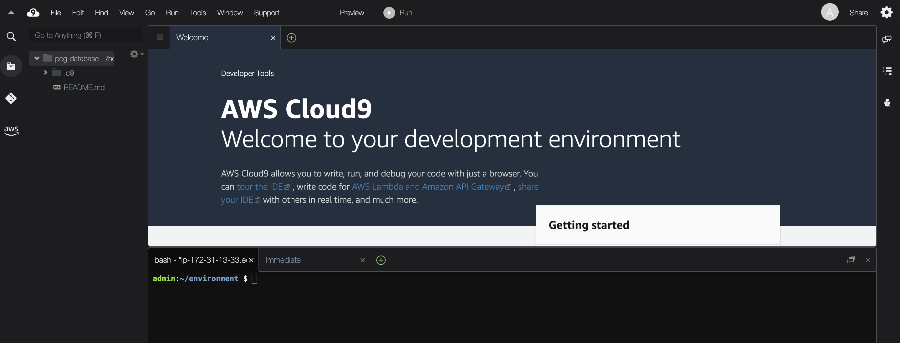
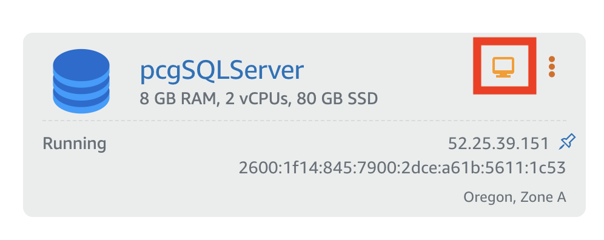
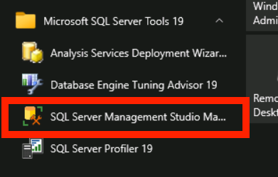
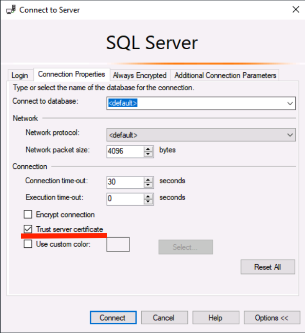
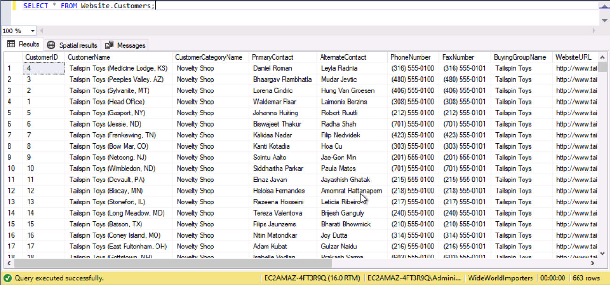
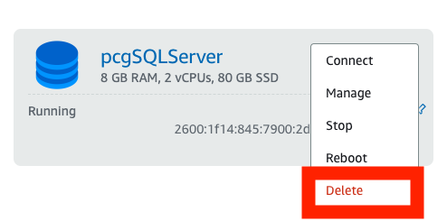
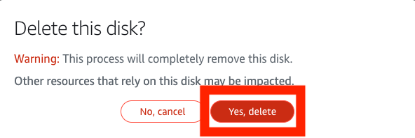

For an IT administrator, restoring a database from a backup isn't unusual. Migrating an on-premise database to the cloud follows a similar process. However, instead of using and automate using scripts. In this tutorial, we'll walk through how to migrate a SQL Server database to the cloud, using the command line to instantiate and configure the database server, rather than a console application.

## Sections
| Info                |                                   |
| ------------------- | -------------------------------------- |
| ✅ AWS Level        | 200 - Intermediate                          |
| ⏱ Time to complete  | 45 minutes                             |
| 💰 Cost to complete | Free when using the AWS Free Tier or USD 1.01      |
|  🧩 Prerequisites | - An AWS account: If you don't have an account, follow the [Setting Up Your AWS Environment](https://aws.amazon.com/getting-started/guides/setup-environment/) tutorial for a quick overview. For a quick overview for creating account follow [Create Your AWS Account](https://aws.amazon.com/getting-started/guides/setup-environment/module-one/).<br>- AWS credentials: Follow the instructions in [Access Your Security Credentials](https://aws.amazon.com/blogs/security/how-to-find-update-access-keys-password-mfa-aws-management-console/#:~:text=Access%20your%20security%20credentials) to get your AWS credentials <br>- A git client: Follow the instructions to [Install Git](https://github.com/git-guides/install-git) for your operating system. |
| 💻 Code Sample         | Code sample used in tutorial on [GitHub](<link if you have a code sample associated with the post, otherwise delete this line>)                             |
| 📢 Feedback            | <a href="https://pulse.buildon.aws/survey/DEM0H5VW" target="_blank">Any feedback, issues, or just a</a> 👍 / 👎 ?    |
| ⏰ Last Updated     | 2023-08-09                             |

| ToC |
|-----|

## What You Will Learn

- How to create a browser-based environment for working with cloud resources
- How to create storage and attach it to a database server
- How to deploy and configure SQL Server with a Lightsail blueprint
- How to restore a MS SQL database on a Windows Server VPS

## Module 1: Setting Up a Working Environment

In this tutorial, you will use the command line. There are advantages to using the command line. First, the command line offers a larger set of options for creating services. Second, commands can be chained together so that one command returns an output that can be used by another. Third, commands can be combined into a script that can be reused.

Whether it’s on-premise or in the cloud, deployments and configuration are frequently done on a local computer. However, a case can be made for using an online environment. Browser-based terminals or integrated development environments (IDEs) offer a consistent environment customized to a specific tasks. They can be configured with custom tool chains that reduce dependency conflicts. In addition, they can be accessed from any browser and maintain state and history from the last time they were used. AWS offers [Cloudshell](https://aws.amazon.com/cloudshell/), a browser-based terminal, and [Cloud9](https://aws.amazon.com/cloud9/), an in-browser IDE.

You will be using the AWS CLI and writing scripts. Cloud9 is ideal because you can write and store commands and scripts in the IDE and execute them in the included terminal. To start with Cloud9, use the AWS console Search bar to find the Cloud9 service.

### Step 1: Create a Cloud9 Environment


Choose **Create Environment**.


In the **Details** panel of the **Create Environment** page, name the environment. You can also add an optional **Description** to specify how it's used and to differentiate it from other environments.


Accept the default values for **New EC2 Instance** and **Networking** panels. Choose **Create**. When the environment is created, choose **Open** to start the environment.


Your Cloud9 environment is ready.



### Step 2: Configure the Environment with Tools

This tutorial uses the AWS CLI and the Lightsail plugin. The current version of Cloud9 includes the 1.x version of the CLI, but the Lightsail plugin requires the 2.x version of the AWS CLI. You will have to upgrade to CLI 2.x version and install the Lightsail plugin. 

In the Cloud9 terminal, download and [install the version 2.x](https://docs.aws.amazon.com/cli/latest/userguide/getting-started-install.html?sc_channel=el&sc_campaign=tutorial&sc_content=itpros&sc_geo=mult&sc_country=mult&sc_outcome=pa&sc_publisher=amazon_media&sc_category=lightsail&sc_medium=link) of the CLI.

```bash
curl "https://awscli.amazonaws.com/awscli-exe-linux-x86_64.zip" -o "awscliv2.zip"
unzip awscliv2.zip
sudo ./aws/install
```

Next, [install the AWS Lightsail plugin](https://lightsail.aws.amazon.com/ls/docs/en_us/articles/amazon-lightsail-install-software#install-lightsailctl-on-linux?sc_channel=el&sc_campaign=tutorial&sc_content=itpros&sc_geo=mult&sc_country=mult&sc_outcome=pa&sc_publisher=amazon_media&sc_category=lightsail&sc_medium=link).

```bash
sudo curl "https://s3.us-west-2.amazonaws.com/lightsailctl/latest/linux-amd64/lightsailctl" -o "/usr/local/bin/lightsailctl"
sudo chmod +x /usr/local/bin/lightsailctl
```

Check the installation.

```bash
aws lightsail —version
aws-cli/2.11.20 Python/3.11.3 Linux/4.14.314-237.533.amzn2.x86_64 exe/x86_64.amzn.2 prompt/off
```

Your Cloud9 environment is ready.

> Tip: Cloud9 is a full-featured IDE and you can save command snippets and scripts in a code repository like [Github](https://github.com/) or [Gitlab](https://about.gitlab.com/). Cloud9 includes [Git Panel](https://docs.aws.amazon.com/cloud9/latest/user-guide/using-gitpanel.html) for managing repositories. An advantage of using a code repository is that it is available anywhere and you can use it to manage snippets and scripts for reuse.

## Module 2: Create a SQL Server Instance from a Lightsail Blueprint

AWS Lightsail includes templates for instantiating VPS with a popular software package. You will instantiate a Windows Server with SQL Server installed with Lightsail. 

In the Cloud9 terminal, use the AWS Lightsail CLI to create a VPS with SQL Server using a blueprint. You can find blueprints with the `aws lightsail get-blueprints` command. The `get-blueprints` command lists all the blueprints available; you can find a specific blueprint by piping the output of the command to the unix [grep](https://www.gnu.org/software/grep/manual/grep.html) utility.

```bash
aws lightsail get-blueprints | grep sql
"blueprintId": "windows_server_2022_sql_2022_express",
"group": "windows_2022_sql_exp_2022",
"blueprintId": "windows_server_2022_sql_2019_express",
"group": "windows_2022_sql_exp_2019",
"blueprintId": "windows_server_2016_sql_2016_express",
"group": "windows_2016_sql_exp",
```

There are several different versions of SQL Server Express available. Use the latest SQL Server version, `windows_server_2022_sql_2022_express`. Create a VPS with with this blueprint. In addition, the `--user-data` parameter creates a directory to store the back SQL Server backup file. The `--bundle-id` sets the size of the server.

```bash
aws lightsail create-instances --instance-names pcgSQLServer \
--availability-zone us-west-2a \
--blueprint-id windows_server_2022_sql_2022_express \
--user-data "mkdir c:\backup" \
--bundle-id large_win_1_0
```

Note that this SQL Server instance is not a managed Relational Database Service (RDS). You are responsible for any system or security updates and backing up data files.

## Module 3: Create Storage for Data and Log Files

Databases typically store data files and logs in separate drives attached to the server. With Lightsail, you can create both object storage and block storage. Block storage is similar to a physical drive and can be formatted with a file system and attached to a server. In this section, you will create block storage. In a following section, you will attach it to a VPS and format it with the NTFS file system.

### Step 1: Create Block Storage

In the Cloud9 terminal, use the AWS CLI to instantiate storage with the `aws lightsail create-disk` command. Name the disk and set the availability zone.

```bash
aws lightsail create-disk \
--disk-name sqlserver-data-and-logs \
--availability-zone us-west-2a \
--size-in-gb 32
```

If successful, Lightsail returns a status message.

```json
{
    "operations": [
        {
            "id": "14d4be4a-955f-45d0-81f7-7a5440195c54",
            "resourceName": "sqlserver-data-and-logs",
            "resourceType": "Disk",
            "createdAt": "2023-08-02T01:52:51.867000+00:00",
            "location": {
                "availabilityZone": "us-west-2a",
                "regionName": "us-west-2"
            },
            "isTerminal": false,
            "operationType": "CreateDisk",
            "status": "Started",
            "statusChangedAt": "2023-08-02T01:52:52.128000+00:00"
        }
    ]
}
```

### Step 2: Attach Block Storage to the Database Server

Attach the block storage to the database server. The server will recognize it as a drive.

```bash
aws lightsail attach-disk \
--disk-name sqlserver-data-and-logs \
--disk-path /dev/xvdf \
--instance-name pcgSQLServer
```

When the disk is attached, it returns a JSON message to confirm the operation.

```json
{
    "operations": [
        ... ,
        {
            "id": "e92ee8ac-45cf-4bae-a16b-ac55fea264c7",
            "resourceName": "pcgSQLServer",
            "resourceType": "Instance",
            "createdAt": "2023-08-02T01:54:18.196000+00:00",
            "location": {
                "availabilityZone": "us-west-2a",
                "regionName": "us-west-2"
            },
            "isTerminal": false,
            "operationDetails": "sqlserver-data-and-logs",
            "operationType": "AttachDisk",
            "status": "Started",
            "statusChangedAt": "2023-08-02T01:54:18.196000+00:00"
        }
    ]
}
```

Although the storage is attached to the server, it is an unformatted disk. You will format it with a Windows Server.

## Module 4: Configure the SQL Server VPS

The VPS is a Windows Server. Use the RDP button in the Lightsail console. Choose the terminal icon in the pcgSQLServer panel.

> Note: The RDP button may take 5-to-7 minutes before it becomes active and you can connect to the server.



We need to format the disk to store data and log files. Here are the steps to make the disk usable by a Windows Server.

### Step 1: Find the Disk Number of the Unformatted-But-Attached Disk.

In the RDP window, open a Powershell window and use the `Get-Disk` commandlet to find the unformatted disk, which is attached but offline.

```powershell
get-disk | Where-Object {$_.OperationalStatus -eq 'Offline' } 

Number   Friendly Name  Serial Number        HealthStatus OperationalStatus Total Size Partition Style
------   -------------  -------------        ------------ ----------------- ---------- ----------
1        AWS PVDISK     vol0318528261ed8ca45 Healthy      Offline           32 GB      RAW
```

Once you know the Disk Number, initialize and partition the disk with the `New-Partition` commandlet. The commandlet also assigns a drive letter and use the entire disk.

```powershell
Initialize-Disk -Number 1
New-Partition –DiskNumber 1 -AssignDriveLetter –UseMaximumSize
Format-Volume -DriveLetter D -FileSystem NTFS -NewFileSystemLabel Data
```
### Step 2: Download the Wide World Importers Sample Database

Microsoft distributes an [example SQL Server backup file](https://github.com/Microsoft/sql-server-samples/releases/tag/wide-world-importers-v1.0). Use this file to restore a backup. When you instantiated the SQL Server VPS, a backup directory was created. Download the Wide World Importers backup file to that directory.

```powershell
$source = "https://github.com/Microsoft/sql-server-samples/releases/download/wide-world-importers-v1.0/WideWorldImporters-Full.bak"
$dest = "C:\backup\WideWorldImporters-Full.bak"
Invoke-WebRequest -Uri $source -OutFile $dest
```

### Step 3: Create Directories for Data Files and Logs

The data files and logs for the Wide World Importers database are stored in a separate drive. Create the directories in the attached drive.

```powershell
mkdir D:\SQL_DATA
mkdir D:\SQL_LOGS
mkdir D:\SQL_LOGS\SQL2022
```

## Module 5: Restore the Database from the Backup File

To restore the database from Powershell, use [Transact-SQL (T-SQL)](https://learn.microsoft.com/en-us/sql/t-sql/language-reference?view=sql-server-ver16), a Microsoft version of SQL. The cmdsql utility lets you use T-SQL commands against SQL Server. Save the following script to a file in the C:\backup directory and name it `restore_database.sql`, use notepad or an editor of your choice.

```tsql
USE [master]
GO
RESTORE DATABASE [WideWorldImporters] FROM DISK = N'C:\backup\WideWorldImporters-Full.bak'
WITH FILE = 1,
MOVE N'WWI_Primary' TO N'D:\SQL_Data\WideWorldImporters.mdf',
MOVE N'WWI_UserData' TO N'D:\SQL_Data\WideWorldImporters_UserData.ndf',
MOVE N'WWI_Log' TO N'D:\SQL_Logs\SQL2022\WideWorldImporters.ldf',
MOVE N'WWI_InMemory_Data_1' TO N'D:\SQL_Data\WideWorldImporters_InMemory_Data_1',
NOUNLOAD,
STATS = 5
GO
```

Run the script using sqlcmd.

```powershell
sqlcmd -i C:\backup\restore_database.sql
```

If the restore is successful, you will see many status messages ending with this message:

```powershell
100 percent processed.
RESTORE DATABASE successfully processed 58496 pages in 4.218 seconds (108.343 MB/sec).
```

You can use [SQL Server Management Studio](https://learn.microsoft.com/en-us/sql/ssms/sql-server-management-studio-ssms?view=sql-server-ver16) to verify the restore was succesful and run a SQL query. 

Open SQL Server Management Studio from the Windows Start button.



When SQL Server Management Studio is open, choose **File > Connect Object Explorer**.


The **Connect to Server** window will open. Select the server name by choosing **Browse for more**, then the server name under **Database Engine**.


We will use **Windows Authentication** which requires choosing the **Options>>** button and selecting **Trust Server Certificate**. Then choose **Connect**.



With the database connected to SQL Server Management Studio, you can query the Wide World Importers database by choosing **New Query**.


In the query window, type in the SQL query. This query lists all the rows in the `Website.Customers` view.

```sql
SELECT * FROM Website.Customers;
```

To run the query, choose **Execute** in the menu.


The **Results** pane displays the rows from the view.



Congrats! You’ve migrated a SQL Server database to the cloud.

## Module 5: Clean up

Delete the VPS, the attached disk, and the Cloud9 environment to prevent further charges. 

### Step 1: Delete the VPS

In the Lightsail console, choose **Instances**, then select the three dots in pcgSQLServer. Choose **Delete**.



Choose **Yes, delete**.


### Step 2: Delete the Disk

In the Lightsail console, choose **Storage**, select the three dots in sqlserver-data-and-logs. Choose **Delete**.


Choose **Yes, delete**.



### Step 3: Delete the Cloud9 Environment

In the Cloud9 console, choose `pcg-database` and select **Delete**.


## What Did You Accomplish?

You deployed a SQL Server in the cloud and restored a database. However, the true takeaway is that you did this in a terminal using the AWS CLI and Lightsail plugin. You accomplished the task without using the console. As an additional challenge, try to complete this tutorial by writing a script to deploy the SQL Server and configure storage and a Powershell script to restore the database. Learning how to use the AWS CLI is the first step to building reproducible and testable infrastructure. The Practical Cloud Guide will use this approach to building and maintaining infrastructure. 

If you want to do a deep dive into SQL Server in the cloud, checkout the [Amazon RDS for SQL Server Workshop](https://catalog.us-east-1.prod.workshops.aws/workshops/897acbd7-8f2e-46ed-8dcd-c97872d5b3ce/en-US) to get hands-on with SQL Server at AWS.

## What's Next?

Instantiating SQL Server from a Lightsail blueprint is not complicated. However, you are responsible for maintaining that instance, which includes updates and backups. An important distinction between the cloud and on-premise data centers is the option to have a fully managed solution. In a managed solution, the cloud provider is responsible for maintaining the resource. In the following tutorial, you will deploy a relational database to scale a web application.

