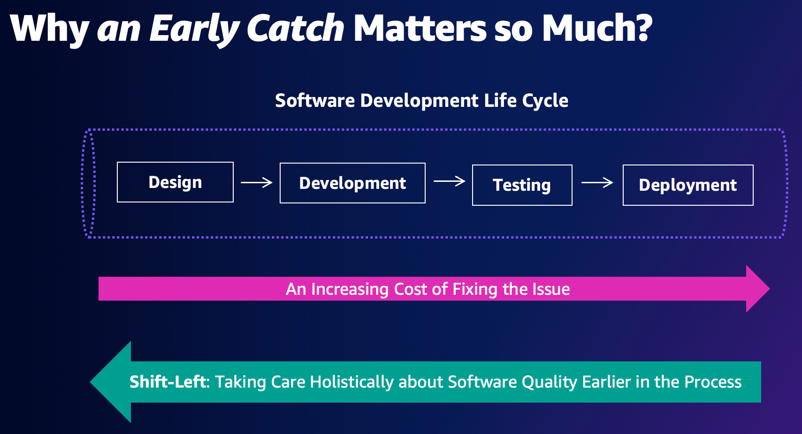
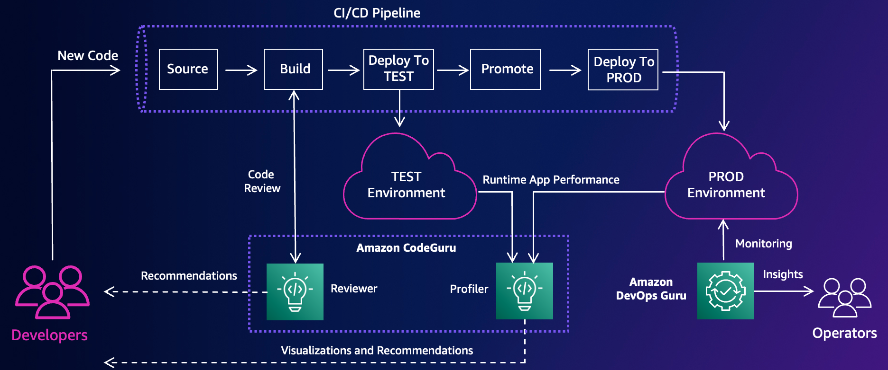
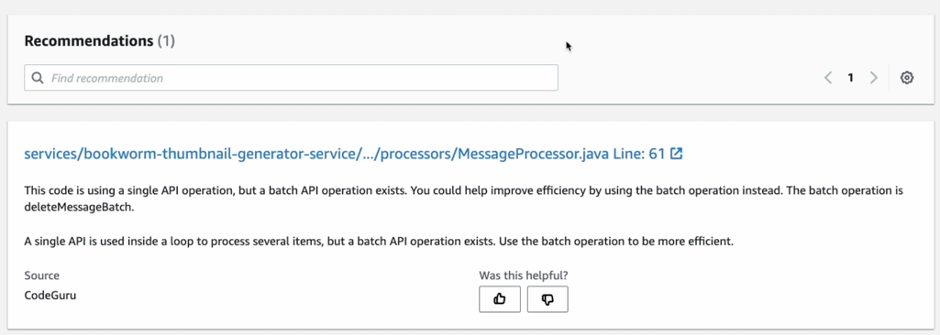

Starting from the 24th of November 2021, people that maintained JVM-based applications were terrified. Rumors, that there is an exploit for a very popular logging library called _[Apache Log4j](https://logging.apache.org/log4j/2.x/)_ turned out to be true. [Log4shell](https://en.wikipedia.org/wiki/Log4Shell) was so severe because it could be easily exploited (even by _script kiddies_ ) and allowed for _remote code execution_.

It was not the first time when such an incident appeared in the news headlines, but recovering from that was pretty usual – many companies spent significant time on patching or remediating the issue. The popularity of the library definitely did not help in this case, as not only regular back-end implementations were affected, but many other workloads – like databases, messaging servers, and other critical infrastructure components.

Besides, the usual recovery time, our industry asked once again: what we can do to protect ourselves from such an impact in the future?

## Why should I shift to the left though?

We should start from a very simple fact: **we cannot treat security as an afterthought when developing IT systems**. This is the exact reason why in such a situation impact is so severe. In other words: we should tackle this topic as early as possible in the software development life cycle (SDLC).

There is one trend in our industry that gains popularity and tackled this challenge. It is called _shift-left_ and refers to the transitioning tough subjects that are tackled later in the software development process, to the left-hand side – which means we deal with topics’ complexity earlier.



Why is that so important? Because the earlier we catch potential issues in the development process, the cheaper and less problematic fix eventually will be. That is true for regular defects and software quality, but also for security incidents as well.

An immediate follow-up question is: would it be possible to catch everything at the beginning? The answer is more complicated, but it boils down to how much investment we want to do in relation to the risk with which we’re comfortable. The more will we invest, the better security state we achieve – but a question about cost-effectiveness remains open and varies case by case.

You may ask also: how do we know what threats are the most problematic? That’s a great question, and that’s why approaching such topics from a [threat modeling](https://owasp.org/www-community/Threat_Modeling) perspective. It requires upfront investment (especially taking into account the time spent on the process), but gives the biggest return in the long run.

So, we know that we can move security topics earlier in the *SDLC* process, we have done threat modeling, and we have performed risk analysis that provided us answers about priorities. Does that mean we are safe and in better shape than previously?

More experienced and tenured people than me already told us that [there are no silver bullets](https://ieeexplore.ieee.org/document/1663532), and the security topic is no different. At least we can strive for the best, but relying on our willpower is naïve, to put it mildly. We need something more reliable, and everything boils down to **automation** and **code review** processes.


The more stuff we automate during the software development phase the more we are certain that the outcome will be predictable. This is an extremely important trait for long-term maintainability, but it enables us to do more things. There are available battle-tested best practices that can provide a nice gain right after we introduce them – and we have tools and processes that can do that reliably.

## How to reliably move security to the left?

Speaking about more stuff we can do: we should leverage tools that will give us insights during the code review phase and point out obvious and non-obvious security issues discovered in our implementation.

This is a well-known technique called the _SAST_ approach, which stands for _Static Application Security Testing_. As a consequence of that, there are valuable tools available in that space – open-source, but also paid ones – including the most popular being delivered as _SaaS_ ( _Software as a Service_ ) tools. That’s one way to tackle the challenge. Another one is to use _DAST_ and treat your software as a black box – in this technique, we rely on _Dynamic Application Security Testing_ process and supporting tools.

Both approaches are relevant, and they are complementing each other. However, there is one additional element, you have to be aware of: _doing the right thing on a security path has to be intuitive and easy_. Convenience is one of the elements that is often overlooked when enforcing security best practices. I think we can all agree that _peopleware_ (aka _humans_ ) are always the weakest link in the chain when it comes to security, and that’s not without a reason – we tend to work around complicated and cumbersome processes.

## Let’s talk about the tools, finally!

Assuming that your workloads already are, or they are aspiring to become considered as cloud-native (aware of the benefits of cloud computing environments) you already have the most of the leg-work done.

In terms of security, cloud providers are referring to the [shared responsibility model](https://aws.amazon.com/compliance/shared-responsibility-model/), where provider takes care about the security **of the cloud** and the customer takes care of security **in the cloud**. That ensures that providers do not leave customers on their own, at the same time – on the level of implementation details – we need a bit more precise recommendation. In that case, AWS helps with this as well by providing actionable advice in the form of [AWS Well-Architected Framework](https://docs.aws.amazon.com/wellarchitected/latest/security-pillar/welcome.html), in particular – with its _Security_ pillar. Thanks to that, you can leverage the best practices and knowledge of multiple teams that build on _AWS_. It’s a great way to stand on the shoulder of giants and learn from someone else’s learnings.

But that’s not enough: in terms of tools that are convenient (because available as managed service inside the cloud portfolio you are already using), _AWS_ also have your back. It would be surprising that for over 200 services available in the portfolio, nothing would cover those elements – but being precise and focused on _SAST_ and _DAST_ landscape I have referred to, we have [Amazon CodeGuru](https://aws.amazon.com/codeguru/), that helps with reviewing code of applications written in *Python* and *Java*, and [Amazon DevOps Guru](https://aws.amazon.com/devops-guru/) that proactively monitors your application infrastructure and detects anomalies.



And speaking about precise examples: [Amazon CodeGuru](https://aws.amazon.com/codeguru/) scans your code and provides insights about insecure usage of _AWS API_ and _SDKs_ , proactively detects secrets and credentials hardcoded inside, and provides insights about the most popular [*OWASP*](https://owasp.org/www-project-top-ten/) security risks. I have not exhausted the list and the catalog of detected issues is available [here](https://docs.aws.amazon.com/codeguru/detector-library/).


## Talk is cheap, show me how it works!

If you would like to investigate how to use _CodeGuru_ in practice – I have prepared a _GitHub_ repository for you with the example: [aws-samples/amazon-codeguru-reviewer-github-actions-shift-left-example](https://github.com/aws-samples/amazon-codeguru-reviewer-github-actions-shift-left-example).

The example contains integration with _CI/CD pipeline_ represented in the form of _GitHub Actions_, two services implemented in _Java_ and _Python_ where we can detect potential security and performance issues with the help of the aforementioned service.

First things first, we need to establish a relationship between _GitHub Actions_ and _Amazon CodeGuru_. The old-fashioned way would be easy: you can easily do this by creating _IAM User_, narrowing down the _IAM_ permissions, and creating _Access Key_ to bridge those two worlds.

However, there is a much better way (*more secure*), as you can use _OpenID Connect_ and _IAM Roles_ which will generate short-lived tokens with the help of _AWS Secure Token Service_ ( _STS_ ) for a particular set of permissions IAM associated with that role.

To use a better path, we just need two elements for that – an _IAM Role_ and a custom _OIDC_ provider. They are created via _AWS CDK_ definitions inside the file `[infrastructure/lib/infrastructure-shared-stack.ts](https://github.com/aws-samples/amazon-codeguru-reviewer-github-actions-shift-left-example/blob/main/infrastructure/lib/infrastructure-shared-stack.ts)`:


```typescript
// GitHub OIDC provider.

const oidcProvider = new CfnOIDCProvider(this, "GitHubOIDCProvider", {
  url: "https://token.actions.githubusercontent.com",

  clientIdList: [
    "sts.amazonaws.com"
  ],

  thumbprintList: [
    // This value is taken from here:
    // https://github.blog/changelog/2022-01-13-github-actions-update-on-oidc-based-deployments-to-aws

    "6938fd4d98bab03faadb97b34396831e3780aea1"
  ]
});

// ...

// GitHub OIDC role for Amazon CodeGuru Reviewer.

const roleForAmazonCodeGuruReviewer = new Role(this, "GitHubOIDCRoleForAmazonCodeGuruReviewer", {
  roleName: "amazon-codeguru-reviewer-oidc-web-identity-role",
  assumedBy:
    new WebIdentityPrincipal(
      oidcProvider.ref,
      {
        "StringLike": {
          "token.actions.githubusercontent.com:sub": 
          	`repo:${props.organizationName}/${props.repositoryName}:*`
        },
        "StringEquals": {
          "token.actions.githubusercontent.com:aud":
          	"sts.amazonaws.com"
        }
      }
    )
});

roleForAmazonCodeGuruReviewer.addManagedPolicy(
  ManagedPolicy.fromAwsManagedPolicyName("AmazonCodeGuruReviewerFullAccess")
);

// ... and here is a place when we add more permissions, see the original file.
```

After that, you can create a _GitHub Actions_ pipeline that will have variables configured to work with your account (details are inside `[.github/workflows/codeguru-reviewer-java.yml](https://github.com/aws-samples/amazon-codeguru-reviewer-github-actions-shift-left-example/blob/main/.github/workflows/codeguru-reviewer-java.yml)` file):

```yaml
  # Configure AWS Credentials.
  - name: Configure AWS Credentials
    uses: aws-actions/configure-aws-credentials@v1
    with:
      role-to-assume: ${{ secrets.AWS_ROLE_FOR_CODEGURU_TO_ASSUME_ARN }}
      aws-region: ${{ secrets.AWS_REGION }}

    # Above you can use Access Key from your IAM User, but that's a less secure path I've mentioned above.
    # Here is the documentation:
    #
    # https://github.com/marketplace/actions/configure-aws-credentials-action-for-github-actions

  # Add CodeGuru Reviewer Action
  - name: Amazon CodeGuru Reviewer
    uses: aws-actions/codeguru-reviewer@v1.1
    with:
      # Overriding a proper workflow name for the Amazon CodeGuru CI/CD association with S3 bucket. Optional.
      name: codeguru-reviewer-${{ github.event.sender.login }}-${{ github.event.repository.name }}
      # Build artifacts directory with JAR files. Optional.
      build_path: services/bookworm-thumbnail-generator-service/build/libs
      # S3 Bucket to storing code artifacts. Required.
      s3_bucket: ${{ secrets.AWS_CODEGURU_REVIEWER_S3_BUCKET }}

  # Upload results to GitHub in order to present them in the UI.
  - name: Upload review results
    uses: github/codeql-action/upload-sarif@v1
    with:
      sarif_file: codeguru-results.sarif.json
```

Now, we can associate the desired repository, by connecting it with our _GitHub_ account inside the wizard – and schedule an initial scan:


After a few minutes you will receive the results of the initial scan inside the _Amazon CodeGuru Reviewer_ user interface:



Now, having a pipeline set up and properly configured you can inspect in the same way each commits that lands on a certain branch, opened _pull request_ ( _PR_ ), or merge. Here are the results for a new _PR_ , I have opened in the past to show this as an example:


## Is that everything?

Not at all! From the perspective of software development processes, AWS provides a lot more in terms of support for additional techniques. To give just one example – you can leverage the _[chaos engineering](https://principlesofchaos.org/)_ techniques and with the help of the [AWS Fault Injection Simulator](https://aws.amazon.com/fis/) service, reliably manage and automate experiments in your path to a more robust and secure infrastructure.

I also encourage you to dive deeper into the [provided example](https://github.com/aws-samples/amazon-codeguru-reviewer-github-actions-shift-left-example) (e.g., how it tackles multiple languages in a single repository, or a new feature in _CodeGuru_: [files exclusion and rules suppression](https://docs.aws.amazon.com/codeguru/latest/reviewer-ug/recommendation-suppression.html)). Last, but not least - if you have any questions, feel free to reach out in the comments below, my contact details on [my blog](https://awsmaniac.com/contact), or on social media: [Twitter](https://twitter.com/afronski), [Instagram](https://instagram.com/afronsky), or [LinkedIn](https://www.linkedin.com/in/afronski/).
