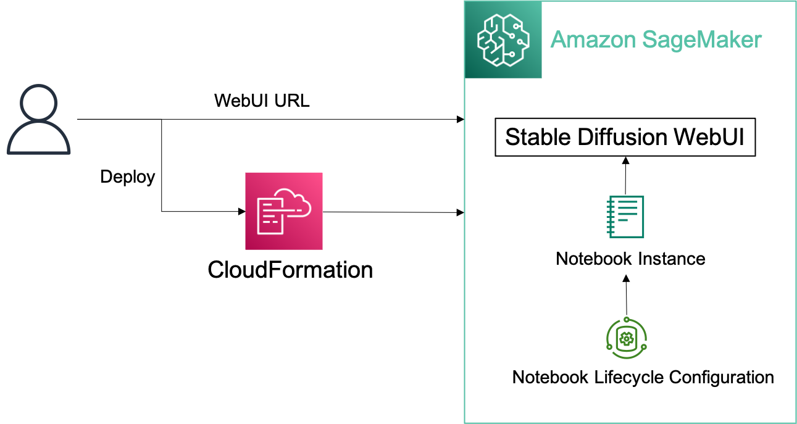
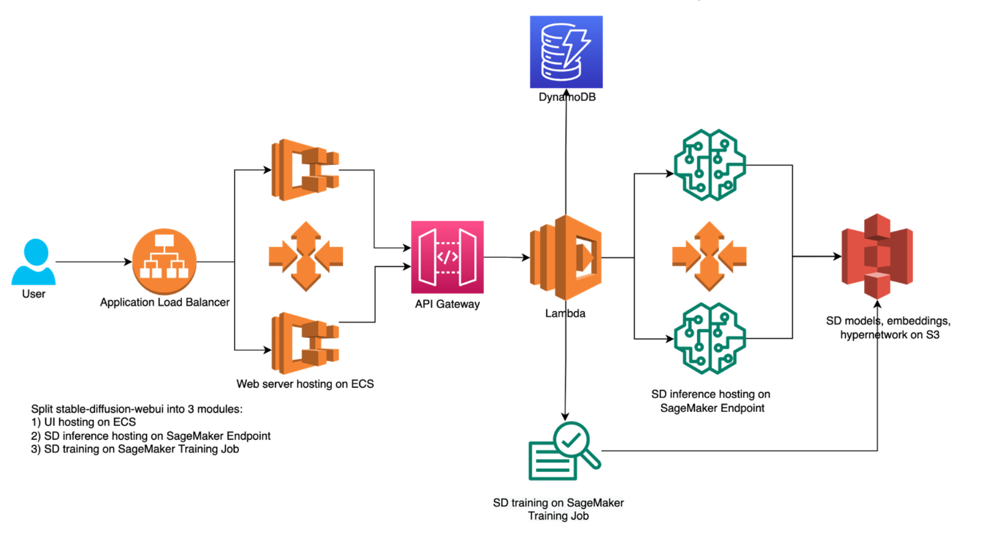
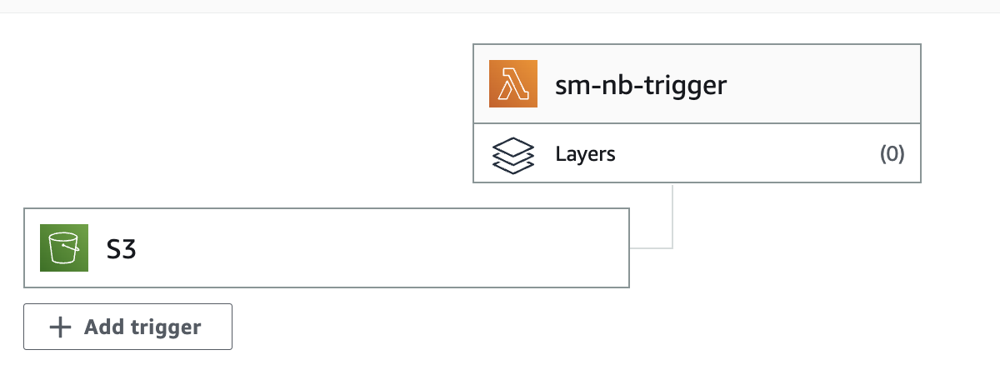
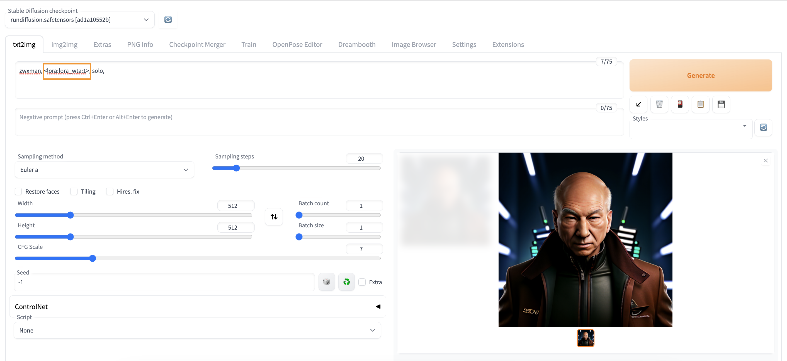

# From Data to Dollars: The Power of Generative AI in Retail Customer Engagement

## Introduction: Stable Diffusion in pan-retail industry 

The convergence of artificial intelligence (AI) and the retail industry has introduced transformative technologies like GenAI and Stable Diffusion. GenAI utilizes machine learning algorithms to generate synthetic data that closely resembles real-world patterns, enabling retailers to enhance virtual try-on experiences, personalized recommendations, and more. Stable Diffusion complements GenAI by stabilizing the output of generative models, ensuring reliable and consistent results.

To effectively leverage GenAI and Stable Diffusion, retailers must first identify their specific use cases and assess the potential return on investment (ROI). This involves evaluating how these technologies can improve customer engagement, boost sales, or optimize supply chain operations. Allocating the right roles and responsibilities is crucial, requiring the hiring of data scientists, prompt engineers, project managers, and artists. Lastly, retailers must implement risk mitigation strategies to minimize the potential licensing risks associated with using copyrighted or restricted content. By carefully navigating these considerations, retailers can leverage the power of GenAI and Stable Diffusion to stay ahead in the competitive retail landscape.

## Stable Diffusion on SageMaker Solution 

* SageMaker Jumpstart
    * One-click to deploy pre-trained stable diffusion model to SageMaker Endpoint without provision.
    * You can get the code from jumpstart to inference endpoint immediately or modify the code according to your scenario.
* SageMaker Notebook Instance



    * Requiring only a few steps to quickly deploy a web application environment for AI-generated image generation in your AWS account with CloudFormation for one-click deployment. 
    * Amazon SageMaker Notebook Instance-hosted Jupyter notebook instance take care of underlying IT development environments (such as storage, networking, etc.) and infrastructure maintenance.
    * The solution is built on the Stable Diffusion version 1.5, provides a great user experience with open-source project usage and supports extensions based on your needs such as ControlNet.
    * Users can fine-tune the model with their own image data and quickly deployed for inference using automated pipeline tools.
* All-in-one



    * Requiring only a few steps to quickly deploy a web application environment for AI-generated image generation in your AWS account with CloudFormation for one-click deployment. 
    * Host the model on SageMaker Endpoint with auto-scaling capability to adjust the resource base on the request queues size.
    * All-in-one solution can integrate with your own model seamlessly. You just upload the model to S3 bucket then it would deploy the model to SageMaker Endpoint automatically without manual configuration.


## Use case 

### Scenario: Lift the limit of location and model for product images

According to the market research, the price of hiring a model for product photography is around $200 per hour and would raise according to how many products you need to shot. Besides the cost of venue, equipments and makeup, it would be a pressure for smaller retailers. Stable Diffusion can help to lift the limit of location and model for product images in seconds.

* Select the model and choose img2img tab on the webUI
* Type the positive prompt: a Japanese/Indian female, high detailed face, masterpiece, beautiful 
* Type the negative prompt: uglay, lowres, low detailed, muted
* Select “inpaint upload” to upload the original photo and masked photo.
* Adjust the Mask Blur to “1” and select mask mode to “inpaint masked“
* Click “Generate” then you will see the results


You can do the same steps with different masked such as clothes, background and so on, then you can get tones of product photos in seconds.


### Scenario: Efficiently generate the advertising materials to increase sales

As the festivals coming, marketing team always be busy for designing the the advertising for sales and campaigns.  It requires a substantial effort to generate diverse advertising materials. Stable diffusion is a great tool for generating materials in seconds to compose your unique advertisements.

Take an advertisement of windbreaker as example, we will need the materials like a forest scene, a model, a product photo and eye-catching words.

* Select the model and choose txt2img tab on the webUI
* Generate the materials with prompts separately.
    * a photo of breathtaking forest scene, raining and foggy, lush forest in the mountain, muddy trail, majestic and astonishing forest scene, masterpiece, high resolution, high quality, hdr, fujifilm xt4, 50mm, f/1.6, sharp focus, high detailed
    * a product photo of yellow windbreaker , masterpiece, (full body), (yellow windbreaker:1.3), sport pants, hiking boots, handsome and young man, normal eyes, high detailed face, High Detail, Sharp focus, lightly smile, nature skin, realistic, intricate, depth of field, fujifilm xt4, medium shot, hdr, 8k, highres, modelshoot style
    * A photo of raining splatter on the (yellow windbreaker), (waterproof), masterpiece, high detail, high resolution, 8k, hdr, (micro shot),


* Then easily assemble the materials to an advertisement


## Fine-tune the LoRA model with your own images data 

In many cases, users require more than just image generation from Stable Diffusion. They often need to utilize the model to generate images that feature specific products or models. For instance, consider a scenario where a retailer collaborates with Key Opinion Leaders (KOLs) to enable them to select endorsements online then employ Stable Diffusion model that can swiftly generate product photography for sales purposes. Therefore, users require a streamlined pipeline that automates the fine-tuning of the model using their own image data. The architecture is following.


As users upload their own images data to S3 input bucket, S3 would send the event to trigger Lambda to start the SageMaker Notebook Instance for training. The instance will use pre-built lifecycle configuration to run the training scripts then export the model to S3 output bucket. Then S3 would send the event to trigger Lambda to shutdown the instance to avoid unnecessary cost. You can follow the steps below to build the pipeline.


### Step1. Create an SageMaker Notebook Instance for fine-tuning

Prepare a notebook instance with GPU for fine-tuning. I choose the ml.g4dn.xlarge as example.

### Step2. Prepare S3 bucket

Prepare three s3 bucket for fine-tuning

* one for training data
* one for generated image output
* one for model output

### Step3. Prepare training data

Prepare your own images of products or characters, also the captions for each image. For example, I would like to create the endorsement photo with Patrick Stewart, so I prepare 6 Patrick Stewart photos(512*704) and 6 txt files with the same name. Write “zwxman” as prompt in each txt file. Then zip the folder to **training_data.zip** for later use.

### Step4. Build the training script


Build a training script for LoRA model training with your own images. I will following this [sample code](https://github.com/terrificdm/dreambooth-stablediffusion-sagemaker-notebook/blob/main/sd-lora-db-finetune-character.ipynb) which modified from[kohya-ss/sd-scripts](https://github.com/kohya-ss/sd-scripts) to build the training script.


#### Install depemdencies

```
!pip install torch==2.0.0+cu118 torchvision==0.15.1+cu118 --extra-index-url https://download.pytorch.org/whl/cu118
!pip install xformers==0.0.18
!git clone https://github.com/kohya-ss/sd-scripts
%cd sd-scripts/
!pip install -U -r requirements.txt
!pip install --upgrade lion-pytorch lycoris-lora

```

```
# fix some warnings and bugs poping up from notebook
!pip install tensorflow==2.11.0
!sudo rm -rf /lib64/libstdc++.so.6 /lib64/libstdc++.so.6
!sudo ln -s /home/ec2-user/anaconda3/envs/python3/lib/libstdc++.so.6 /lib64/libstdc++.so.6

import os
os.environ['TF_ENABLE_ONEDNN_OPTS'] = '0'
os.environ['TF_CPP_MIN_LOG_LEVEL'] = '1'
```

#### Initialize training environment

```
from accelerate.utils import write_basic_config
write_basic_config()
```

```
%%writefile dataset.toml
[general]
enable_bucket = true
shuffle_caption = true
caption_extension = '.txt'
keep_tokens = 0

# DreamBooth caption based character datasets
[[datasets]]
resolution = 512
batch_size = 2

  [[datasets.subsets]]
  image_dir = './images/sample'
  num_repeats = 10
```

```
MODEL_NAME = "runwayml/stable-diffusion-v1-5"
DATASET_CONFIG = "./dataset.toml"
TRAIN_DATA_DIR = "./images/sample"
IMAGES_OUTPTS = "./images/outputs"
!mkdir -p $IMAGES_OUTPTS
```

```
!rm -rf sample training_data.zip $TRAIN_DATA_DIR
#REMEMBER TO CHANGE YOUR OWN BUCKET NAME FOR DATA INPUT
!aws s3 cp s3://<your s3 bucket for data input>/training_data.zip .
!unzip training_data.zip
!mv sample $TRAIN_DATA_DIR
!rm -rf training_data.zip
```

#### Train model

```
!accelerate launch train_network.py \
   --pretrained_model_name_or_path=$MODEL_NAME \
   --dataset_config=$DATASET_CONFIG \
   --output_dir="./output" \
   --logging_dir="./logs" \
   --network_module="networks.lora" \
   --max_train_epochs=10 \
   --learning_rate="1e-4" \
   --unet_lr="1e-4" \
   --text_encoder_lr="1e-5" \
   --lr_scheduler="cosine_with_restarts" \
   --lr_scheduler_num_cycles=1 \
   --network_dim=64 \
   --network_alpha=32 \
   --output_name="lora_wta" \
   --save_every_n_epochs=2 \
   --mixed_precision="fp16" \
   --cache_latents \
   --gradient_checkpointing \
   --clip_skip=2 \
   --prior_loss_weight=1 \
   --max_token_length=225 \
   --save_model_as="safetensors" \
   --noise_offset=0.1 \
   --xformers --use_8bit_adam
```

#### [Option] Inference the model to generate a image for verification

```
import torch
import datetime

from diffusers import StableDiffusionPipeline, EulerAncestralDiscreteScheduler
from networks.lora import LoRAModule, create_network_from_weights
from safetensors.torch import load_file

import boto3

model_id_or_dir = r"runwayml/stable-diffusion-v1-5"

# create pipe
print(f"creating pipe from {model_id_or_dir}...")
scheduler = EulerAncestralDiscreteScheduler.from_pretrained(model_id_or_dir, subfolder="scheduler")
generator = torch.Generator(device="cuda")
pipe = StableDiffusionPipeline.from_pretrained(model_id_or_dir, scheduler=scheduler, torch_dtype=torch.float16)
# pipe = StableDiffusionPipeline.from_pretrained(model_id_or_dir, custom_pipeline="lpw_stable_diffusion", scheduler=scheduler, torch_dtype=torch.float16)
pipe = pipe.to("cuda")
vae = pipe.vae
text_encoder = pipe.text_encoder
unet = pipe.unet

# load lora networks
print(f"loading lora networks...")

lora_path = r"./output/lora_wta.safetensors"
sd = load_file(lora_path)   # If the file is .ckpt, use torch.load instead.
network, sd = create_network_from_weights(0.8, None, vae, text_encoder,unet, sd)
network.apply_to(text_encoder, unet)
network.load_state_dict(sd)
network.to("cuda", dtype=torch.float16)

# Uncomment below codes, if you don't want to enable NFSW
def dummy(images, **kwargs):
    return images, False
pipe.safety_checker = dummy

# prompts
prompt = "zwxman, solo,"
negative_prompt = "lowres, worst quality, ugly, extra limbs, deformed legs, disfigured legs, (disfigured), ((mutated hands, misshapen hands, mutated fingers, fused fingers):1.2), text, logo, watermark"

# exec pipe
print("generating image...")

num_images = 1
seeds = []
s3upload_client = boto3.client("s3")

for _ in range(num_images):
    seed = generator.seed()
    seeds.append(seed)
    generator = generator.manual_seed(seed)
    with torch.autocast("cuda"):
        image = pipe(
            prompt, 
            negative_prompt=negative_prompt,
            height=512,
            width=512,
            num_images_per_prompt=1,
            num_inference_steps=20,
            guidance_scale=7, 
            generator = generator
        ).images[0]
        display(image)
        now = datetime.datetime.now().strftime("%Y-%m-%d %H:%M:%S")
        file_path = IMAGES_OUTPTS + "/" + str(seed) + "_" + str(now) + ".png"
        print(file_path + "\n")
        image.save(file_path)
        #REMEMBER TO CHANGE YOUR OWN BUCKET NAME FOR IMAGE OUTPUT
        s3upload_client.upload_file(file_path, "<your s3 bucket for image output >", str(seed) + "_" + str(now) + ".png")
# print(seeds)
print(f"\nSeeds for generating images: {seeds}\n")
```

#### Upload the fine-tuned model to S3

```
#REMEMBER TO CHANGE YOUR OWN BUCKET NAME FOR MODEL OUTPUT
!aws s3 cp ./output/lora_wta.safetensors s3://<your s3 bucket for model output>/
```


### Step 5. Create a notebook lifecycle configuration

Since we need to automatically run the training script as the instance startup, we need to build a lifecycle configuration for notebook instance.

* Navigate to [SageMaker](https://us-east-1.console.aws.amazon.com/sagemaker/home?region=us-east-1#/landing), click the Lifecycle configuration at the left-side menu
* Select “Notebook Instance” tab and click “Create configuration”


* Type the Name and select the “Start notebook” tab then paste the following code, remember to replace your training script name

```
ENVIRONMENT=python3
NOTEBOOK_FILE=/home/ec2-user/SageMaker/<your training script name>.ipynb
source /home/ec2-user/anaconda3/bin/activate "$ENVIRONMENT"
nohup jupyter nbconvert --ExecutePreprocessor.timeout=-1 --ExecutePreprocessor.kernel_name=python3 --to notebook --execute "$NOTEBOOK_FILE" >output.log 2>&1 < /dev/null &
```


* Click “Create configuration”

### Step6. Configure the Lambda and S3 bucket event trigger

Create two Lambda:

* one for start up the notebook instance as the training data upload to S3
* one for stop the notebook instance as the fine-tuned model upload to S3

Please following the steps below

* Navigate to [Lambda](https://us-east-1.console.aws.amazon.com/lambda/home?region=us-east-1#/discover)
* Click “Create function” and select Python
* Type the following code, remember to replace your notebook instance name

```
import json
import boto3
import logging

notebook_name='<your notebook instance name>'
# starts customer segmentation notebook instance on S3 file put
def lambda_handler(event, context):
    client = boto3.client('sagemaker')
    notebook_description = client.describe_notebook_instance(NotebookInstanceName=notebook_name)
    # keep this line
    if notebook_description['NotebookInstanceStatus'] in ['Stopped', 'Failed']:
        client.start_notebook_instance(NotebookInstanceName= notebook_name)
    return 0 
```

* Set your S3 bucket of input data as trigger with Event types: s3:ObjectCreated:* 
* Deploy the function



* Click “Create function” again and select Python
* Type the following code, remember to replace your notebook instance name

```
import json
import boto3
import logging

notebook_name='<your notebook instance name>'
# starts customer segmentation notebook instance on S3 file put
def lambda_handler(event, context):
    client = boto3.client('sagemaker')
    notebook_description = client.describe_notebook_instance(NotebookInstanceName=notebook_name)
    # keep this line
    if notebook_description['NotebookInstanceStatus'] in ['InService']:
        client.stop_notebook_instance(NotebookInstanceName= notebook_name)
    return 0
```

* Set your S3 bucket of model output as trigger with Event types: s3:ObjectCreated:* 
* Deploy the function


Now, you are all set. You can try to upload the **training_data.zip** to start the auto fine-tuning pipeline. You can see your model under s3://<your s3 bucket of model output> and generated image under under s3://<your s3 bucket of image output>.


Of course, you can also download the model from s3 and use in WebUI directly.


## Conclusion

In conclusion, SageMaker provides a user-friendly ML platform that enables retailers to quickly start and accelerate their ML projects. With its managed infrastructure and pre-built algorithms, retailers can reduce the overhead of infrastructure management and focus on developing and fine-tuning their ML models. Additionally, SageMaker's autoscaling feature allows for seamless handling of unpredictable demand, ensuring a reliable and scalable AI service for retailers.

Overall, SageMaker empowers retailers with a streamlined ML platform, enabling them to leverage AI capabilities effectively and drive innovation in the retail industry. By leveraging SageMaker's quick start capabilities, reduced infrastructure management overhead, and autoscaling features, retailers can expedite their AI initiatives, deliver exceptional customer experiences, and stay competitive in the evolving retail landscape.