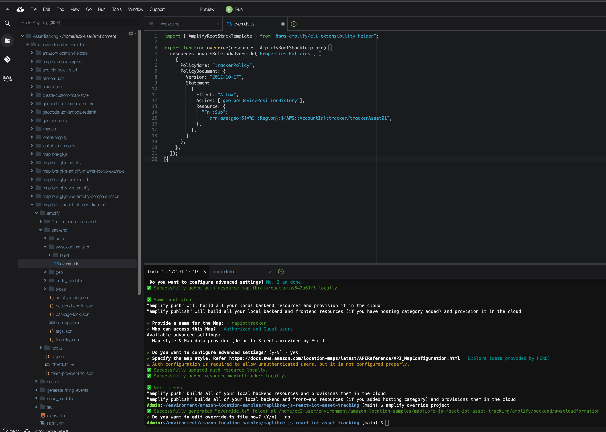
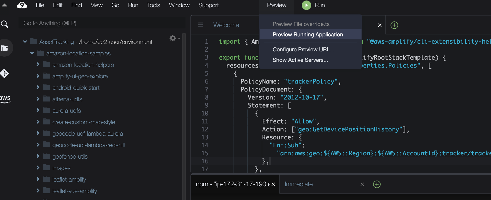
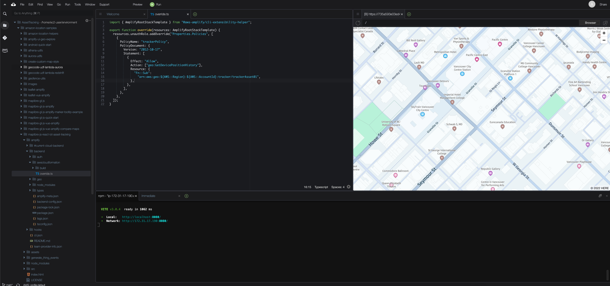
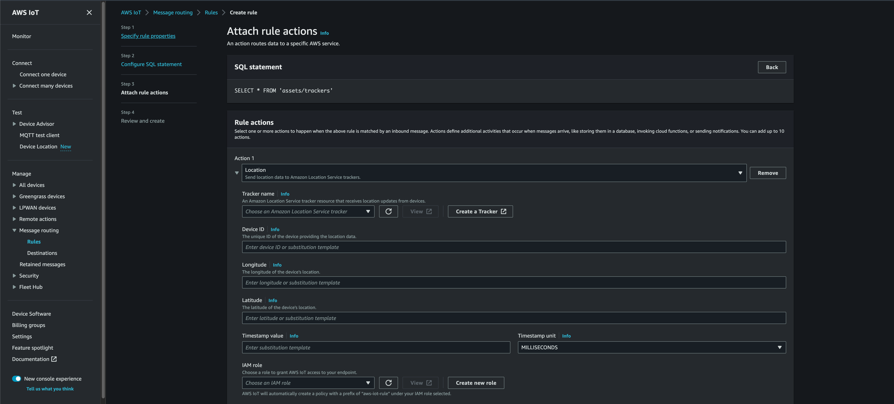
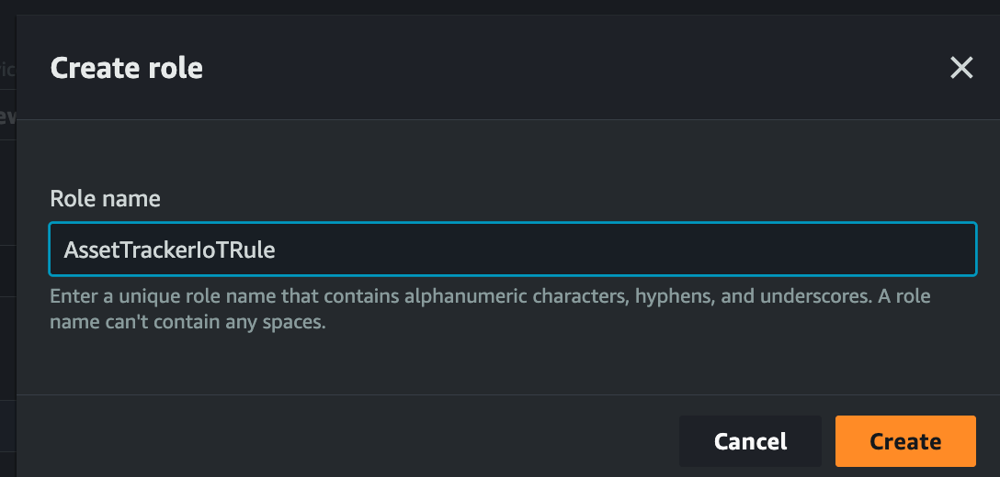
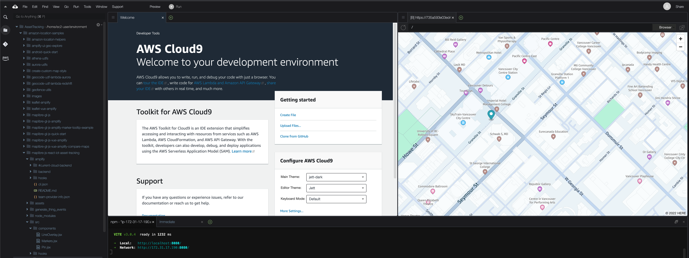
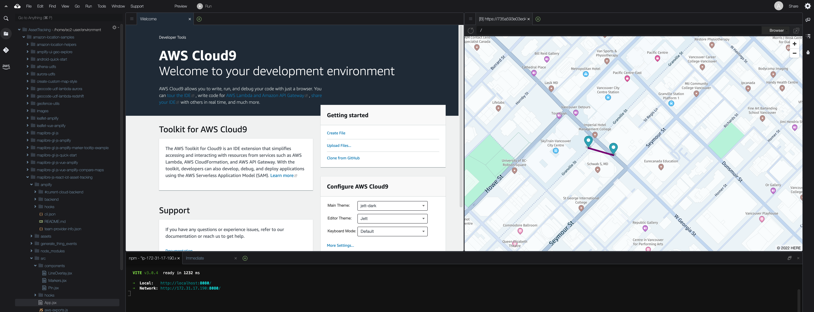

Asset tracking is critical to supply chain operations. Whether it is tracking trucks across the country, or last mile deliveries around a neighborhood, knowing where your fleet is located is incredibly important. In this getting started, we will deploy a simple web application that shows an asset's current location, as well as historical location. We'll then use AWS IoT Core to update this asset, making use of the MQTT protocol. We will cover how to:
- Use AWS Amplify to set up a web application
- Configure Amazon Location Service trackers
- Connect Amazon Location Service with AWS IoT Core
## Prerequisites

Before starting this tutorial, you will need the following:

 - An AWS Account (if you don't yet have one, you can create one and [set up your environment here](https://aws.amazon.com/getting-started/guides/setup-environment/)).

## Sections
<!-- Update with the appropriate values -->
| Info                | Level                                  |
| ------------------- | -------------------------------------- |
| ✅ AWS Level        | Intermediate                               |
| ⏱ Time to complete  | 45 minutes                             |
| 💰 Cost to complete | Free tier eligible      |
| 🧩 Prerequisites    | - [AWS Account](https://portal.aws.amazon.com/billing/signup#/start/email)<br>|
| 💻 Code Sample         | Code sample used in tutorial on [GitHub](https://github.com/aws-samples/amazon-location-samples/tree/main/maplibre-js-react-iot-asset-tracking)                             |
| 📢 Feedback            | <a href="https://pulse.buildon.aws/survey/DEM0H5VW" target="_blank">Any feedback, issues, or just a</a> 👍 / 👎 ?    |
| ⏰ Last Updated     | 2023-02-10                             |

| ToC |
|-----|

---

## Deploy Cloud9 Instance
Before we deploy our asset tracking app, we need to deploy an AWS Cloud9 Instance. Navigate to the AWS Console and select **Cloud9**. Next select **Create environment**. 


Set the instance type to `t3.small` and provide a name. Select **Create**


Once the Cloud9 instance has launched, we can begin deploying our app.

## Deploying the tracking app

From your Cloud9 terminal, clone the repo:
```bash
git clone https://github.com/aws-samples/amazon-location-samples.git
``` 

Next, navigate to the app directory
```bash
cd amazon-location-samples/maplibre-js-react-iot-asset-tracking/
```

Install our dependencies:
```bash
npm install
```

In order to configure Amplify, we need to setup an AWS Profile on the Cloud9 instance. To do this, enter the following command, making sure to replace the region with the region you are running the lab in. For example for us-east-1:

```bash
echo $'[profile default]\nregion=us-east-1' > ~/.aws/config
```

Next we need to ensure Amplify is installed 

```bash
npm install -g @aws-amplify/cli
```

Now we can initialize our Amplify environment
```bash
amplify init
```

Accept the default options
```bash
Note: It is recommended to run this command from the root of your app directory
? Enter a name for the project maplibrejsreactiotas
The following configuration will be applied:

Project information
| Name: maplibrejsreactiotas
| Environment: dev
| Default editor: Visual Studio Code
| App type: javascript
| Javascript framework: react
| Source Directory Path: src
| Distribution Directory Path: build
| Build Command: npm run-script build
| Start Command: npm run-script start

? Initialize the project with the above configuration? Yes
Using default provider  awscloudformation
? Select the authentication method you want to use: AWS profile

For more information on AWS Profiles, see:
https://docs.aws.amazon.com/cli/latest/userguide/cli-configure-profiles.html

? Please choose the profile you want to use default
```


Now we can use AWS Amplify to add our Amazon Location Service resources
```bash
amplify add geo
```

And select the following options

```bash
? Select which capability you want to add: Map (visualize the geospatial data)
✔ geo category resources require auth (Amazon Cognito). Do you want to add auth now? (Y/n) · yes
Using service: Cognito, provided by: awscloudformation

 The current configured provider is Amazon Cognito.

 Do you want to use the default authentication and security configuration? Default configuration
 Warning: you will not be able to edit these selections.
 How do you want users to be able to sign in? Username
 Do you want to configure advanced settings? No, I am done.
✅ Successfully added auth resource maplibrejsreactiotase08797a2 locally

✅ Some next steps:
"amplify push" will build all your local backend resources and provision it in the cloud
"amplify publish" will build all your local backend and frontend resources (if you have hosting category added) and provision it in the cloud

✔ Provide a name for the Map: · mapiottracker
✔ Who can access this Map? · Authorized and Guest users
Available advanced settings:
- Map style & Map data provider (default: Streets provided by Esri)

✔ Do you want to configure advanced settings? (y/N) · yes
✔ Specify the map style. Refer https://docs.aws.amazon.com/location-maps/latest/APIReference/API_MapConfiguration.html · Explore (data provided by HERE)
⚠️ Auth configuration is required to allow unauthenticated users, but it is not configured properly.
✅ Successfully updated auth resource locally.
✅ Successfully added resource mapiottracker locally.

✅ Next steps:
"amplify push" builds all of your local backend resources and provisions them in the cloud
"amplify publish" builds all of your local backend and front-end resources (if you added hosting category) and provisions them in the cloud
```


Before we push our Amplify configuration, we need to make one small change to allow our application to work with Amazon Location Service Trackers.
```bash
amplify override project
```


Now navigate to the amplify/backend/awscloudformation/override.ts file that was just created, and replace the contents with the following:

```javascript
import { AmplifyRootStackTemplate } from "@aws-amplify/cli-extensibility-helper";

export function override(resources: AmplifyRootStackTemplate) {
  resources.unauthRole.addOverride("Properties.Policies", [
    {
      PolicyName: "trackerPolicy",
      PolicyDocument: {
        Version: "2012-10-17",
        Statement: [
          {
            Effect: "Allow",
            Action: ["geo:GetDevicePositionHistory"],
            Resource: {
              "Fn::Sub":
                "arn:aws:geo:${AWS::Region}:${AWS::AccountId}:tracker/trackerAsset01",
            },
          },
        ],
      },
    },
  ]);
}
```



Save the `override.ts` file and now we can push our Amplify configuration and create our resources in the cloud.
```bash
amplify push
```


Selecting Y for the options presented here:

```bash
✔ Successfully pulled backend environment dev from the cloud.

    Current Environment: dev
    
┌──────────┬──────────────────────────────┬───────────┬───────────────────┐
│ Category │ Resource name                │ Operation │ Provider plugin   │
├──────────┼──────────────────────────────┼───────────┼───────────────────┤
│ Auth     │ maplibrejsreactiotas543a61f5 │ Create    │ awscloudformation │
├──────────┼──────────────────────────────┼───────────┼───────────────────┤
│ Geo      │ mapiottracker                │ Create    │ awscloudformation │
└──────────┴──────────────────────────────┴───────────┴───────────────────┘
✔ Are you sure you want to continue? (Y/n) · yes
```


Next start the application by running
```bash
npm start
```

Keep `npm start` running throughout this tutorial in order to keep the asset tracking app running.

In your Cloud9, navigate to **Run** and then select **Preview running application** to view the app.



You should now see your application running inside Cloud9



## Setting up IoT Core Resources

Now that we have our Amazon Location Service resources configured and our web app up and running, we need to configure our IoT Rule to send MQTT events to our new Amazon Location Service Tracker.

Navigate to the IoT Core Console, and click on Message Routing then Rules


Click on **Create Rule**


Now let's give our rule the name `AssetTrackingRule` and click Next


Now we need our SQL statement. We will be using the topic `assets/trackers`. Enter `SELECT * FROM 'assets/trackers'`


then click Next

Now it's time to setup our Location Action. Select **Location** from the **Choose an action** dropdown



Select **Create a Tracker** and enter the name `AssetTracker`. 


Select **Create tracker**


Now we can configure mapping of our payload to the rule. In order to do this, we will use substitution templates in IoT Core. Select trackerAsset01 for the Tracker name dropdown, then, for each field, copy/paste the following values: 

Device ID: `thing123`

Longitude: `${longitude}`

Latitude: `${latitude}`

Timestamp value: `${timestamp()}`

Finally, we need to create a new IAM Role that will give IoT Core Rules Engine permissions to update the Amazon Location Service Tracker resource. Click Create new role, give it the name `AssetTrackerIoTRule` and click Create



Our configuration should look like this. 


Select **Next**


Now select **Create**

Now that we've created our IoT Core Rule, we can start sending messages.

## Sending MQTT Messages
From the IoT Core console, navigate to **MQTT test client** and select the **Publish to a topic** tab.

Enter the following to send our first point:
```json
{
  "deviceId": "thing123",
 "latitude": "49.282301",
"longitude": "-123.118408"
}
```

and select **Publish**


Navigate back to Cloud9 and your running application. Refresh the application and you should see the point on the map



Now let's enter another point. In the **MQTT test client** enter the following, then select **Publish**

```json
{
  "deviceId": "thing123",
 "latitude": "49.282144",
"longitude": "-123.117574"
}
```

Refresh the page and you will see a second pin, with a line connecting it with the previous point. 


## Cleaning up your AWS Environment
In order to remove resources created as part of this tutorial, we need to complete the following steps.

### Delete Cloud9
In order to not incur charges from our Cloud9 Instance, we need to delete the environment. Follow the steps [here](https://docs.aws.amazon.com/cloud9/latest/user-guide/delete-environment.html) to remove the `AssetTracking` environment.

### Delete Amazon Location Service Tracker
Navigate to the Amazon Location Service console, select **Trackers** select `trackerAsset01` and select **Delete**, confirming you wish to delete it.

### Deleting IoT Core Rule
Navigate to the IoT Core Console, select **Message Routing** and **Rules**. Select `AssetTrackingRule` and select **Delete**, confirming you wish to delete it.

## Conclusion
Congratulations! You just built a simple asset tracking app using AWS Amplify, Amazon Location Service, and AWS IoT Core. If you enjoyed this tutorial, found any issues, or have feedback us, <a href="https://pulse.buildon.aws/survey/DEM0H5VW" target="_blank">please send it our way!</a>
