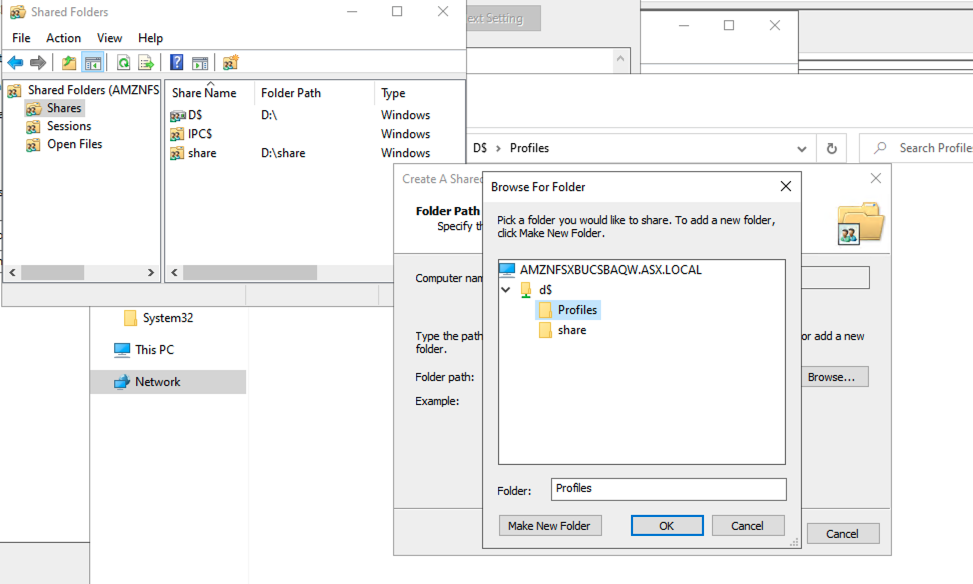
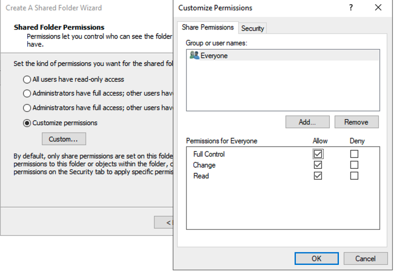
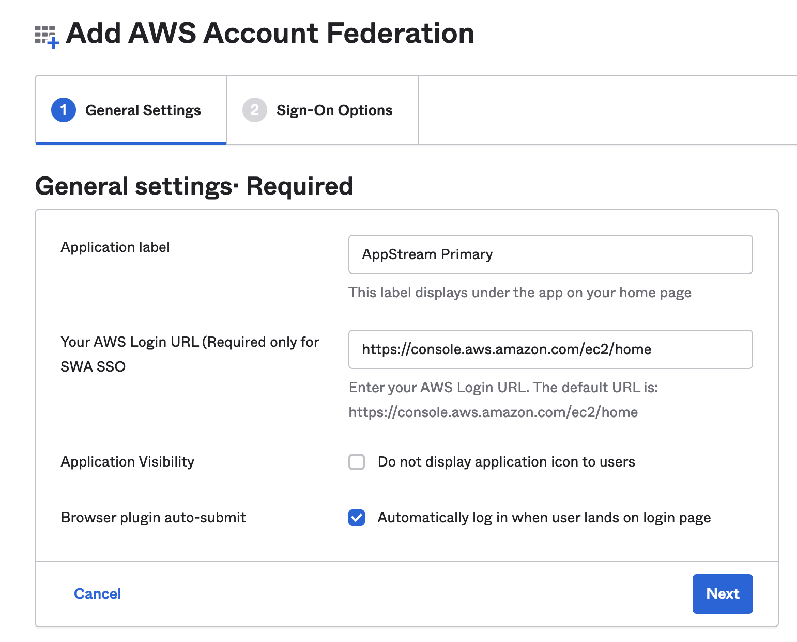
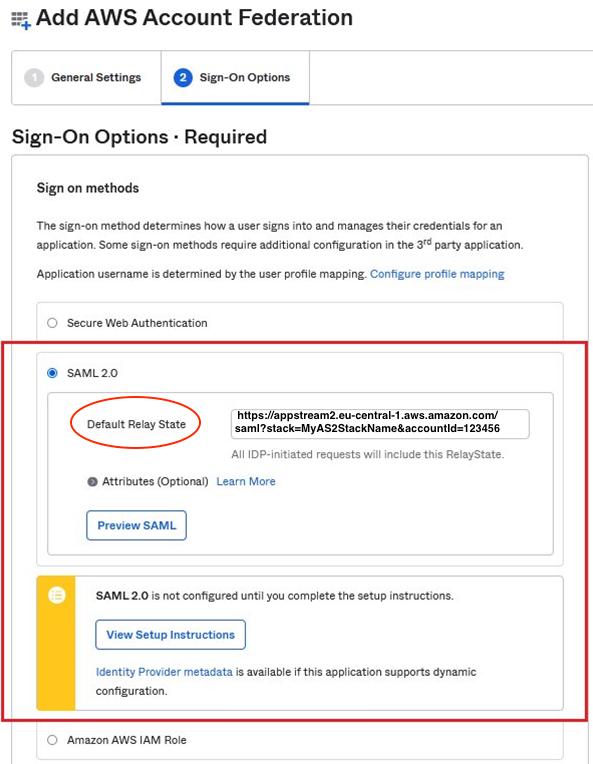
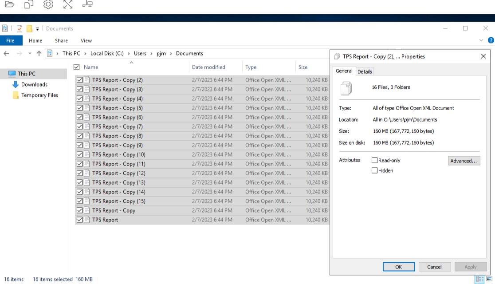

## Introduction
In this blog, I will show you how you can build a multi-region disaster recovery environment for [Amazon AppStream 2.0](https://aws.amazon.com/appstream2?sc_channel=el&sc_campaign=resiliencewave&sc_geo=mult&sc_country=mult&sc_outcome=acq&sc_content=mr-dr-for-appstream). These concepts can also apply to other virtual desktop environments such as [AWS WorkSpaces](https://aws.amazon.com/workspaces?sc_channel=el&sc_campaign=resiliencewave&sc_geo=mult&sc_country=mult&sc_outcome=acq&sc_content=mr-dr-for-appstream) or [Citrix virtual desktops](https://www.citrix.com/solutions/vdi-and-daas/what-is-a-virtual-desktop.html) to name a few. 

Having a disaster recovery (DR) region configured is essential for business continuity during an outage. Without one, customers would have to rebuild their environment in a new region during the outage. This can be difficult and time consuming, which can impact revenue and in some cases, lose data or access to user profile settings. There is also potential for human error when doing this under production downtime pressure. Planning and maintaining a disaster recovery mechanism to avoid compromising business performance is essential for businesses of all sizes.

AWS has published [Disaster Recovery considerations with Amazon
AppStream
2.0](https://aws.amazon.com/blogs/desktop-and-application-streaming/disaster-recovery-considerations-with-amazon-appstream-2-0?sc_channel=el&sc_campaign=resiliencewave&sc_geo=mult&sc_country=mult&sc_outcome=acq&sc_content=mr-dr-for-appstream)
and [Optimize User Experience with latency-based routing for Amazon
AppStream
2.0](https://aws.amazon.com/blogs/desktop-and-application-streaming/optimize-user-experience-with-latency-based-routing-for-amazon-appstream-2-0?sc_channel=el&sc_campaign=resiliencewave&sc_geo=mult&sc_country=mult&sc_outcome=acq&sc_content=mr-dr-for-appstream)
that address DR for customer environments that are using [Home Folder
Synchronization](https://docs.aws.amazon.com/appstream2/latest/developerguide/home-folders.html?sc_channel=el&sc_campaign=resiliencewave&sc_geo=mult&sc_country=mult&sc_outcome=acq&sc_content=mr-dr-for-appstream)

While these are excellent solutions, they cater to customers using
[Application Settings Persistence](https://docs.aws.amazon.com/appstream2/latest/developerguide/app-settings-persistence.html?sc_channel=el&sc_campaign=resiliencewave&sc_geo=mult&sc_country=mult&sc_outcome=acq&sc_content=mr-dr-for-appstream), a feature which stores user profile and application settings data in Amazon S3. This limits a user's profile size to under 1GB. Anything larger will impact the logon experience, and would not be suitable for applications such as Microsoft Office 365 that can grow in size fast.

Some customers require user profile sizes to be larger than 20GB, dynamically expandable, and at the same time have limited impact to performance and log-on times.
To meet these requirements, customers can use a high-speed network storage service paired with FSLogix, [Cloud Cache](https://learn.microsoft.com/en-us/fslogix/cloud-cache-resiliency-availability-cncpt), a technology that provides incremental replication of user profile and office containers. Cloud Cache automatically replicates the local cache and user profile data between the two SMB locations, when one location goes down, another takes over seamlessly. This enables any virtual desktop service or on premise device to store user profile data on Server Message Block (SMB) shares, located in different regions, without the need to deploy complex replication infrastructure. FSLogix Cloud Cache takes care of VHD(x) replication automatically, reduces management overhead and facilitates Disaster Recovery.
By distributing the inputs and outputs per second (IOPS) to the local disk cache of each operating system, FSLogix Cloud Cache reduces the IOPS consumption and infrastructure required to host a central storage solution.

One example of a high-speed network storage service that is scalable in compute, storage and is easy to get started with is [Amazon FSx for Windows File Server](https://aws.amazon.com/fsx/windows?sc_channel=el&sc_campaign=resiliencewave&sc_geo=mult&sc_country=mult&sc_outcome=acq&sc_content=mr-dr-for-appstream). When launched in the same subnets as the Amazon AppStream 2.0 fleet, it reduces the latency and serves user profile data efficiently.
Services like [Amazon FSx for NetApp ONTAP](https://aws.amazon.com/fsx/netapp-ontap?sc_channel=el&sc_campaign=resiliencewave&sc_geo=mult&sc_country=mult&sc_outcome=acq&sc_content=mr-dr-for-appstream), can also be used as a user profile storage location.

Before launching your FSx for Windows or storage service of choice, please keep in mind that right sizing the performance and storage capacity is essential to a successful deployment. These decisions impact the user experience and budget. 

According to Microsoft the [IOPS an FSLogix profile needs](https://learn.microsoft.com/en-us/azure/virtual-desktop/faq#what-s-the-largest-profile-size-fslogix-can-handle-) at a steady state, it is **10 IOPS per user** and sign-in\out consumes **50 IOPS per user**. The IO load of a single VDI desktop has a high read IO load (up to several 100s of IOPS) when the Operating System boots. The user logs in and a 60% read at about 50 IOPS is seen. Then the user starts working with about 5-10 IOPS at 85% writes for the rest of the day.

In a scenario where you have 500 users, in a steady state, a storage service that provides a constant 5000 IOPS is required. If all 500 users log on at the same time, your storage solution would need to be able to provide 25000 IOPS. Some storage services have a burst capability that handle this short spike of IOPS.


Storing user profiles on an SMB share provides:

1. Administrators the ability to create or integrate Amazon AppStream 2.0 users with existing organizational home folder and filing structures. 
1. Replication of user profile begins when the user logs on to their virtual desktop and Cloud Cache copies the incremental changes to DR location automatically.
1. AppStream 2.0 users can share folders between different AppStream fleets, which was challenging when using S3 for home folders. 
1. Terabytes of user profile and other data stored on premise can be accessed securely and remotely using AppStream 2.0 and [Amazon FSx File Gateway](https://aws.amazon.com/storagegateway/file/fsx?sc_channel=el&sc_campaign=resiliencewave&sc_geo=mult&sc_country=mult&sc_outcome=acq&sc_content=mr-dr-for-appstream), which provide seamless read and write activity when files are shared between their on-premises locations and the cloud. Users will have a similar experience inside a virtual desktop as they do on-premise using a physical laptop\device
1. Fine grained access control of data from a central source such as Active Directory (AD) that integrates with existing onboarding workflows and security folder monitoring tools.
1. Reduces administration by removing the need to maintain a full list of inclusions and exclusions for profile roaming


In this blog, I will guide you through how to build a multi-region disaster recovery environment for Amazon AppStream 2.0 using Amazon FSx for Windows as a storage location.

## Prerequisites

Before you get started, you must have the following resources deployed
in your account:

1.  Read through [Disaster Recovery considerations with Amazon
    AppStream
    2.0](https://aws.amazon.com/blogs/desktop-and-application-streaming/disaster-recovery-considerations-with-amazon-appstream-2-0?sc_channel=el&sc_campaign=resiliencewave&sc_geo=mult&sc_country=mult&sc_outcome=acq&sc_content=mr-dr-for-appstream)
    to understand new region scaling limits per account and image
    considerations

1.  An existing domain joined Amazon AppStream 2.0 fleet in a stopped
    state and a stack that does **not** have [Application Settings
    Persistence](https://docs.aws.amazon.com/appstream2/latest/developerguide/app-settings-persistence.html?sc_channel=el&sc_campaign=resiliencewave&sc_geo=mult&sc_country=mult&sc_outcome=acq&sc_content=mr-dr-for-appstream)
    enabled

1.  Active Directory Services in both Primary (Frankfurt) and Disaster   Recovery (DR) region (London). In this blog, I am using AWS Managed AD with [multi-region
    replication](https://aws.amazon.com/blogs/aws/multi-region-replication-now-enabled-for-aws-managed-microsoft-active-directory?sc_channel=el&sc_campaign=resiliencewave&sc_geo=mult&sc_country=mult&sc_outcome=acq&sc_content=mr-dr-for-appstream)
    enabled. You can also use a self-managed Active Directory installed on an EC2 instance or your on premise Active Directory with network connectivity between the locations.

1.  An existing Windows File Server or [Amazon FSx For Windows File
    System](https://docs.aws.amazon.com/fsx/latest/WindowsGuide/what-is.html?sc_channel=el&sc_campaign=resiliencewave&sc_geo=mult&sc_country=mult&sc_outcome=acq&sc_content=mr-dr-for-appstream)
    used for profile storage, check [this blog
    post](https://aws.amazon.com/blogs/desktop-and-application-streaming/use-amazon-fsx-and-fslogix-to-optimize-application-settings-persistence-on-amazon-appstream-2-0?sc_channel=el&sc_campaign=resiliencewave&sc_geo=mult&sc_country=mult&sc_outcome=acq&sc_content=mr-dr-for-appstream)
    for setup instructions

1.  The VPC subnets for Amazon AppStream 2.0 in primary and disaster
    recovery region, must be able to connect on port 445, to both
    primary and disaster recovery FSx for Windows File Systems.

1.  Both VPCs connected via Transit Gateway or VPC Peering  
    ([VPC peering is preferable in most
    settings](https://docs.aws.amazon.com/whitepapers/latest/best-practices-for-deploying-amazon-appstream-2/availability-zones.html?sc_channel=el&sc_campaign=resiliencewave&sc_geo=mult&sc_country=mult&sc_outcome=acq&sc_content=mr-dr-for-appstream))

1.  A SAML IdP such, deployed in two or more regions like
    [Okta](https://www.okta.com/sites/default/files/2020-10/Okta%27s-Architecture-eBook.pdf)
    which is able to endure a region failure.

**Note**

*AWS IAM Identity Center (Successor to AWS Single Sign-On) does not
support multi-region at this time and can only be deployed in one
region, per AWS Organization.*

## Solution overview


The high level steps is as follows:

1.  Setup file share and folder permissions to store user profile data

2.  Setup share permissions to allow data write and replication over
    network

3.  Install and configure FSLogix on the Amazon AppStream 2.0
    ImageBuilder

4.  Setup the Group Policy to configure FSLogix

5.  Create an Amazon AppStream 2.0 image

6.  Copy the Amazon AppStream 2.0 image to the DR region

7.  Recreate the Amazon AppStream 2.0 Stack configuration in the DR
    region

8.  Setup your SAML IdP

9.  Test if Disaster Recovery is working as expected

## Deploy the solution

### Step 1: Setup file and folder permissions

1.  The first step is to create a folder on both your primary and DR file servers to store
    your user profile containers, in this blog I will be using FSx for
    Windows to store my user profile containers.  
    Create a folder on the D drive (D\$) of your Primary and DR FSx file
    servers manually or using this PowerShell command from a domain
    joined machine.

(Replace **fsxPrimary.asx.local** with the DNS name of your storage server) 

```powershell
New-Item -Path '\\fsxPrimary.asx.local\D$' -Name Profiles -ItemType Directory
```

```powershell
New-Item -Path '\\fsxDR.asx.local\D$' -Name Profiles -ItemType Directory
```

 
More details about creating a file share on FSx for windows can be found [here](https://docs.aws.amazon.com/fsx/latest/WindowsGuide/managing-file-shares.html?sc_channel=el&sc_campaign=resiliencewave&sc_geo=mult&sc_country=mult&sc_outcome=acq&sc_content=mr-dr-for-appstream).

Once the profiles folder has been created, setup the NTFS permissions
on the folder as follows:

- CREATOR OWNER – Full Control (Apply onto: **Subfolders and Files
  Only**)

- SYSTEM – Full Control (Apply onto: **This Folder, Subfolders and
  Files**)

- Administrators (If self-managed AD) – Full Control (Apply onto: **This
  Folder, Subfolders and Files**)

- Users – Create Folder/Append Data (Apply to: **This Folder Only**)

- Users – List Folder/Read Data (Apply to: **This Folder Only**)

- Users – Read Attributes (Apply to: **This Folder Only**)

- Users – Traverse Folder/Execute File (Apply to: **This Folder Only**)

- You can change **Users** for a domain group containing the target user
  accounts. This could be the same group, added to the local groups on
  the ImageBuilder that [enable inclusion (or exclusion) of Profile
  Containers](https://aws.amazon.com/blogs/desktop-and-application-streaming/use-amazon-fsx-and-fslogix-to-optimize-application-settings-persistence-on-amazon-appstream-2-0?sc_channel=el&sc_campaign=resiliencewave&sc_geo=mult&sc_country=mult&sc_outcome=acq&sc_content=mr-dr-for-appstream)

- **Administrators** can be changed to the AWS Delegated Administrators
  group if using AWS Managed AD and do not have access to domain admins.


* Advanced permissions of profiles folder*

 Once the folder NTFS permissions have been setup on your primary region manually, you can clone the ACLs to the FSx file server in your DR region using PowerShell:

```powershell
Get-ACl -Path '\\FSxPrimary.asx.local\D$\Profiles' | Set-ACL '\\FSxDR.asx.local\D$\Profiles'
```

### Step 2: Setup share permissions

 Turn the “Profiles” folder on the Primary and DR file server into a
 network share using the Microsoft snap-in **fsmgmt.msc**, please
 follow [these steps](https://docs.aws.amazon.com/fsx/latest/WindowsGuide/managing-file-shares.html?sc_channel=el&sc_campaign=resiliencewave&sc_geo=mult&sc_country=mult&sc_outcome=acq&sc_content=mr-dr-for-appstream) for detailed instructions.





The permissions on the share can be set to EVERYONE or Authenticated
Users – Full Control (Apply onto: **This Folder, Sub-folders and
Files**) as this only applies to the share and access will be limited
to the NTFS permissions set in step 1.1.



You can also set these permissions using PowerShell by running the following commands:

```powershell
# Edit $FSxRemotePowerShellEndpoint to match your FSx Primary and run again for FSx DR
$FSxRemotePowerShellEndpoint = "amznfsxkamxenex.mytestdomain.local"
# Create credential object
$Credential = Get-Credential
# The folder name created in step 1.
$RootShareName = "Profiles"
# Convert Profiles Folder Into SMB Share
Invoke-Command -ConfigurationName FSxRemoteAdmin -ComputerName $FSxRemotePowerShellEndpoint -Credential $Credential -scriptblock {New-FSxSmbShare -Name $Using:RootShareName -Path "D:\$Using:RootShareName" -Description "FSLogix Profiles Share" -Credential $Using:Credential}
# Grant Everyone Full Control (this only applies to the share and access will still be limited to the NTFS permissions set in step 1.1 )
Invoke-Command -ConfigurationName FSxRemoteAdmin -ComputerName $FSxRemotePowerShellEndpoint -Credential $Credential -scriptblock {Grant-FSxSmbShareAccess -Name $Using:RootShareName -AccountName Everyone -AccessRight Full} 
```


### Step 3: Install and configure FSLogix

**To prepare Amazon AppStream 2.0 image with the FSlogix agent
software**

1.  Open Amazon [AppStream 2.0 console](https://console.aws.amazon.com/appstream2?sc_channel=el&sc_campaign=resiliencewave&sc_geo=mult&sc_country=mult&sc_outcome=acq&sc_content=mr-dr-for-appstream) choose  **Images** and launch or connect to an existing image builder.

2.  When the image builder is ready, log in as the Administrator.

3.  [Download FSLogix from Microsoft](https://docs.microsoft.com/en-us/fslogix/install-ht) on the image builder and run it. Navigate through the wizard to
    complete installation.

4.  Once installation is complete, execute **lusrmgr.msc** from a  **Run** prompt to open the Local Users and Groups manager.

5.  In this blog, I will **not** be using Office 365 Containers, As a result, we’re going to remove all members from the group called **FSLogix ODFC Include List**.  
    Choose **Groups** and then **FSLogix ODFC Include List**. **Remove**
    “Everyone” from Members and then choose **Apply** and **OK**.  
    Step 5 can also be achieved using this PowerShell one liner:

```powershell
Get-LocalGroupMember -Group 'FSLogix ODFC Include List' | Where {$_.objectclass -like 'User'} | Remove-LocalGroupMember 'FSLogix ODFC Include List'
```

6.  FSLogix Profile Include List group is the include list for dynamic profiles. Select the **FSLogix Profile Include List** group. **Remove** “Everyone” and modify the list of Members so that your Security Group for  AppStream 2.0/FSLogix users is included. Choose **Apply** and   **OK**.

### Step 4: Setup the Group Policy to configure FSLogix

1.  Copy  **fslogix.admx** in to your Active Directory's Sysvol directory 
 
    Typically located at:

    ```
    \\%USERDOMAIN%\SYSVOL\%USERDOMAIN%\Policies\PolicyDefinitions
    ```

1.  Next Copy **fslogix.adml** to 

    ```
    \\%USERDOMAIN%\SYSVOL\%USERDOMAIN%\Policies\PolicyDefinitions\en-US
    ```

    Follow this [guide](https://learn.microsoft.com/en-us/fslogix/how-to-use-group-policy-templates) for if you need more information on the step 4.1


1.  Create a GPO to be linked to the Amazon AppStream 2.0 computer objects   
        Edit the GPO and enter the settings:

1.  Go to Computer configuration \> Policies \> Administrative Templates \> FSLogix \> Profile containers 
        set  **Enabled**  to Enabled

1.  **Delete Local Profile when FSLogix Profile should apply**
        *Enabled* (Please use caution with this setting. When the FSLogix
        Profiles system determines that a user should have a FSLogix
        profile but a local profile exists, the local profile will be
        **removed** and the user is logged on with the FSLogix profile.)

1. Go to Profile Containers \> Cloud Cache and set **Clear local cache on logoff** \> Disabled

1. Go to Computer configuration \> Policies \> Administrative Templates \> FSLogix \> [VHD Compact Disk](https://learn.microsoft.com/en-us/fslogix/reference-configuration-settings?tabs=profiles#vhdcompactdisk) 
    This setting can also be listed as **Disk Compaction** in older versions of FSlogix, see this link for version history [2210](https://learn.microsoft.com/en-us/fslogix/overview-release-notes#fslogix-2210-29836152326) 

1.  **IsDynamic:** If enabled, the profile container uses the minimum space on disk regardless of what is specified in SizeInMBs. As your user profile container grows in size, the amount of data on disk will grow up to the size specified in SizeInMBs.
 **Note:** When the data is deleted inside the user environment, the VHD(x) file size on disk will automatically shrink if a feature called [VHD Disk Compaction](https://learn.microsoft.com/en-us/fslogix/concepts-vhd-disk-compaction) is enabled and configured. 
In older versions of FSlogix, free space would not be reclaimed and users would need to run commands or a script in order to periodically remove empty blocks from a dynamically-expanding virtual hard disk file.

1.  Please disable the [VHDLocations](https://admx.help/?Category=FSLogixApps&Policy=FSLogix.Policies::0ceb51ebe4453fc710be22f8eb646d91) if you are using it and only enable [CCDLocations](https://admx.help/?Category=FSLogixApps&Policy=FSLogix.Policies::4aa3e56009bb2b4246504d7bddaac159) for Cloud Cache.

1. **Cloud Cache locations** (no spaces, one line and in this
    order, replace **fsxPrimary.asx.local** and **fsxDR.asx.local** with your storage server DNS names accordingly.)
    
    ```
    type=smb,connectionString=\\fsxPrimary.asx.local\Profiles;type=smb,connectionString=\\fsxDR.asx.local\Profiles
    ```

1. **Swap directory name** -\> Go to Computer configuration \>
    Policies \> Administrative Templates \> FSLogix \> Profile
    containers \> Container and Directory Naming \> [Swap directory name components](https://learn.microsoft.com/en-us/fslogix/reference-configuration-settings?tabs=profiles#flipflopprofiledirectoryname)
    \> Check the box  
    (When checked causes new containing directories to be named with  the user name first followed by the SID.)

1. **Log Settings (Optional):** Go to Computer configuration \>
    Policies \> Administrative Templates \> FSLogix \>[Enable
    Logging](https://admx.help/?Category=FSLogixApps&Policy=FSLogix.Policies::095343fa0c8b70c9a94ece25c0982bc6)
    More details on logging can be found [here](https://learn.microsoft.com/en-us/fslogix/reference-configuration-settings?tabs=profiles#flipflopprofiledirectoryname)
  
  You can find the full list of Profile Container configuration settings in [Profile Container registry configuration reference](https://docs.microsoft.com/en-us/fslogix/profile-container-configuration-reference).  

### Step 5: Create an Amazon AppStream 2.0 Image

1.  Finish [creating your AppStream 2.0 image using the Image
    Assistant](https://docs.aws.amazon.com/appstream2/latest/developerguide/tutorial-image-builder.html?sc_channel=el&sc_campaign=resiliencewave&sc_geo=mult&sc_country=mult&sc_outcome=acq&sc_content=mr-dr-for-appstream).

2.  Once the image is ready, deploy your AppStream 2.0 image to a domain  joined fleet in the primary region. Verify that the native  “application settings persistence” AppStream 2.0 feature has been disabled on the associated stack.

3.  Start the fleet, if your fleet was already running, stop and start the fleet in order to get the new GPO applied at start-up.

### Step 6: Copy the image to the DR region

1.  To copy an image to another AWS Region, launch the [AppStream 2.0 console](https://console.aws.amazon.com/appstream2?sc_channel=el&sc_campaign=resiliencewave&sc_geo=mult&sc_country=mult&sc_outcome=acq&sc_content=mr-dr-for-appstream) and select the region that contains your existing image. In the navigation pane,
    choose **Images**, select your existing image that has FSLogix
    installed, choose **Actions**, select **Copy**, and then pick your
    target AWS Region. You can also use the CopyImage API to
    programmatically copy images. Visit [Tag and Copy an
    Image](https://docs.aws.amazon.com/appstream2/latest/developerguide/tutorial-image-builder.html#tutorial-image-builder-tag-copy?sc_channel=el&sc_campaign=resiliencewave&sc_geo=mult&sc_country=mult&sc_outcome=acq&sc_content=mr-dr-for-appstream) for more information.

### Step 7: Recreate the Amazon AppStream 2.0 configuration in the DR region

1.  Recreate Amazon AppStream 2.0 stack in DR region with the exact **same stack name** case sensitive. This will allow for easy switch  between regions using one IAM role and policy.

1.  Create the fleet in the DR region with the same fleet name, case sensitive and using the image that was prepped with FSLogix in Step 3 and copied to DR region.

### Step 8: Setup your SAML IdP

1.  In this example, I am using Okta as my SAML Identity provider(IdP), Log in into your IdP admin console.
    From the left panel, select **Applications** \> **Applications**.
    Select **Browse App Catalog** and search for “AWS Account
    Federation.” Select the AWS Account Federation app and choose **Add
    Integration**.

 


1.  Change the **Application label** to something descriptive to
    represent your primary region and choose **next**  



1. To avoid duplication, follow steps found in blog post [Improve the Availability of  Existing Okta IAM Federation Setup Using Multi-Region SAML Endpoints](https://aws.amazon.com/blogs/apn/improve-the-availability-of-existing-okta-iam-federation-setup-using-multi-region-saml-endpoints?sc_channel=el&sc_campaign=resiliencewave&sc_geo=mult&sc_country=mult&sc_outcome=acq&sc_content=mr-dr-for-appstream).
      
    Repeat **steps 1-16** for Primary and again for DR region.
    This will create two Okta AWS Federated applications, one for
    Primary and the other for the DR region.  
    The difference with Amazon AppStream 2.0, is that we will need to change step 3 (Relay State)
    and 6 (IAM Trust Policy).  
    The **Default Relay State** in Okta needs to match the Amazon
    AppStream 2.0 format, for example, my Okta application for Primary
    Region(Frankfurt) relay state URL is:


https://**appstream2.eu-central-1.aws.amazon.com/saml**?stack=**MyAS2StackName**&accountId=**123456**





**London:**  
https://**appstream2.eu-west-2.aws.amazon.com/saml**?stack=**MyAS2StackName**&accountId=**123456**  
Check [documentation](https://docs.aws.amazon.com/appstream2/latest/developerguide/external-identity-providers-setting-up-saml.html?sc_channel=el&sc_campaign=resiliencewave&sc_geo=mult&sc_country=mult&sc_outcome=acq&sc_content=mr-dr-for-appstream) for more details on the relay state URL.


4. Create an IAM role for SAML 2.0 Federation following [Step 2](https://docs.aws.amazon.com/appstream2/latest/developerguide/external-identity-providers-setting-up-saml.html#external-identity-providers-grantperms?sc_channel=el&sc_campaign=resiliencewave&sc_geo=mult&sc_country=mult&sc_outcome=acq&sc_content=mr-dr-for-appstream)

    Next, modify the **role**, edit the **trust relationship policy** and replace the singular “Principal”: { “Federated”: “arn:aws:iam…” } with a multi-valued SAML Identity provider, one for Primary and another for
    the DR region. 

    In your new IAM role's details, choose the **Trust relationships** tab, and then choose **Edit trust relationship**. The Trust Relationship policy should include both SAML providers and endpoints as per the Trusted Entities Policy for IAM role example:

**Trusted Entities Policy for IAM role example:**

```json
{
    "Version": "2012-10-17",
    "Statement": [
        {
            "Effect": "Allow",
            "Principal": {
                "Federated": [
                    "arn:aws:iam::0123456789:saml-provider/okta",
                    "arn:aws:iam::0123456789:saml-provider/oktaLondon"
                ]
            },
            "Action": "sts:AssumeRoleWithSAML",
            "Condition": {
                "StringEquals": {
                    "SAML:aud": [
                        "https://eu-west-2.signin.aws.amazon.com/saml",
                        "https://eu-central-1.signin.aws.amazon.com/saml"

                    ]
                }
            }
        }
    ]
}

```

My IAM SAML Identity provider for the primary region is named okta and DR is called **oktaLondon**. 

Replace **okta**, **oktaLondon**, **eu-west-2**, **0123456789**
and **eu-central-1** with values that match your environment.

Edit your Okta user assignments to use the Okta role created in step 8.4. 
Log in into your Okta admin console. From the left panel, select
**Application** \> **Application**. 
Select the Application, In this blog it is called AppStream Primary, 
Select **Assignments**, Edit (pencil icon), Select the correct Role, in my account it is called “oktarole”, edit the users domain (@as2.local) in the UserName field to match the Amazon AppStream 2.0 fleet domain, if needed and **Save.** Repeat for DR region.


After completing the Okta application configuration, IAM Role and SAML
identity provider setup, your Okta dashboard should have two
applications:  
  


### Step 9: Test if DR is working as expected

1.  Login to your IdP dashboard, and connect to the Amazon AppStream 2.0
    fleet in your primary region using the okta application tile.

2.  Once connected to the fleet, use file explorer to connect to your
    SMB locations 
    ```
    \\FSxPrimaryDNSName\Profiles
    ```
    and confirm that the user profile folder and vhdx file appears under the specified SMB    locations, set in step 3. Take note of the initial profile size


3.  Add some files to your Documents folder




4.  Verify profiles sizes have increased in both Primary and DR SMB
    locations


5.  End the Amazon AppStream 2.0 streaming session

6.  Simulate a region failure by blocking all inbound TCP port 445 to
    Primary SMB location.

7.  Connect to your Okta DR application, in my example it the Okta
    application would be called “AppStream 2.0 DR”

8.  If you have logged in and your documents are all there, it means at
    this point you have successfully failed over and working in the DR
    region

9.  Add some more test files to your Documents folder on the DR fleet
    which will automatically get synced back once the Primary file
    server port 445 is reachable from the DR fleet.

10. Enable Inbound TCP port 445 for Primary file server SMB location and
    verify that all the newly added files from DR fleet have synced back
    to your primary region.

11. After testing, you can stop the fleet in your DR region to save on
    running costs.

### Clean-Up:

In this blog, we deployed resources in an AWS account and made
configuration changes in Active Directory. If you want to clean up these
resources and reverse changes you made, complete the following
steps:

1.  Unlink and delete the FSLogix GPO you created in the section **Setup
    Group Policy to** **Configure FSLogix**. If you want, you can remove
    the FSLogix Administrative templates you deployed to your central
    store.

2.  Remove users from your AppStream 2.0/FSLogix Active Directory group.

3.  Delete your Amazon FSx for Windows File Server file systems in both
    regions.

4.  Delete or stop any AppStream 2.0 fleets, images, stacks, and image
    builders you have created specifically for this blog.

5.  Delete the IAM Roles and SAML Identity providers

6.  Delete the Okta Applications created for this blog

## Conclusion

In this blog, I showed you how you can use FSlogix Cloud Cache and Amazon FSx for Windows File Server to build a multi-region disaster recovery environment for Amazon AppStream 2.0. This helps reduce data loss and improves an organization's ability to respond to and recover from an event that negatively affects business operations.

I encourage you to explore these concepts further and think holistically about how common settings like Outlook [Cached Exchange Mode](https://support.microsoft.com/en-us/office/turn-on-cached-exchange-mode-7885af08-9a60-4ec3-850a-e221c1ed0c1c), can be configured to reduce your cloud storage costs by limiting the past email to a few months instead of 1 year. 

This tutorial sets the foundations that enables you to use your existing FSLogix configuration to explore and deploy advanced controls like [Application Masking](https://aws.amazon.com/blogs/desktop-and-application-streaming/simplify-appstream-2-0-image-management-with-application-masking?sc_channel=el&sc_campaign=resiliencewave&sc_geo=mult&sc_country=mult&sc_outcome=acq&sc_content=mr-dr-for-appstream), to limit apps based on Active Directory group membership. This is great for users sharing a single Amazon AppStream fleet. 

To learn more about FSLogix and CloudCache, please see [FSLogix: An In-Depth Look](https://bluexp.netapp.com/blog/azure-anf-blg-fslogix-an-in-depth-look)

If you enjoyed this tutorial, found an issues, or have feedback for us, <a href="https://pulse.buildon.aws/survey/DEM0H5VW" target="_blank">please send it our way!</a>
