By default, Amazon WorkSpaces provides the ability for users to authenticate into their WorkSpaces using their AD username and password. To enhance security during authentication, WorkSpaces provides customers with the ability to enable the usage of Common Access Card (CAC) and Personal Identity Verification (PIV) smart cards for authentication into WorkSpaces. This functionality supports smart cards for both pre-session authentication (authentication into the WorkSpace) and in-session authentication (authentication that's performed after logging in). For example, users can log into their WorkSpaces using smart cards and use their smart cards within their WorkSpace session to authenticate to websites or other applications. By integrating this, you can eliminate the need for the end user to use their username and password when using their WorkSpace and all AD-related authentication can be done via the user's smart card certificate.

In this post, we will walk through step-by-step how you can set up and configure new or existing Microsoft PKI to support PIV smart card authentication including setting up an OCSP responder, proper configuration of Active Directory, domain controllers, certificate templates, group policy, and WorkSpaces. You can expect to have a fully functioning WorkSpaces smart card authentication environment for both Linux and Windows WorkSpaces after completing the steps in this post.

The following figure shows the high-level architecture of the Amazon WorkSpaces solution, depicting internet access by a user to access an Amazon WorkSpace using their smart card in the Amazon WorkSpaces client.

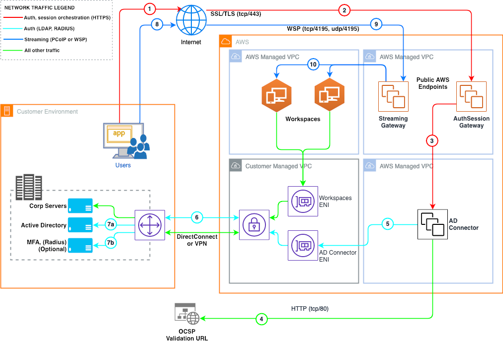

[WorkSpaces smart card authentication](https://docs.aws.amazon.com/workspaces/latest/adminguide/smart-cards.html?sc_channel=el&sc_campaign=tutorial&sc_geo=mult&sc_country=mult&sc_outcome=acq&sc_content=microsoft-pki-smart-card-authentication-amazon-workspaces) is supported in the following regions at this time:

* Asia Pacific (Sydney)
* Asia Pacific (Tokyo)
* Europe (Ireland)
* AWS GovCloud (US-East)
* AWS GovCloud (US-West)
* US East (N. Virginia)
* US West (Oregon)

| Attributes                |                                   |
| ------------------- | -------------------------------------- |
| ✅ AWS Level        | Advanced - 300                         |
| ⏱ Time to complete  | 2 hours 30 minutes                         |
| 💰 Cost to complete | $150 USD/month (dependent on instance types)      |
| 🧩 Prerequisites    | - [AWS Account](https://aws.amazon.com/resources/create-account/?sc_channel=el&sc_campaign=tutorial&sc_geo=mult&sc_country=mult&sc_outcome=acq&sc_content=microsoft-pki-smart-card-authentication-amazon-workspaces)<br>- A VPC with at least 2 private subnets (with internet access) and 1 public subnet (with internet access)<br>- Two Active Directory (AD) domain controllers in different private subnets<br>- An [AD Connector](https://docs.aws.amazon.com/directoryservice/latest/admin-guide/directory_ad_connector.html?sc_channel=el&sc_campaign=tutorial&sc_geo=mult&sc_country=mult&sc_outcome=acq&sc_content=microsoft-pki-smart-card-authentication-amazon-workspaces)<br>- A [EC2 security group](https://docs.aws.amazon.com/AWSEC2/latest/WindowsGuide/working-with-security-groups.html#creating-security-group?sc_channel=el&sc_campaign=tutorial&sc_geo=mult&sc_country=mult&sc_outcome=acq&sc_content=microsoft-pki-smart-card-authentication-amazon-workspaces)<br>- A [EC2 Keypair](https://docs.aws.amazon.com/AWSEC2/latest/WindowsGuide/create-key-pairs.html#having-ec2-create-your-key-pair?sc_channel=el&sc_campaign=tutorial&sc_geo=mult&sc_country=mult&sc_outcome=acq&sc_content=microsoft-pki-smart-card-authentication-amazon-workspaces)<br>- A [EC2 Windows instance joined to the AD domain](https://docs.aws.amazon.com/directoryservice/latest/admin-guide/join_windows_instance.html?sc_channel=el&sc_campaign=tutorial&sc_geo=mult&sc_country=mult&sc_outcome=acq&sc_content=microsoft-pki-smart-card-authentication-amazon-workspaces)<br>- A Windows computer with the [WorkSpaces Client](https://clients.amazonworkspaces.com/) installed<br>- A CAC or PIV card<br>- **(Recommended)** A public domain in Route53 or a public domain in another provider using a top-level domain found in the [IANA Root Zone Database](https://www.iana.org/domains/root/db)<br>- **(Optional)** A public S3 bucket|
| 📢 Feedback            | <a href="https://pulse.buildon.aws/survey/DEM0H5VW" target="_blank">Any feedback, issues, or just a</a> 👍 / 👎 ?    |
| ⏰ Last Updated     | 2023-06-23                             |

|ToC|
|---|

## Prerequisites

For this walkthrough, you should have the following prerequisites:

* A VPC with at least **2 private subnets (with internet access)** and **1 public subnet (with internet access)** ([Example](https://docs.aws.amazon.com/vpc/latest/userguide/vpc-example-web-database-servers.html?sc_channel=el&sc_campaign=tutorial&sc_geo=mult&sc_country=mult&sc_outcome=acq&sc_content=microsoft-pki-smart-card-authentication-amazon-workspaces)) that does not overlap with the [WorkSpaces management interface IP ranges](https://docs.aws.amazon.com/workspaces/latest/adminguide/workspaces-port-requirements.html#management-ip-ranges?sc_channel=el&sc_campaign=tutorial&sc_geo=mult&sc_country=mult&sc_outcome=acq&sc_content=microsoft-pki-smart-card-authentication-amazon-workspaces).
* Two Active Directory (AD) domain controllers in different private subnets. (You can use [AWS Launch Wizard for Active Directory](https://docs.aws.amazon.com/launchwizard/latest/userguide/what-is-launch-wizard-active-directory.html?sc_channel=el&sc_campaign=tutorial&sc_geo=mult&sc_country=mult&sc_outcome=acq&sc_content=microsoft-pki-smart-card-authentication-amazon-workspaces) to deploy self-managed AD or AWS Managed Microsoft AD if you do not have AD setup. If using on-premises AD, ensure VPC connectivity to on-premises is already set up.)
* An [AD Connector](https://docs.aws.amazon.com/directoryservice/latest/admin-guide/directory_ad_connector.html?sc_channel=el&sc_campaign=tutorial&sc_geo=mult&sc_country=mult&sc_outcome=acq&sc_content=microsoft-pki-smart-card-authentication-amazon-workspaces) configured to use those domain controllers (including the credentials to your AD Connector service account).
* A security group that allows [outbound connectivity](https://learn.microsoft.com/en-us/troubleshoot/windows-server/identity/config-firewall-for-ad-domains-and-trusts) to the AD domain controllers.
* A [EC2 Keypair](https://docs.aws.amazon.com/AWSEC2/latest/WindowsGuide/create-key-pairs.html#having-ec2-create-your-key-pair?sc_channel=el&sc_campaign=tutorial&sc_geo=mult&sc_country=mult&sc_outcome=acq&sc_content=microsoft-pki-smart-card-authentication-amazon-workspaces).
* A [EC2 Windows instance joined to the AD domain](https://docs.aws.amazon.com/directoryservice/latest/admin-guide/join_windows_instance.html?sc_channel=el&sc_campaign=tutorial&sc_geo=mult&sc_country=mult&sc_outcome=acq&sc_content=microsoft-pki-smart-card-authentication-amazon-workspaces) (referred to as the MGMT EC2 instance in this post).
* A Windows computer with the [WorkSpaces Client](https://clients.amazonworkspaces.com/) installed for testing authentication into the WorkSpace
* A CAC or PIV card used for smart card authentication (e.g. [Yubikey 5](https://www.yubico.com/authentication-standards/smart-card/), Taglio PIVKey + Smart Card Reader, or equivalent products supporting CAC/PIV).
* **(Recommended)** A public domain in Route53 or a public domain in another provider using a top-level domain found in the [IANA Root Zone Database](https://www.iana.org/domains/root/db) to host a DNS record for the OCSP (Online Certificate Status Protocol) responder instance.
* **(Optional)** A public S3 bucket to store certificate revocation lists (CRLs) and public certificates of the CA(s). You aren’t required to store the certificates and CRLs in an S3 bucket. If you don’t use an S3 bucket, the CRLs will be hosted in a file share and [Internet Information Services (IIS)](https://docs.microsoft.com/en-us/iis/get-started/introduction-to-iis/iis-web-server-overview) website on the Enterprise CA.

## Deploying the Solution

The solution I present here involves the following steps:

1. Deploy [Microsoft PKI Quick Start template](https://aws-quickstart.github.io/quickstart-microsoft-pki/) and set up OCSP responder (required if you do not have PKI already set up in your AD environment)
2. Create objects in Active Directory with necessary permissions
3. Configure the Certificate Authority to allow certificates to be issued to smart card users
4. Request a certificate for your individual smart card user
5. Verify the smart card is working with its certificate properly and test that the certificate can be verified with OCSP
6. Register AD Connector with WorkSpaces, create a test Windows WorkSpace using WorkSpaces Streaming Protocol (WSP), import the WSP GPO template, and enable smart card redirection on WorkSpaces
7. Configure the AD Connector to use smart card authentication
8. Test pre-session smart card authentication on Windows WorkSpaces
9. Test in-session smart card authentication on Windows WorkSpaces
10. Set up smart card authentication on Linux WorkSpaces **(GovCloud only)**
11. Test smart card authentication on Linux WorkSpaces **(GovCloud only)**

### Section 1: Deploy an offline root CA and enterprise subordinate CA by using the Microsoft Public Key Infrastructure Quick Start template and set up an OCSP responder

If you do not already have Microsoft PKI infrastructure set up (e.g. CAs, OCSP responder) in your AD environment, this first section is to deploy an offline root CA and enterprise subordinate CA by using the Microsoft Public Key Infrastructure Quick Start template and create an OCSP responder instance. **If you already have PKI infrastructure set up, including an OCSP responder, please skip to Section 2.**

#### Step 1. Create a Secret in Secrets Manager

In this step, you store the AD account credentials used for deploying the template in a Secrets Manager secret. Automation uses this secret to create the CA infrastructure in your self-managed AD environment. This user account should be in the Enterprise Admins group.

1. In the [Secrets Manager console](https://console.aws.amazon.com/secretsmanager/?sc_channel=el&sc_campaign=tutorial&sc_geo=mult&sc_country=mult&sc_outcome=acq&sc_content=microsoft-pki-smart-card-authentication-amazon-workspaces), choose **Store a new secret**.
2. On the **Store a new secret page**, under **Select secret type**, choose **Other type of secret**.
3. Under **Key/value pairs**, do the following:
    * In the first field, enter `username`, and in the same row, in the next field, enter the name of your AD account.
    * Choose **+ Add row**.
    * On the new row, in the first field, enter `password`, and on the same row, in the next field, enter the password for your AD account.
    * Under **Encryption key**, choose a key of your choice.
    * Choose **Next**.
4. On the **Store a new secret page**, for **Secret name**, enter a name for the secret, leave the default settings for the remaining fields, and choose **Next** on each of the next two pages.
5. Review the settings, and then choose **Store** to save your changes. The Secrets Manager console returns you to the list of secrets in your account with your new secret included in the list.
6. Choose your newly created secret from the list, and take note of the **Secret ARN** value. You will need it in the next step.

#### Step 2: Deploy the Microsoft Public Key Infrastructure Quick Start template

In this step, you deploy an offline root CA and an enterprise subordinate CA by using the [Microsoft Public Key Infrastructure Quick Start](https://aws.amazon.com/quickstart/architecture/microsoft-pki/). Because you use a Quick Start template for this deployment, you only need to enter the following information—you can change the default values for any fields not explicitly mentioned below.

To deploy the CAs with the Microsoft Public Key Infrastructure Quick Start

1. In the [AWS CloudFormation console](https://console.aws.amazon.com/cloudformation/), choose Create stack and then do the following:
    * For **Prepare template**, select **Template is ready**.
    * For **Template source**, select **Amazon S3 URL**.
    * For **Amazon S3 URL**, enter:  `https://aws-quickstart.s3.amazonaws.com/quickstart-microsoft-pki/templates/microsoft-pki.template.yaml`
    * Choose **Next**.
2. Specify the stack details as follows:
    * For **VPC CIDR**, enter the CIDR of the VPC where your AD domain controllers reside.
    * For **VPC ID**, select the VPC where your AD domain controllers reside.
    * For **CA(s) Subnet ID**, select a private subnet in the VPC where your AD domain controllers reside.
    * For **Domain Members Security Group ID**, select an existing security group that allows [outbound communication](https://learn.microsoft.com/en-us/troubleshoot/windows-server/identity/config-firewall-for-ad-domains-and-trusts) with the AD domain controllers. This will be attached to the CA instances that are created.
    * For **Key Pair Name**, select any EC2 key pair in your account.
    * For **Active Directory Domain Services Type**, select **SelfManaged** or **AWSManaged** (dependent on your AD environment).
    * For **Domain FQDN DNS Name**, enter the DNS name of the AD domain. In this example, I use `corp.example.com`.
    * For **Domain NetBIOS Name**, enter the NetBIOS name of the AD domain. In this example, I use `CORP`.
    * For **IP used for DNS (Must be accessible)**, enter the IP address of one of the AD domain controllers.
    * For **IP used for DNS (Must be accessible)**, enter the IP address of the other AD domain controller in a different subnet.
    * For **Secret ARN Containing CA Install Credentials**, enter the Secrets Manager secret ARN created in **Step 1: Create Secret in Secrets Manager**.
    * For **CA Deployment Type**, select **One-Tier** or **Two-Tier**. Two-Tier is recommended, refer to [CA Hierachies](https://techcommunity.microsoft.com/t5/ask-the-directory-services-team/designing-and-implementing-a-pki-part-i-design-and-planning/ba-p/396953) for more details.
    * For **Use S3 for CA CRL Location**, select **No** or **Yes**.
       **Note:** If you don’t want to use an S3 bucket to store the certificate revocation lists (CRLs), set **Use S3 for CA CRL Location** to **No**. When **No** is selected, the Quick Start stores and hosts the CRLs in a file share and [Internet Information Services (IIS)](https://docs.microsoft.com/en-us/iis/get-started/introduction-to-iis/iis-web-server-overview) website on the Enterprise CA. 
    * For **CA CRL S3 Bucket Name**, enter the name of the bucket you created to store certificate revocation lists (CRLs) and certificates.
        **Note:** If you set **Use S3 for CA CRL Location** to **No**, leave this field as default.
    * Select **Next** on the current screen and the following screen.
    * Check the box next to each of the following statements.
        * **I acknowledge that AWS CloudFormation might create IAM resources with custom names.**
        * **I acknowledge that AWS CloudFormation might require the following capability: CAPABILITY_AUTO_EXPAND.**
    * Choose **Create stack**.
  


It should take 20 to 30 minutes for the resources to deploy.

#### Step 3: Allow the Domain Controllers to Communicate with the Enterprise CA

In this step, you configure AWS security group rules so that your directory domain controllers can connect to the enterprise subordinate CA to request a certificate. To do this, you must add outbound rules to each domain controller’s AWS security group to allow all outbound traffic to the AWS security group of the enterprise subordinate CA so that the directory domain controllers can connect to the enterprise subordinate CA to request a certificate. If you are using **self-managed AD** and your domain controllers are outside of AWS, you can ensure your domain controllers allow the necessary traffic from on-premises to the enterprise subordinate CA instance.

1. In the navigation pane of the [AWS VPC console](https://console.aws.amazon.com/vpc/?sc_channel=el&sc_campaign=tutorial&sc_geo=mult&sc_country=mult&sc_outcome=acq&sc_content=microsoft-pki-smart-card-authentication-amazon-workspaces), under the **Security** heading, choose **Security Groups**.
2. Select the AWS security group of your AWS Managed Microsoft AD directory. When using AWS Managed Microsoft AD, the security group name is formatted like the following: `d-1234567890_controllers`. If using self-managed AD, select a different security group that is attached to your domain controllers.
3. Switch to the **Outbound rules** tab, and choose **Edit outbound rules**.
4. Choose **Add rule** and then do the following:
   * For **Type**, select **Custom TCP**.
   * For **Port range**, enter `135`.
   * For **Destination**, select **Custom** and then enter the private IP assigned to the Enterprise CA instance.
   * Add an additional rule by repeating the same above steps, but change the **Port range** value to `49152 - 65535`.
   * Add another additional rule by repeating the same above steps, but change the **Port range** value to `80` and the **Destination** to **Anywhere-IPv4** to allow the domain controllers to check CRLs during authentication. This can be restricted further based on your environment.
5. Choose **Save rules**.

When using AWS Managed Microsoft AD, the domain controllers will automatically request a certificate based on the template named **LdapOverSSL-QS** that was created by the Microsoft Public Key Infrastructure on AWS Quick Start deployment. It can take up to **30 minutes** for the directory domain controllers to auto-enroll the available certificates. If using self-managed AD, the next step discusses how you can enable auto-enrollment to accomplish the same.

#### Step 4: Setup domain controller auto-enrollment for certificates (self-managed AD)

As the CloudFormation template creates and deploys a certificate template named **LdapOverSSL-QS**, ensure your domain controllers have auto-enrollment enabled in order for them to be granted a certificate to be used for authenticating users. Each domain controller that is going to authenticate smart card users **must have** a domain controller certificate. If you are using **AWS Microsoft Managed AD**, you can skip this step as it is already enabled.

1. Connect to your MGMT instance with an AD user in the Domain Admins group or a group with equivalent permissions.
2. Open PowerShell as an Administrator and run the following commands to install the Group Policy Management console if it's not installed and open it:

```powershell
Install-WindowsFeature GPMC
gpmc.msc
```

3. Create or locate an existing group policy in your domain that will apply to your domain controllers, right-click it, select **Edit…**
4. Enable certificate auto-enrollment in the policy:
    * In the Group Policy Management Editor, under **Computer Configuration**, and expand **Policies**.
    * Expand **Windows Settings**, expand **Security Settings**, and select **Public Key Policies.**
    * Double-click **Certificate Services Client – Auto-Enrollment** and set the following settings:  

    * After applying the setting, close out of Group Policy Management Editor.

#### Step 5: Confirm the Domain Controllers Contain Required Certificates

Each domain controller that is going to authenticate smart card users **must have** a domain controller certificate. Ensure the domain controllers have a certificate in their Personal store from the certificate template **LdapOverSSL-QS**. 

Review the certificate store on each domain controller to ensure they receive a certificate from the **LdapOverSSL-QS** template:

1. On the MGMT instance, open **certlm.msc**.
2. Right-click **Certificates – Local Computer**, select **Connect to Another Computer**, enter the name of one of the DCs, select **OK**.
3. Expand **Personal**, select **Certificates**, and confirm a certificate exists from the **LdapOverSSL-QS** template:

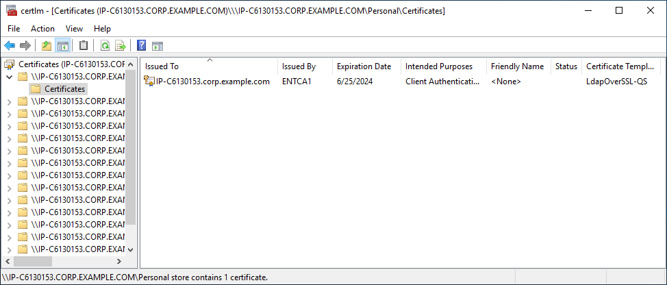

4. Repeat the above steps for the remaining domain controllers in the domain that will be authenticating users.
5. Run the following command in PowerShell and ensure it completes successfully without any errors:

```powershell
certutil -DCInfo
```

#### Step 6: Deploy an EC2 Windows Instance and Configure it as an OCSP Responder Instance

For pre-session authentication into WorkSpaces, Online Certificate Status Protocol (OCSP) is required for certificate revocation checking. An OCSP responder is a component of a public key infrastructure (PKI) that can be installed on Windows Server to meet this requirement. The OCSP responder is required to be publicly accessible on the internet over HTTP. In this blog post, we are only setting up one OCSP responder, which we will refer to as the OCSP instance. If you’d like to make the OCSP responder highly available, you can do so by setting up [multiple OCSP responders in an Array](https://techcommunity.microsoft.com/t5/ask-the-directory-services-team/implementing-an-ocsp-responder-part-v-high-availability/ba-p/396882).

1. [Launch a standard EC2 Windows instance](https://docs.aws.amazon.com/AWSEC2/latest/WindowsGuide/EC2_GetStarted.html?sc_channel=el&sc_campaign=tutorial&sc_geo=mult&sc_country=mult&sc_outcome=acq&sc_content=microsoft-pki-smart-card-authentication-amazon-workspaces) using Windows Server in a public subnet (OCSP responder should be in a public subnet) and set **Auto-assign public IP** to **enable**. At minimum, a t2.medium instance type or equivalent is recommended.
2. Attach a security group to the OCSP instance that allows you to **RDP (port 3389)** into it.
3. [Allocate an Elastic IP](https://docs.aws.amazon.com/AWSEC2/latest/UserGuide/elastic-ip-addresses-eip.html?sc_channel=el&sc_campaign=tutorial&sc_geo=mult&sc_country=mult&sc_outcome=acq&sc_content=microsoft-pki-smart-card-authentication-amazon-workspaces) and [associate the Elastic IP](https://docs.aws.amazon.com/AWSEC2/latest/UserGuide/elastic-ip-addresses-eip.html?sc_channel=el&sc_campaign=tutorial&sc_geo=mult&sc_country=mult&sc_outcome=acq&sc_content=microsoft-pki-smart-card-authentication-amazon-workspaces) with the EC2 instance.
4. Gather a public DNS name that resolves to the public IP address of your EC2 instance for use later when setting the OCSP responder URL:
    * **Option 1: (Recommended)** If you own a public domain in Route53 or another provider, [create an A record](https://docs.aws.amazon.com/Route53/latest/DeveloperGuide/resource-record-sets-creating.html?sc_channel=el&sc_campaign=tutorial&sc_geo=mult&sc_country=mult&sc_outcome=acq&sc_content=microsoft-pki-smart-card-authentication-amazon-workspaces) that resolves to the IP address of the OCSP instance. Note down the full DNS name of this record (e.g. ocsp.mydomain.com) as you will need it in the following steps when configuring the CA for OCSP.
    * **Option 2:** If you do not own a public domain, you can instead use the [auto-generated public IPv4 DNS name](https://docs.aws.amazon.com/vpc/latest/userguide/vpc-dns.html?sc_channel=el&sc_campaign=tutorial&sc_geo=mult&sc_country=mult&sc_outcome=acq&sc_content=microsoft-pki-smart-card-authentication-amazon-workspaces) of your EC2 instance. You can find this value in the details tab of your EC2 instance in AWS console. Note down the value of the **Public IPv4 DNS** name for the following steps when configuring the CA for OCSP. If this value does not appear, please ensure [DNS hostnames](https://docs.aws.amazon.com/vpc/latest/userguide/vpc-dns.html#vpc-dns-hostnames?sc_channel=el&sc_campaign=tutorial&sc_geo=mult&sc_country=mult&sc_outcome=acq&sc_content=microsoft-pki-smart-card-authentication-amazon-workspaces) is enabled on your VPC.
    * **Note:** If using a DNS name, it must use a top-level domain found in the [Internet Assigned Numbers Authority (IANA) Root Zone Database](https://www.iana.org/domains/root/db).
5. [Manually join](https://docs.aws.amazon.com/directoryservice/latest/admin-guide/join_windows_instance.html?sc_channel=el&sc_campaign=devopswave&sc_content=microsoft-pki-smart-card-authentication-amazon-workspaces&sc_geo=mult&sc_country=mult&sc_outcome=acq) the OCSP instance to your AD domain, specify a desired computer name (e.g. OCSP), and restart it.
6. Connect to your Enterprise CA instance (created from the Quick Start template) with an AD user in the Domain Admins or AWS Delegated Administrators group.
7. Duplicate a new OCSP response signing certificate template:
    * Open **certtmpl.msc**, find **OCSP Response Signing** template, right-click it, select **Duplicate Template**.
    * Select the **Compatibility** tab, select the operating system used by the Enterprise CA. Choose **Server 2016** if using Server 2016 or newer. For **Certificate recipient**, select the Windows version used by the OCSP responder instance.
    * Select the **General** tab, give it a name (e.g. CA OCSP Response Signing), and check **Publish certificate in Active Directory**.  
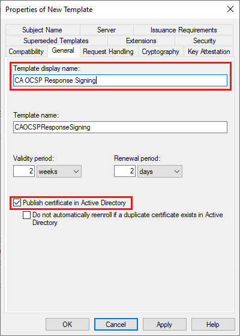
    * Select **Security** tab, select **Add…**, select **Object Types…**, check **Computers**, select **OK**.  

    * Enter the computer name of your OCSP instance, select **OK**.
    * For the computer you just added, under **Allow** column, check both **Read** and **Enroll**, select **OK**.  

8. Publish your certificate template (e.g. CA OCSP Response Signing) and set the OCSP URL on your CA:
    * Open **certsrv.msc**, expand the underlying CA.
    * Right-click **Certificate Templates**, hover over **New**, select **Certificate Template to Issue**.
    * Select your certificate template (e.g. CA OCSP Response Signing), select **OK**.  
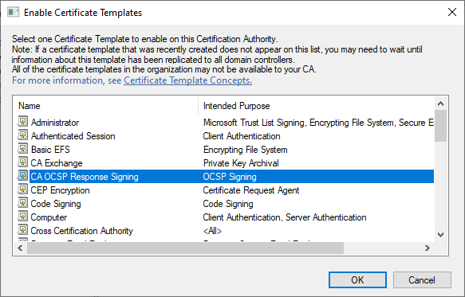
9. Set the OCSP URL on your CA:
    * Under **Certification Authority (Local)**, right-click the underlying CA (e.g. ENTCA1), select **Properties**, select **Extensions** tab.
    * Under **Select extension:**, change to **Authority Information Access (AIA)**, select **Add…**
    * For **Location:** enter the URL that includes the DNS name you noted previously in Point 4 above with /ocsp at the end: `http://ocsp.example.com/ocsp`  
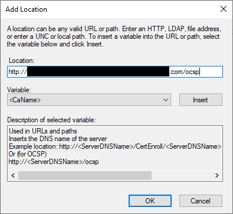
    * Select **OK**, check the box **Include in the online certificate status protocol (OCSP) extension**.  

    * Select **OK**, select **Yes** when prompted to restart the AD CS service for the changes to take effect.
    * **Note:** AD Connector [requires an HTTP URL](https://docs.aws.amazon.com/directoryservice/latest/admin-guide/prereqs-clientauth.html#ocsp?sc_channel=el&sc_campaign=tutorial&sc_geo=mult&sc_country=mult&sc_outcome=acq&sc_content=microsoft-pki-smart-card-authentication-amazon-workspaces) for the OCSP responder URL.
10. Connect to your OCSP instance and install the OCSP responder:
    * Connect to your OCSP instance with an AD user in the Domain Admins or AWS Delegated Administrators group.
    * Open PowerShell as Administrator and run the following commands to install the OCSP responder:  

      ```powershell
      Import-Module ServerManager
      Add-WindowsFeature Adcs-Online-Cert
      Install-AdcsOnlineResponder
      Install-WindowsFeature RSAT-Online-Responder
      ```
    * **Note:** The above commands were tested on Server 2019 and newer.

    * Respond to any installation prompts and wait for the installation to complete.

11. Configure OCSP after installation:
    * Open **ocsp.msc**, right-click **Revocation Configuration**, select **Add Revocation Configuration**.
    * Select **Next**, enter a name (e.g. OCSP), select **Next**, select **Select a certificate for an Existing enterprise CA**, select **Next**.  

    * Select **Browse CA certificates published in Active Directory**, select **Browse…**  

    * Select your CA, select **OK**  
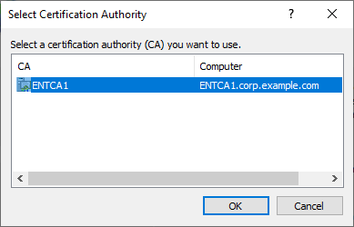
    * Select **Next**, ensure to select the certificate template created earlier.  

    * Select **Next**, select **Finish**.
12. Adjust the security group attached to the OCSP instance to allow **HTTP (port 80) inbound** from all **IP addresses** as required for the OCSP responder configuration. To perform certificate revocation checking, the OCSP responder must be internet-accessible.

13. Connect back to the Enterprise CA instance and verify Enterprise PKI status:
    * Connect to your Enterprise CA instance.
    * Open **pkiview.msc**, expand out your CAs, select **Refresh**, left-click your CA
    * The content should look similar to the following (with your correct OSCP URL that you also set on the certificate template earlier):  

**Note:** If the OCSP Location #1 shows any error status, it can be due to your Enterprise CA instance not having internet connectivity and/or the OCSP instance is not allowing HTTP traffic from ALL IPs. The Enterprise CA instance needs internet access to verify that the OCSP location is publicly reachable.

14. The public DNS name for your OCSP instance should be publicly resolvable and should be accessible over HTTP (port 80), therefore, on any computer confirm this:
    * Open PowerShell and run the following command (adjust the command to your configured OCSP DNS name): `tnc ocsp.mydomain.com -port 80`
    * The results should look similar to the following:  


### Section 2: Create Objects in the Active Directory with the Necessary Permissions

In this step, we will configure AD objects in your environment to prepare for smart card authentication and setup Kerberos Constrained Delegation on your AD Connector service account.

1. Install Active Directory tools on the MGMT instance and create AD objects:
    * Connect to your MGMT EC2 instance with an AD user in the Domain Admins or AWS Delegated Administrators group.
    * Once connected, open PowerShell as Administrator and run the following commands. When prompted, enter the desired password for the test smart card user and hit enter. These commands will create an AD user for your test smart card user and an AD group for the smart card users. If you already have an AD user with an email address and AD group created for this purpose, you can skip this.

   ```powershell
   $SmartCardTestUser = "testuser"
   $SmartCardUsersGroup = "Smartcard Users"
   Install-WindowsFeature RSAT-AD-Tools
   
   $DomainName = ("$env:USERDNSDomain".ToLower())
   $OrganizationalUnitForGroup = Get-ADDomain -Current LocalComputer | Select-Object -Expand UsersContainer
   New-ADGroup -Name $SmartCardUsersGroup -SamAccountName $SmartCardUsersGroup -GroupCategory Security -GroupScope Global -DisplayName $SmartCardUsersGroup -Path $OrganizationalUnitForGroup
   New-ADUser -Name $SmartCardTestUser -AccountPassword (Read-Host -AsSecureString "Enter the desired account password for $SmartCardTestUser") -OtherAttributes @{'mail'="$SmartCardTestUser@$DomainName";'UserPrincipalName'="$SmartCardTestUser@$DomainName"} -Enabled $true
   Add-ADGroupMember -Identity $SmartCardUsersGroup -Members $SmartCardTestUser 
   ```

2. Use the SetSpn command to set a Service Principal Name (SPN) for your existing AD Connector service account to enable the service account for delegation configuration:
    * Open PowerShell and run the following commands (adjust the variables to specify your service account and any unique SPN):  

   ```powershell
   $ServiceAccount = "ADConnectorSvc"
   $UniqueSPNName = "my/spn"
   setspn -s $UniqueSPNName $ServiceAccount
   ```

3. Configure the delegation settings on your AD Connector service account to allow [mutual TLS authentication with your AD Connector](https://docs.aws.amazon.com/directoryservice/latest/admin-guide/ad_connector_clientauth.html?sc_channel=el&sc_campaign=tutorial&sc_geo=mult&sc_country=mult&sc_outcome=acq&sc_content=microsoft-pki-smart-card-authentication-amazon-workspaces):
    * Open **dsa.msc**, locate your AD Connector service account, right-click it, select **Properties**.
    * Choose the **Delegation** tab, Select the **Trust this user for delegation to specified services only** and **Use any authentication protocol** radio buttons:  

    * Choose **Add…**, select **Users or Computers**, and add ALL of the domain controllers that the AD Connector service account will be allowed to complete TLS mutual authentication with. If using AWS Managed Microsoft AD, add all domain controllers.
    * Choose **OK** to display a list of available services used for delegation.
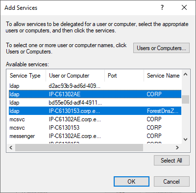
    * Choose the **LDAP** service type for each domain controller, click **OK** and click **OK** to finish the configuration.
    * Please note that the Kerberos Constrained Delegation setting is specific to computer names. When using AWS Managed AD as your domain controllers, the domain controllers may be replaced with new domain controllers causing this setting to become inaccurate, which will cause users to fail to log in with smart card authentication in the WorkSpaces client. You may want to consider automating the updating of this value using PowerShell in that scenario. 

### Section 3: Configure the Certificate Authority to Allow Certificates to be Issued to Smart Card Users

1. Create a certificate template to allow self-enrollment smart card logon certificates to your users:
    * Connect to your Enterprise CA with an AD user in the Domain Admins or AWS Delegated Administrators group.
    * Open **certtmpl.msc**, find the **Smartcard Logon** template, right-click it, select **Duplicate Template**.
    * Select the **Compatibility** tab, select the operating system used by the Enterprise CA. Choose **Server 2016** if using Server 2016 or newer. For **Certificate recipient**, select the oldest Windows version in your environment.
    * Select the **General** tab:
        * Change the **Template display name** to a desired name (e.g. SmartcardWS, you will need this name later).
        * (Optional) Select **Publish certificate in Active Directory**.
        * (Optional) Select **Do not automatically reenroll if a duplicate certificate exists in Active Directory**.
        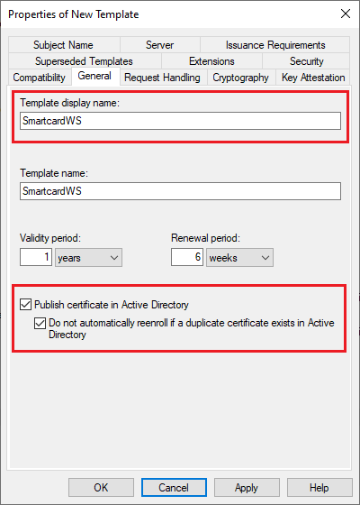
    * Select the **Request Handling** tab:
        * Ensure **Purpose:** is **Signature and encryption**
        * **(Optional)** Check **Include symmetric algorithms allowed by the subject**.
        * Change **Do the following when the subject is enrolled and when the private key associated with this certificate is used** to **Prompt the user during enrollment** or to your preference.
        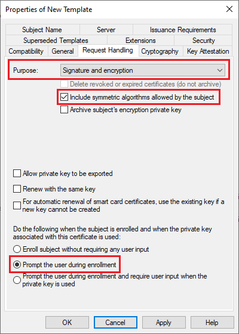
    * Select the **Cryptography** tab:
        * Change **Provider Category:** to **Key Storage Provider**.
        * Select **Requests must use one of the following providers**, check **Microsoft Smart Card Key Storage Provider**.  
        * Change **Request hash:** to **SHA256** or to your preference.
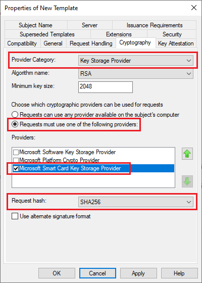
    * Select the **Security** tab and select **Add…**
    * Add a user or group that you want to have the ability to request a smart card certificate (e.g. Smartcard Users AD group that was created earlier), and select **OK**.
    * For the user/group you added, check both **Read** and **Enroll** under the **Allow** column.  

    * Select **OK** to finish the creation of the certificate template

2. Publish the certificate template:
    * Open **certsrv.msc**, expand the underlying CA.
    * Right-click **Certificate Templates**, hover over **New**, select **Certificate Template to Issue**.
    * Select the certificate template you just created, select **OK**.

### Section 4: Request a Certificate for Your Test Smart Card User

In this section, we will log in as the smart card user, confirm the smart card is functioning, request a certificate used for smart card authentication, and load the certificate onto the smart card. Some smart cards may require specific drivers to be installed in order for the smart card to function in Windows.

1. Connect to a EC2 Windows instance or computer that is joined to your domain as your test smart card user. 

**Note:** If connecting to a remote computer, ensure to use an RDP client that can redirect the smart card into the remote session. The Microsoft Remote Desktop Client can be used for this purpose.

2. Confirm the smart card is functioning in Windows:
    * Open PowerShell, run the command `certutil -scinfo`, and enter your PIN when prompted.
    * The smart card should report as available for use and no errors should be reported.  
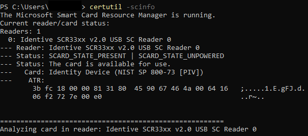
    **Note**: Some smart cards may require minidrivers to be installed. Please refer to the guidance from the manufacturer of the smart card to configure it for use in Windows.

3. Request a certificate for the smart card test user:
    * Open **certmgr.msc** while logged in as your test smart card user.
    * Right-click **Personal**, select **All Tasks**, select **Request New Certificate…**
    * Select **Next**, select **Next**, check the box next to your certificate template (e.g. SmartcardWS), select **Enroll**:  
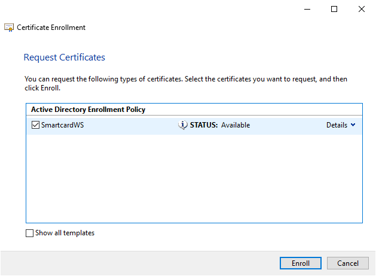
        **Note:** If you do not see the certificate template, ensure your user has enroll permissions on the certificate template. If the computer does not have the CA certificates installed, the certificate template may not be presented. Complete a group policy update to install the certificates.
    * When prompted, enter in your smart card PIN and complete the certificate request:  
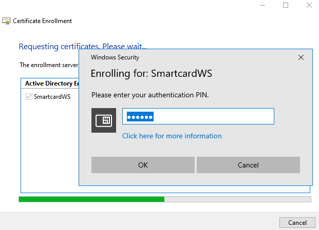
    * The certificate request should succeed:  
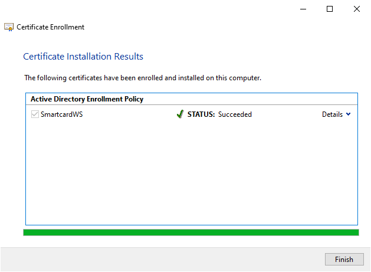
    **Note:**
        * If you are not prompted to enter your PIN during this process, please ensure your certificate template is set up correctly and that your smart card is functioning.
        * Smart cards can have multiple digital slots. Please ensure your certificate is loaded into the authentication slot in order for Windows smart card authentication to succeed.

### Section 5: Verify the Smart Card is Working Properly with its Certificate and Test that the Certificate Can Be Verified with OCSP

1. Verify the smart card is working properly with its certificate:
    * Open **certmgr.msc** while logged in as your test smart card user on a computer with the smart card inserted.
    * Expand **Personal**, select **Certificates** folder, and confirm if you see a certificate appear that is signed by your CA’s certs.  

    * If the certificate appears, delete the certificate (ensure you delete the correct one), and unplug your smart card.
    * If the certificate doesn't appear, unplug your smart card. Plug the smart card back in, click the refresh button in certmgr.msc, and the certificate should appear (it may take some time and multiple refreshes).
    * This confirms that the smart card is functioning as expected.

2. Test that the certificate can be verified with OCSP:
    * In **certmgr.msc**, right-click your test user’s certificate, select **All Tasks**, select **Export…**.
    * Select **Next**, select **Next,** select **Next** select **Browse…**, save the certificate, select **Finish**, and select **OK**.
    * Open PowerShell and change directory (cd) to the directory where the certificate was exported to, and run the following command against the certificate: `certutil -URL exportedcertificate.cer`
    * In the URL Retrieval Tool window that opens, select the **OCSP (from AIA)** radio button.  

    * Select **Retrieve**, and you should see the status as **Verified** and the OCSP URL appear.  
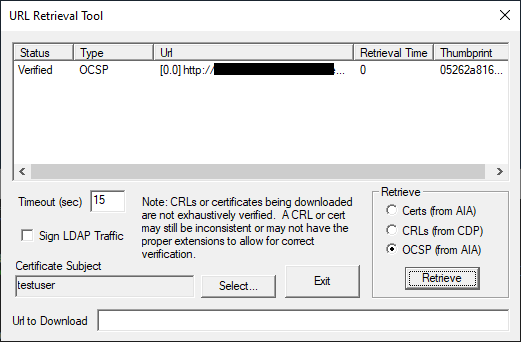
    **Note:** If the above fails after 15 seconds or returns unsuccessful, it's likely that you do not have your CA certificates installed in the local computer store that is completing this test, or that your OCSP responder is not configured correctly.

### Section 6: Register AD Connector with WorkSpaces, Create a Test Windows WSP WorkSpace, Import the WSP GPO Template, and Enable Smart Card Redirection on WorkSpaces

In this section, we will register your AD Connector with WorkSpaces, create a test Windows WSP WorkSpace, import the WSP GPO template, and enable smart card redirection via Group Policy.

1. [Register your AD Connector](https://docs.aws.amazon.com/workspaces/latest/adminguide/register-deregister-directory.html?sc_channel=el&sc_campaign=tutorial&sc_geo=mult&sc_country=mult&sc_outcome=acq&sc_content=microsoft-pki-smart-card-authentication-amazon-workspaces) with WorkSpaces:
    * Open the [WorkSpaces console](https://console.aws.amazon.com/workspaces/?sc_channel=el&sc_campaign=tutorial&sc_geo=mult&sc_country=mult&sc_outcome=acq&sc_content=microsoft-pki-smart-card-authentication-amazon-workspaces), and choose **Directories** in the navigation pane.
    * Select your AD Connector, choose **Actions**, select **Register**.
    * Select two subnets of your VPC that are not in the same Availability Zone. The WorkSpaces launched against this directory will be launched in these subnets.
    * Choose **Register**.

2. Create a test Windows WSP WorkSpace:
    * [Launch a WSP WorkSpace](https://docs.aws.amazon.com/workspaces/latest/adminguide/launch-workspace-ad-connector.html?sc_channel=el&sc_campaign=tutorial&sc_geo=mult&sc_country=mult&sc_outcome=acq&sc_content=microsoft-pki-smart-card-authentication-amazon-workspaces) for your test user and wait for it to become available.
    **Note:** Smart card authentication is only supported on WSP Windows and WSP Amazon Linux 2 WorkSpaces at this time.
3. [Allow RDP](https://repost.aws/knowledge-center/connect-workspace-rdp) into your WorkSpaces.
4. Import the [WSP GPO template](https://docs.aws.amazon.com/workspaces/latest/adminguide/group_policy.html#gp_install_template_wsp?sc_channel=el&sc_campaign=tutorial&sc_geo=mult&sc_country=mult&sc_outcome=acq&sc_content=microsoft-pki-smart-card-authentication-amazon-workspaces):
    * Connect to your test user’s WorkSpace via RDP (it must be in a running state) with an AD user in the Domain Admins or AWS Delegated Administrators group.
    * Open PowerShell and run all of the following commands to copy the WSP GPO template to the SYSVOL folder:  

    ```powershell
   $DomainName = ("$env:USERDNSDomain".ToLower())
   New-Item \\$DomainName\SYSVOL\$DomainName\Policies\PolicyDefinitions -ItemType "Directory"
   New-Item \\$DomainName\SYSVOL\$DomainName\Policies\PolicyDefinitions\en-US -ItemType "Directory"
   Copy-Item "C:\Program Files\Amazon\WSP\wsp.admx" \\$DomainName\SYSVOL\$DomainName\Policies\PolicyDefinitions
   Copy-Item "C:\Program Files\Amazon\WSP\wsp.adml" \\$DomainName\SYSVOL\$DomainName\Policies\PolicyDefinitions\en-US
   ```

5. Enable smart card redirection via Group Policy on WorkSpaces:
    * Connect to your MGMT instance or a domain controller with an AD user in the Domain Admins or AWS Delegated Administrators group.
    * Open **gpmc.msc**, create or locate an existing group policy in your domain applied to the OU where the WorkSpaces computer objects are stored (e.g. default computers container or Computers OU in AWS Managed Microsoft AD), right-click it, select **Edit…**
    * In the Group Policy Management Editor, under **Computer Configuration**, expand **Policies**, expand **Administrative Templates**, expand **Amazon**, and select **WSP**.
    * Find **Enable/disable smart card redirection**, right-click it, select **Edit**, select **Enabled**, select **OK**.  
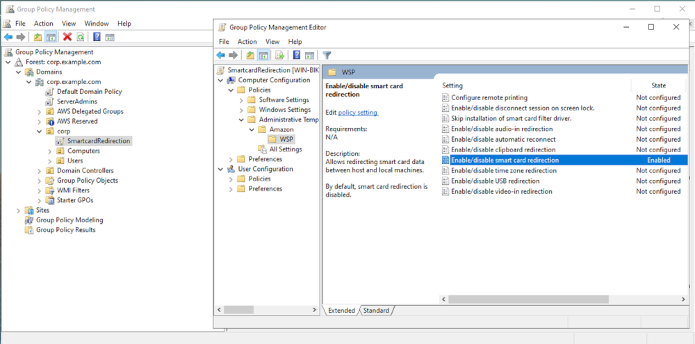
    * Close out of Group Policy Management Editor once it has been enabled.
    * Once deployed, reboot the test WorkSpace to update the group policy applied to the WorkSpace.

### Section 7: Configure the AD Connector to use smart card authentication

1. Export all of your CA certificates used in your certificate chain in Base-64 encoded format:
    * Connect to your MGMT instance as your test smart card user.
    * Open **certmgr.msc**, expand **Personal**, and select **Certificates**.
    * Double-click the user certificate, select the **Certification Path** tab.  

    * You will need to export and register every certificate in the certification path (besides the user certificate) with the AD Connector.
    * Expand **Trusted Root Certification Authorities**, and select **Certificates**.  

    * Right-click your root certificate, select **All Tasks**, select **Export…**, select **Next**, select **Base-64 encoded X.509 (.CER)**, and select **Next**.
    * Select **Browse…**, save the certificate, select **Next**, select **Finish**, select **OK**.
    * Repeat the same steps for any intermediate certificate in the **Intermediate Certification Authorities** store.  
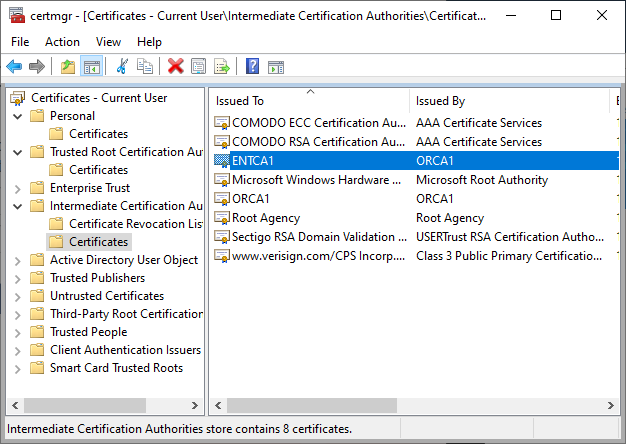
    * Copy the outputted Base64 certificate(s) to your local computer or a computer with access to AWS console.

2. Register the outputted certificates with your AD Connector:
    * Open [Directory Services console](https://console.aws.amazon.com/directoryservice/?sc_channel=el&sc_campaign=tutorial&sc_geo=mult&sc_country=mult&sc_outcome=acq&sc_content=microsoft-pki-smart-card-authentication-amazon-workspaces), view the details page of your AD Connector, scroll down to **Smart card authentication**.
    * Under **CA certificates**, select **Actions**, select **Register Certificate**.
    * Select **Choose file**, choose the certificate exported from previous step.
    * For **OCSP responder URL**, enter your OCSP responder URL.  


    * Select **Register certificate**.
    * Repeat the above steps again for each certificate in your certificate chain that you exported.
    * After all of the certificates have been registered, select **Enable** under **Smart Card authentication**, and select **Enable**, which will enable smart card authentication for the entire AD Connector.

### Section 8: Test Pre-Session Smart Card Authentication on Windows WorkSpaces

Use the WorkSpaces client to test smart card authentication:

* Download the latest [WorkSpaces client](https://clients.amazonworkspaces.com/) and open the client.
* Enter your registration code for your directory when prompted.
* Select **Insert your smart card** and select your user’s certificate when prompted.  


* Enter the smart card pin when prompted:  


* This completes the TLS mutual authentication with AD Connector login phase.
* Next, you will be presented with the Windows logon page.
* Select **Sign-in options**, select the smart card icon, and enter your smart card PIN:  


* This completes pre-session smart card authentication with Windows WorkSpaces. If you receive any errors, refer to the troubleshooting section towards the end of this article.

### Section 9: Test In-Session Smart Card Authentication on Windows WorkSpaces

Within a WorkSpaces session, test in-session smart card authentication:

* Connect to the WorkSpace.
* RDP into an EC2 instance or computer using your smart card and enter your PIN when prompted.  
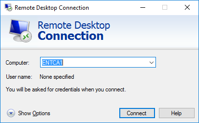  
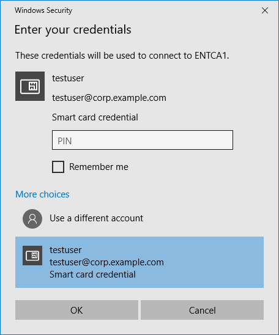

* This completes in-session smart card authentication with Windows WorkSpaces.

**Note:** Additional customizations of the Windows logon experience can be done using Microsoft's provided GPOs and the [WSP GPO template](https://docs.aws.amazon.com/workspaces/latest/adminguide/group_policy.html?sc_channel=el&sc_campaign=tutorial&sc_geo=mult&sc_country=mult&sc_outcome=acq&sc_content=microsoft-pki-smart-card-authentication-amazon-workspaces).

### Section 10: Set Up Smart Card Authentication on Linux WorkSpaces (GovCloud Only)

Smart card authentication is supported on Amazon Linux 2 WorkSpaces using the WSP protocol in the us-gov-west-1 and us-gov-east-1 regions. To set this up, you will need to [create a custom image](https://docs.aws.amazon.com/workspaces/latest/adminguide/create-custom-bundle.html?sc_channel=el&sc_campaign=tutorial&sc_geo=mult&sc_country=mult&sc_outcome=acq&sc_content=microsoft-pki-smart-card-authentication-amazon-workspaces) that contains the certificates in your certificate chain. The following steps assume the Linux user already has a certificate on their smart card. 

1. Create a temporary Linux WSP WorkSpace:
    * [Launch a WSP WorkSpace](https://docs.aws.amazon.com/workspaces/latest/adminguide/launch-workspace-ad-connector.html?sc_channel=el&sc_campaign=tutorial&sc_geo=mult&sc_country=mult&sc_outcome=acq&sc_content=microsoft-pki-smart-card-authentication-amazon-workspaces) for your test user and wait for it to become available.
2. Connect to the WorkSpace using the client (requires smart card authentication being disabled on your AD Connector for this part).
3. Configure the WorkSpace to allow users in a specific AD group of your choosing to SSH into the WorkSpaces:
    * Follow the steps to [Grant SSH access to Amazon Linux **WorkSpaces** administrators](https://docs.aws.amazon.com/workspaces/latest/adminguide/manage_linux_workspace.html#linux_ssh?sc_channel=el&sc_campaign=tutorial&sc_geo=mult&sc_country=mult&sc_outcome=acq&sc_content=microsoft-pki-smart-card-authentication-amazon-workspaces).
    * Adjust the security group attached to your WorkSpaces to [allow SSH from desired IPs](https://docs.aws.amazon.com/workspaces/latest/adminguide/connect-to-linux-workspaces-with-ssh.html#enable-ssh-directory-level-access-linux-workspaces?sc_channel=el&sc_campaign=tutorial&sc_geo=mult&sc_country=mult&sc_outcome=acq&sc_content=microsoft-pki-smart-card-authentication-amazon-workspaces).
4. From a Windows computer in your AD environment, export ALL of the certificates in your certificate chain in DER format (not including the user certificate). You can do this using **certmgr.msc** from any AD-joined Windows computer in your environment.
5. Use PowerShell from one of your Windows computers in your AD environment (e.g. MGMT instance) to copy the certificates onto the WorkSpace using SCP:  

   ```powershell
   scp C:\Users\Administrator\Desktop\root.cer example\testuser@workspace-ip-address:~/
   scp C:\Users\Administrator\Desktop\int.cer example\testuser@workspace-ip-address:~/
   ```

6. Once the certificates are copied to the WorkSpace, convert each of your certificates into PEM format using Terminal:  

   ```powershell
   openssl x509 -inform der -in ~/root.cer -out /tmp/root.pem
   openssl x509 -inform der -in ~/int.cer -out /tmp/int.pem
   ```

7. Prepare the WorkSpace for smart card authentication by running the following commands to enable smart card authentication by referring each certificate in the certificate chain:  

   ```powershell
   sudo su
   cd /usr/lib/skylight/
   ./enable_smartcard --ca-cert **/tmp/root.pem /tmp/int.pem**
   ```

8. Disconnect from the WorkSpace and [create a custom image](https://docs.aws.amazon.com/workspaces/latest/adminguide/create-custom-bundle.html#create_custom_image_bundle?sc_channel=el&sc_campaign=tutorial&sc_geo=mult&sc_country=mult&sc_outcome=acq&sc_content=microsoft-pki-smart-card-authentication-amazon-workspaces) from the WorkSpace.
9. Create a bundle from the image once the image is finished creating.
10. Launch a WorkSpace for your test smart card user from your custom bundle.

### Section 11: Test Smart Card Authentication on Linux WorkSpaces (GovCloud Only)

Use the WorkSpaces client to test smart card authentication:

* Open the WorkSpaces client.
* Enter your registration code for your directory, if prompted.
* Select **Insert your smart card**, and select your user’s certificate when prompted.  


* Enter the smart card pin when prompted:  


* This completes the TLS mutual authentication with AD Connector login phase.
* Enter your PIN at the logon page.  
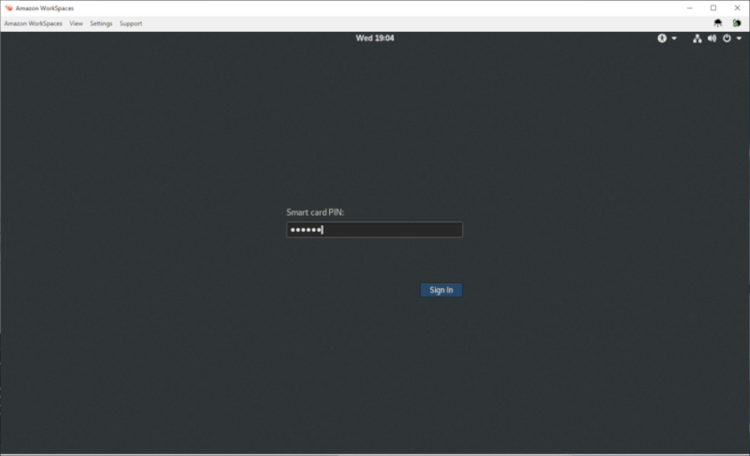

* This completes pre-session smart card authentication with Linux WorkSpaces. If you receive any errors, refer to the troubleshooting section towards the end of this article.

## Troubleshooting

### Certificate Validation Failed Error in the WorkSpaces Client 


Certificate validation failed indicates a failure before or during the mutual TLS authentication phase that occurs with the AD Connector. This can be caused due to various reasons including the following:

* The AD Connector’s service account does not have the correct Kerberos Constrained Delegation Settings. Ensure the service account is delegated access to the LDAP service on each DC that it can authenticate with, refer to [this](https://docs.aws.amazon.com/directoryservice/latest/admin-guide/enable-clientauth.html#step1?sc_channel=el&sc_campaign=tutorial&sc_geo=mult&sc_country=mult&sc_outcome=acq&sc_content=microsoft-pki-smart-card-authentication-amazon-workspaces).
* The Kerberos supported encryption types for your service account and domain controllers do not match. If you are using self-managed AD, collect the packet captures on each DC when reproducing the issue and analyze the Kerberos and LDAP traffic from the AD Connector IPs for any errors.
* OCSP validation is failing. Refer to the previous Section 5 Step 2 to test OCSP validation.
* The AD Connector registered certificates for smart card authentication are not correct.
* The smart card is failing to redirect the certificate into the user’s personal store.
* A proxy or local networking configuration is interfering with the authentication process.
* A packet capture on the self-managed domain controllers during authentication may be necessary to pinpoint the root cause. If using AWS Managed Microsoft AD (of size large) and need to take a packet capture, you can use [Traffic Mirroring](https://docs.aws.amazon.com/vpc/latest/mirroring/what-is-traffic-mirroring.html?sc_channel=el&sc_campaign=tutorial&sc_geo=mult&sc_country=mult&sc_outcome=acq&sc_content=microsoft-pki-smart-card-authentication-amazon-workspaces).

### Unknown Error Occurred in the WorkSpaces Client

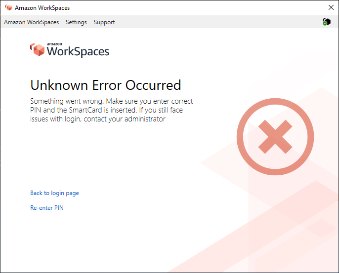

This indicates that the mutual TLS authentication with AD Connector was successful, but an issue prevented the client from starting smart card authentication. This can be caused by the following:

* The WSP GPO template to enable smart card redirection is not configured or is set to deny.
* The user certificate fails to be redirected into the WorkSpace.

### At the Windows WorkSpace Logon Screen, Various Errors Can Be Reported During Smart Card Authentication


The above error indicates a Windows OS-level smart card authentication failure. This and other related errors at this logon screen can be caused due to the following reasons:

* The domain controller authenticating the user does not have a certificate in the personal store. Review the Event Viewer logs on the WorkSpace.
* The user’s smart card certificate is not trusted by the WorkSpace. Connect to the WorkSpace using RDP and confirm what certificate is being redirected into the user’s personal store and ensure it is trusted.
* The user’s certificate is not configured correctly for Windows smart card authentication.

### At the Linux WorkSpace Logon Screen, Various Errors Can Be Reported During Smart Card Authentication


The above error indicates a Linux OS-level smart card authentication failure. This and other related errors at this logon screen can be caused due to the following reasons:
    
* The custom image used to create the WorkSpace does not have the correct certificates in the certificate chain added in the image.
* A separate OS-level authentication issue. SSH into the WorkSpace and review the logs in /var/log for any errors around the timestamp.

## Cleaning Up

1. Disable smart card authentication on the AD Connector:
    * Open [Directory Services console](https://console.aws.amazon.com/directoryservice/?sc_channel=el&sc_campaign=tutorial&sc_geo=mult&sc_country=mult&sc_outcome=acq&sc_content=microsoft-pki-smart-card-authentication-amazon-workspaces), view the details page of your AD Connector, scroll down to Smart card authentication.
    * Select **Disable** under Smart Card authentication, which will disable smart card authentication for the entire AD Connector.
2. Delete any existing WorkSpaces:
    * Open [Amazon **WorkSpaces** console](https://console.aws.amazon.com/workspaces/?sc_channel=el&sc_campaign=tutorial&sc_geo=mult&sc_country=mult&sc_outcome=acq&sc_content=microsoft-pki-smart-card-authentication-amazon-workspaces), select any existing WorkSpaces and select **Delete**.
    * Wait for the WorkSpaces to terminate.
3. Delete the custom bundle and image for your Linux WorkSpaces:
    * Open [Amazon **WorkSpaces** console](https://console.aws.amazon.com/workspaces/?sc_channel=el&sc_campaign=tutorial&sc_geo=mult&sc_country=mult&sc_outcome=acq&sc_content=microsoft-pki-smart-card-authentication-amazon-workspaces), select **Bundles**, select your bundle and select **Delete**.
    * Select **Images**, select your image, and select **Delete**.
4. Deregister the AD Connector from WorkSpaces:
    * Open [Amazon **WorkSpaces** console](https://console.aws.amazon.com/workspaces/?sc_channel=el&sc_campaign=tutorial&sc_geo=mult&sc_country=mult&sc_outcome=acq&sc_content=microsoft-pki-smart-card-authentication-amazon-workspaces) and select **Directories**.
    * Select the directory, choose **Actions**, and choose **Deregister**.
5. Delete the OCSP EC2 instance:
    * Open [EC2 console](https://console.aws.amazon.com/ec2/?sc_channel=el&sc_campaign=tutorial&sc_geo=mult&sc_country=mult&sc_outcome=acq&sc_content=microsoft-pki-smart-card-authentication-amazon-workspaces) and select **Instances**.
    * Locate the OCSP instance, select it, select **Instance state**, select **Terminate instance**.
6. If you deployed the Microsoft PKI Quick Start Template:
    * Open [CloudFormation console](https://console.aws.amazon.com/cloudformation/?sc_channel=el&sc_campaign=tutorial&sc_geo=mult&sc_country=mult&sc_outcome=acq&sc_content=microsoft-pki-smart-card-authentication-amazon-workspaces) and select the created stack.
    * Select **Delete**.
7. If you created an S3 bucket to store the CRLs:
    * Open [S3 console](https://console.aws.amazon.com/s3/?sc_channel=el&sc_campaign=tutorial&sc_geo=mult&sc_country=mult&sc_outcome=acq&sc_content=microsoft-pki-smart-card-authentication-amazon-workspaces) and select the created bucket.
    * Select Delete.
8. Delete the secret in Secrets Manager:
    * Open [Secrets Manager console](https://console.aws.amazon.com/secretsmanager/?sc_channel=el&sc_campaign=tutorial&sc_geo=mult&sc_country=mult&sc_outcome=acq&sc_content=microsoft-pki-smart-card-authentication-amazon-workspaces) and select **Secrets** on the left-side.
    * Choose the secret your created, select **Actions**, and select **Delete** secret.
9. Remove the Kerberos Constrained Delegation setting from your AD Connector service account.
10. Clean up any created DNS records, AD users, groups, and group policies your environment.

## Conclusion

In this post, you learned how to set up and configure a new or existing Microsoft PKI environment for use with smart card authentication for Amazon WorkSpaces. Now your users are able to authenticate into their WorkSpaces without needing to use a username or password.

Next, if you are using self-managed AD, instead of having users request their certificates manually through **certmgr.msc**, you can grant users autoenroll permissions on the certificate template and [configure user certificate auto-enrollment](https://learn.microsoft.com/en-us/windows-server/networking/core-network-guide/cncg/server-certs/configure-server-certificate-autoenrollment#configure-user-certificate-auto-enrollment) on their local computer. Users can then be prompted to autoenroll a certificate onto their smart card at logon to their local computer. 

Additionally, to enforce smart card authentication at the WorkSpace OS-level for Windows WorkSpaces, you can apply a group policy to adjust the [interactive logon policy](https://learn.microsoft.com/en-us/windows/security/identity-protection/smart-cards/smart-card-group-policy-and-registry-settings#additional-smart-card-group-policy-settings-and-registry-keys) on the OU where the WorkSpaces computer objects exist to require users to use a smart card when authenticating in Windows.

For more information on the Windows smart card authentication process, you can refer to Microsoft's documention on [how smart card authentication works in Windows](https://learn.microsoft.com/en-us/windows/security/identity-protection/smart-cards/smart-card-how-smart-card-sign-in-works-in-windows).
