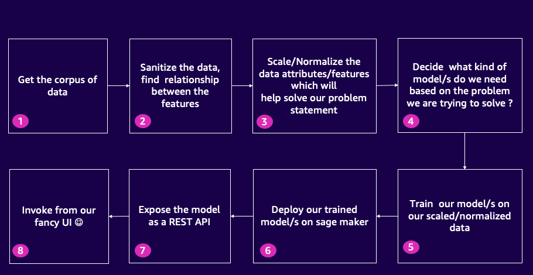

There's a point in every developer's journey when they realize that building machine learning models in isolation isn't enough. They need to integrate those models into their full-stack applications to create real-world value. But when it comes to recommendation engines, that can be easier said than done. The process can be daunting, especially if you're trying to build a streaming platform from scratch. For instance, imagine building a streaming platform lets call it “MyFLix” that provides personalized content recommendations to its users.You need to complete the project quickly, but you don't know where to start.This tutorial will help solve the challenge that developers face when it comes to building recommendation engines and integrating them into their full stack applications. In this tutorial, **you will learn**:

- How to get started with using jupyter notebooks and python code to sanitize your raw data and perform data visualizations 
- How to scale the features in your raw data
- How to build, train and deploy your  machine learning models on sagemaker.
- How to expose the models as a REST API using AWS Lambda and AWS API Gateway using Open Source Chalice framework (https://github.com/aws/chalice)
- How to write your own telemetry data with the OpenTelemetry SDK
- How to integrate the REST API's from our custom streaming platform clone UI


| Attributes             |                                                                 |
|------------------------|-----------------------------------------------------------------|
| ✅ AWS experience      | 200 - Intermediate                                                        |
| ⏱ Time to complete    | 60 minutes                                                      |
| 💰 Cost to complete    | Free tier eligible                                               |
| 🧩 Prerequisites       | - [AWS Account](https://aws.amazon.com/resources/create-account/?sc_channel=el&sc_campaign=devopswave&sc_content=obsvbltjv&sc_geo=mult&sc_country=mult&sc_outcome=acq)|
| 

| ToC |
|-----|

## Introduction

In this tutorial we will be building a recommendation engine for a streaming platform clone called Myflix. Initially we will go through the process of analyzing, cleaning, and selecting features from our raw movie data, setting the foundation for a robust recommendation engine for our streaming platform clone. Next we will build a custom scaling model to ensure accurate comparisons of our wrangled movie data features. Then we will utilize these scaled values to train and construct our k means clustering algorithm for movie recommendations. Additionally, we will learn how to deploy our models on SageMaker to achieve maximum efficiency. Finally we will build fronting API’s for  our ML models for real time predictions. We will learn how to use the open-source Chalice framework (https://github.com/aws/chalice) as a one click build and deploy tool for building our API’s. Chalice will even expose the API as a lambda and create the API gateway endpoint out of the box with exceptional ease! By the end through this tutorial we would have learnt how to bridge the gap between our ML models and Front end. The skills learnt through this tutorial can be used in to integrate your own full stack applications with API's and ML Models.

### Diagrammatic flow of our entire process



## Getting started with the existing code

1. CLI setup for creating teh nested stacks
2. Login to the AWS console in which the tutorial setup will be done. - Validate everything created properly.
3. Open Sagemaker Domain, Sagemaker User Profile, Launch Sagemaker IDE
4. Analyze and Visualizations
5. Deploy K Means Algorithm on Sagemaker for Real time inferencing
5. Now open Cloud 9 to deploy the Custom scaling model
6. Open Cloud 9. Cloud 9 is a browser based Integrated Development environment on AWS which makes Code devlopment super easy.Once you are logged into the AWS Cloud 9 Environment, open a new terminal and execute the following command to clone the repository using the main branch
```bash
git clone https://github.com/build-on-aws/recommendation-engine-full-stack 
sudo yum install git-lfs
cd recommendation-engine-full-stack
git lfs fetch origin main
git lfs pull origin
```
7. Open AWS Console and check the 2 API's that have been deployed in Sagemaker.
8. Use Cloud 9 to build the REST API's using Chalice 
9. Integrate the Local UI with the REST API's.
10. Following command to delete the stack. 

🎥 Here is a video containing a hands-on implementation about this section.


