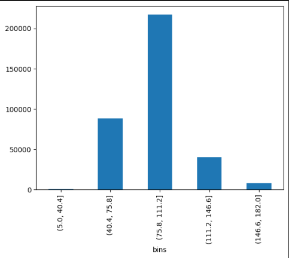
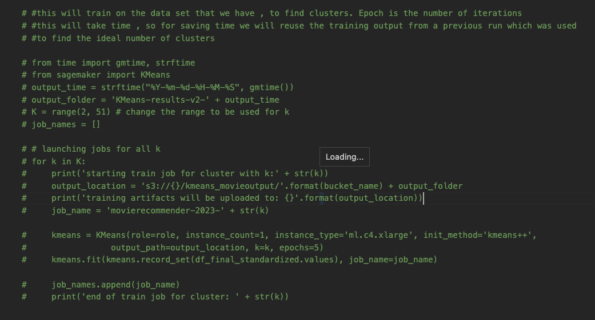
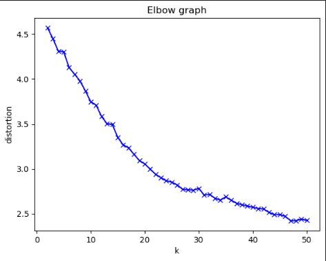
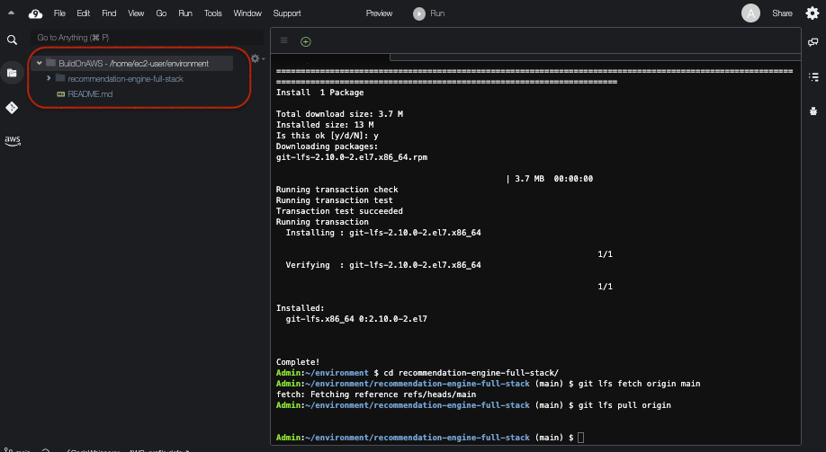
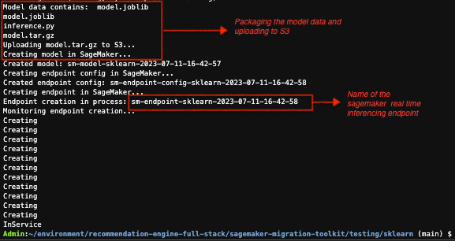
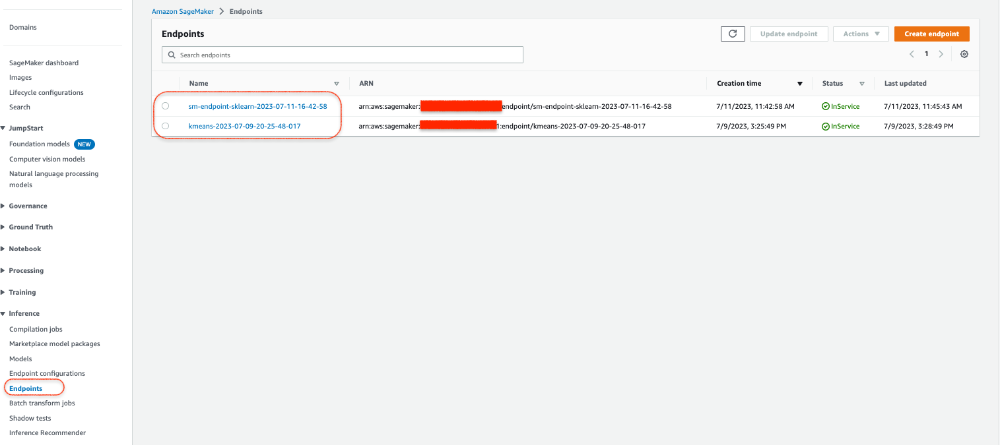
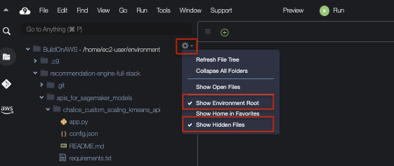
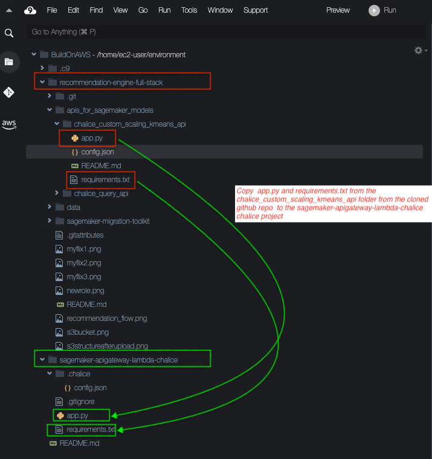
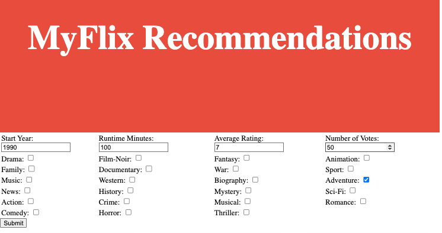

There's a point in every developer's journey when they realize that building machine learning models in isolation isn't enough. They need to integrate those models into their full-stack applications to create real-world value. But when it comes to recommendation engines, that can be easier said than done. The process can be daunting, especially if you're trying to build a streaming platform from scratch. For instance, imagine building a streaming platform lets call it “MyFLix” that provides personalized content recommendations to its users.You need to complete the project quickly, but you don't know where to start.This tutorial will help solve the challenge that developers face when it comes to building recommendation engines and integrating them into their full stack applications. In this tutorial, **you will learn**:

- How to get started with using jupyter notebooks and python code to sanitize your raw data and perform data visualizations 
- How to find relationships between various features in your data set and convert the relevant features into numerical features
- How to scale the numerical features in your raw data to bring all the features on the same scale for comparison purposes
- How to build, train and deploy your custom and native machine learning models on sagemaker.
- How to expose the deployed models through a REST API using AWS Lambda and AWS API Gateway using Open Source Chalice framework (https://github.com/aws/chalice)
- How to integrate the REST API's with a fronting User Interface (In our case this UI will represent our custom streaming platform clone called Myflix but you can use the skills you learn in this tutorial for building your own full stack applications with ML Models)


| Attributes             |                                                                 |
|------------------------|-----------------------------------------------------------------|
| ✅ AWS experience      | 200 - Intermediate                                                        |
| ⏱ Time to complete    | 60 minutes                                                      |
| 💰 Cost to complete    | Free tier eligible                                               |
| 🧩 Prerequisites       | - [AWS Account](https://aws.amazon.com/resources/create-account/?sc_channel=el&sc_campaign=devopswave&sc_content=obsvbltjv&sc_geo=mult&sc_country=mult&sc_outcome=acq)|
| 

| ToC |
|-----|

## Introduction

In this tutorial we will be building a recommendation engine for a streaming platform clone called Myflix. Initially we will go through the process of analyzing, cleaning, and selecting features from our raw movie data, setting the foundation for a robust recommendation engine for our streaming platform clone. Next we will build a custom scaling model to ensure accurate comparisons of our wrangled movie data features. Then we will utilize these scaled values to train and construct our k means clustering algorithm for movie recommendations. Additionally, we will learn how to deploy our models on SageMaker to achieve maximum efficiency. Finally we will build fronting API’s for  our ML models for real time predictions. We will learn how to use the open-source Chalice framework (https://github.com/aws/chalice) as a one click build and deploy tool for building our API’s. Chalice will even expose the API as a lambda and create the API gateway endpoint out of the box with exceptional ease! By the end through this tutorial we would have learnt how to bridge the gap between our ML models and Front end. The skills learnt through this tutorial can be used in to integrate your own full stack applications with API's and ML Models.

### Diagrammatic flow of our entire process


## Getting started with the existing code

1. We will use AWS CLI and Cloudformation nested stacks to build the infrastructure resources needed for this tutorial. We can create these resources by downloading the [Cloudformation Templates from this folder](https://github.com/pkamra/recommendation-engine-full-stackapp/tree/main/infrastructure). Here is how I execute the AWS CLI Commands to deploy the Cloudformation Nested stacks. This is how my directory structure looks like after I download the Cloudformation templates:-
```bash
-rw-r--r--     1 XXXXX  XXXX   6582 Jul  5 22:07 customresource-stack.yaml
-rw-r--r--     1 XXXXX  XXXX    269 Jul  7 21:23 glue-stack.yaml
-rw-r--r--     1 XXXXX  XXXX   3091 Jul  4 02:24 instance-stack.yaml
-rw-r--r--     1 XXXXX  XXXX   2550 Jul  7 13:11 main-stack.yaml
-rw-r--r--     1 XXXXX  XXXX   2141 Jul  5 14:45 sagemaker-stack.yaml
-rw-r--r--     1 XXXXX  XXXX   6877 Jul  7 00:57 vpc-stack.yaml
```
2. The below command is used to package the CloudFormation template in "main-stack.yaml" and output the packaged template as `packaged.yaml` to an Simple Storgage Service bucket (S3) named `placeholder-cloudformation-s3-bucket-to-store-infrastructure-template` in the `us-east-1` region. Create your own S3 bucket in your account and use it in the command below instead of `placeholder-cloudformation-s3-bucket-to-store-infrastructure-template` 
``` bash
aws cloudformation package --template-file main-stack.yaml --output-template packaged.yaml --s3-bucket placeholder-cloudformation-s3-bucket-to-store-infrastructure-template --region us-east-1
```
3. Next execute the `aws cloudformation deploy` command to deploy the above generated CloudFormation template named package.yaml. To override the default values for the parameters provided in the main-stack.yaml for S3BucketName, SageMakerDomainName, GitHubRepo, VpcStackName, VpcRegion, ImageId and KeyName you can include the --parameter-overrides option followed by the parameter key-value pairs. Here's an example of how I did it:
```bash
  aws cloudformation deploy \
  --stack-name buildonaws \
  --template-file  <Absolute path>/packaged.yaml  \
  --parameter-overrides S3BucketName=myfamousbucket \
               SageMakerDomainName=buildonaws \
               GitHubRepo=https://github.com/build-on-aws/recommendation-engine-full-stack \
	       VpcStackName=MyBuildOnAWSVPC \
	       VpcRegion=us-east-1 \
               ImageId=ami-06ca3ca175f37dd66 \
	       KeyName=my-key \
	--capabilities CAPABILITY_NAMED_IAM --region us-east-1
```
4. Replace the values (myfamousbucket, buildonaws, MyBuildOnAWSVPC, us-east-1, ami-06ca3ca175f37dd66 ,my-key) with your desired default parameter values. ami-06ca3ca175f37dd66 is the AMI for EC2 For Amazon Linux 2023 in us-east-1 region. Choose an AMI for  EC2 For Amazon Linux 2023 for teh region in which you are deploying this stack. The purpose of this EC2 Instance which will be spun up is to populate the S3 bucket with the Jupyter notebook, pre-trained models, and raw data for our tutorial. After the S3 bucket is populated, the EC2 instance is spun down.
5. Next Login to the AWS console in which the tutorial setup will be done and validate that everything has been created properly. Look at all the Infrastructure resources that have been created for our tutorial. Go to the S3 bucket that has been created as part of this (In my case the name of the newly created S3 bucket is `myfamousbucket`).
6. Take a quick look at the folder structure inside the S3 bucket. Here is how the folder structure should look like :-

7. Now we will click on the Sagamker IDE url and open Sagemaker studio where we will analyze our raw movie data , perform visualizations and come up with the right set of features for our movie data set.
8. Once the Sagemaker Studio opens, 
    - Go to File -> New Terminal
    - Execute the following on the terminal to download the python notebook from the S3 bucket. Replace the `myfamousbucket` S3 bucket name in the below command with the S3 bucket name from the Cloudformation Output.
```bash
aws s3 cp s3://myfamousbucket/python_notebook/AWSWomenInEngineering2023_V3.ipynb .
```
9. Double clicking the Jupyter Notebook will start the kernel. This process takes about 5 mins. The Jupyter notebook has a table of centents at the beginning of the notebook and every cell has detailed explanation of the steps being executed but I will call out some of the important cells of the notebook over here which will help provide an overview of the setup in the Jupyter Notebook. 
    - We start our data preparation process by downloading our data set from S3 and build a pandas data frame to start analyzing the data in cell#5. This is how the initial data structure in the pandas dataframe looks :-
   
    - In order to find the distribution of the releaseYears for movie we draw a box plot in Cell#10 and to find the Interquartile ranges of the release years we draw a box plot in Cell#11. the Interquartile ranges (IQR) are a statistical measure used in data preparation and analysis to understand the spread and distribution of data. They help identify and analyze the variability within a dataset. The IQR can be used to identify outliers in a dataset. Outliers are data points that fall significantly outside the range of most other data points. By calculating the IQR and applying a threshold, you can identify observations that are potential outliers. On execition of Cell #11 , here is how you can visualize the IQR and the outliers which are then filtered out in the subsequent cells. :-    
   
    - Next in Cell #14 we look at Binning Visualization Technique. By applying binning and creating specific bins or categories for different runtime ranges, we are able to identify movies with runtimes of more than 3 hours as outliers. These movies fall outside the majority of the dataset and represent extreme values. After identifying the outliers, we make the decision to remove movies with runtimes exceeding 3 hours from the dataset. By doing so, we eliminate the influence of these extreme values on the analysis and create a more representative dataset with a narrower range of runtimes. After removing the outliers, we observe a more symmetrical and bell curve-shaped distribution of movie runtimes. :-    
   
    - In Cell #16, the genres column from the dataset is transformed into one-hot encoded columns. This process involves splitting the genres by commas, creating unique genre labels, and adding them as new columns to the dataset. Each movie is then assigned a value of 1 or 0 in these new columns based on whether it belongs to that particular genre or not. This transformation allows for easy analysis and modeling based on the presence or absence of specific genres in movies. This how the pandas dataframe look like after one hot encoding is done. :-  
    
    - Several other filtering, cleanup and removal of unnecessary features are done and finally in Cell # 31, this is how the final list of numerical features look like. Now the features are ready for being used to build our ML Models. :-
   
10. On observing the final features of the raw movie data set, the features such as startYear, runtimeMinutes, averageRating, and numVotes have different magnitudes. When building a movie recommender algorithm, it is essential to scale these features to a common range to ensure fair comparisons and prevent any particular feature from dominating the algorithm's calculations. Using a custom scaling model from the scikit-learn library allows us to normalize the features and bring them within a similar scale. This normalization helps in avoiding biases and ensures that all features contribute equally to the recommendation process, resulting in more accurate and reliable movie recommendations. So in Cell #33 and Cell #34 we build on own custom scaling algorithm with the help of the sckitlearn library and serialize and save the model.joblib locally. Additionally we also save a copy of model.joblib to S3 bucket for use later on. Finally in Cell#36, you can observe how the scaled numerical features look now once they are on the same scale of magnitude. :-  
  
11. In order to determine the appropriate number of clusters for our movie recommender algorithm, we employ the elbow method. The code snippet provided in Cell#37 demonstrates the process of training a K-means clustering model on our dataset. However, due to the time-consuming nature of the training process, we have commented out the code for quick analysis. To streamline the analysis, we can refer to the output of previous runs, which have been saved in the S3 bucket folder `kmeans_movieoutput/` for the 50 iterations. This allows us to examine the results without retraining the model each time.The purpose of the elbow method is to identify the optimal number of clusters by evaluating the within-cluster sum of squares (WCSS) for different values of k. In this case, k represents the number of clusters. By assessing the WCSS for a range of k values, we can determine the point at which the addition of more clusters provides diminishing returns in terms of reducing the WCSS. To execute the code, we use Amazon SageMaker's KMeans estimator. It performs multiple epochs of training. The training artifacts, including the resulting cluster assignments, are stored in an S3 bucket folder `kmeans_movieoutput/` specified by the output location. By analyzing the output from previous runs, we gain insights into the ideal number of clusters for our movie recommender system, which will help enhance its accuracy and effectiveness. :-  
  
12. Next in Cell #38, to determine the appropriate number of clusters for our movie recommender system, we utilize the models generated in the previous step. This code snippet aims to create an elbow graph visualization, which helps us identify the optimal number of clusters based on the distortion metric. :-  
  
13. Next in Cell #40, using the optimal number of clusters (In my case I chose 26 based on the above figure), deploy the Kmeans Model on Sagemaker for real time inferencing.
14. After that in Cell #43 and Cell #44, we augment our raw movie dataset with the correct cluster number. This is how the augment data set now looks with the cluster number. This augmented data set will be used by the REST API's that we will be building in the next steps to retrieve the set of movies given a particular cluster number. :-  
  
15. Finally I execute a few more cells, to store this augmented information in a Glue Database. The augmented information is stored in parquet file format in the S3 bucket in the `clusteredfinaldata` folder.
16. At this point although the KMeans model is deployed as a sagemaker endpoint, our Custom Scaling Model is still only available locally in our Sagemaker studio environment as a serialized model.joblib. Our next step will be to deploy our custom scaling model inside Sagemaker's Native SKLearn Container. This is one of the ways of implementing Bring Your Own Model (BYOM) on Sagemaker if you want to utilize Sagemaker's Native Containers. Here is a diagrammatic view of the process to deploy a custom scaling model on Sagemaker's SKLearn Container by creating creating a compressed tar.gz file consisting of the model.joblib and an inference.py file and providing these artifacts to create a sagemaker model endpoint and endpoint configuration. :-  
 
17. There are various ways to automate these steps, but we will be using a sagemaker migration toolkit from [our GitHub Repository](https://github.com/build-on-aws/recommendation-engine-full-stack) to make this process easy. So lets move on to the next steps.

## Deploying the custom scaling model as a Sagemaker Endpoint
1. Log onto the AWS console of the AWS Account in which you have deployed the Cloudformation templates to build the resources for this tutorial. Make sure you are in the AWS Region in which you have deployed your stack. Copy the ARN of the Sagemaker IAM Role. We will use it for setting up the sagemaker migration toolkit, since it has the permissions necessary for creating and deploying the Sagemaker Models, Endpoint configurations and Endpoints.In my case my IAM role is in this format - `arn:aws:iam::XXXXXXXXX:role/SageMakerUserProfileRole-BuildOnAWS`

2. Now, lets open AWS Cloud9 via the AWS Console to deploy the Custom scaling model model.joblib. Cloud9 is a browser based Integrated Development environment on AWS which makes Code devlopment super easy. Once you are logged into the AWS Cloud9 Environment, open a new terminal (Go to Window-> New Terminal) and execute the following command to clone the repository using the main branch.
```bash
git clone https://github.com/build-on-aws/recommendation-engine-full-stack 
sudo yum install git-lfs
cd recommendation-engine-full-stack
git lfs fetch origin main
git lfs pull origin
```
3. This is how my Cloud9 Integrated Development Environment looks like after I clone the github repository. :-  
 
4. Here are the remaining commands to install the migration toolkit in the Cloud9 console which will enable us to package the custom scaling model `model.joblib` and the `inference.py`for inferencing in a format that is compatible with Sagemaker's Native SKLearn container 
```bash
cd sagemaker-migration-toolkit
pip install wheel
python setup.py bdist_wheel
pip install dist/sagemaker_migration_toolkit-0.0.1-py3-none-any.whl
```
5. Next execute the below command to install the sagemaker migration toolkit. Follow steps and enter the  Sagemaker IAM role that you copied above.
```bash
sagemaker_migration-configure --module-name sagemaker_migration.configure
```
6. Next go to the sklearn/testing folder and download the model.joblib from the S3 bucket by executing the command as follows -
```bash
cd testing/sklearn/
aws s3 cp s3://<S3 bucket from cloudformation output where all data is stored>/model.joblib ./
```
7. Lets analyze the `inference.py` script inside the `testing/sklearn` folder. This `inference.py` file has the `model_fn` for loading and deserializing the model.joblib. The `input_fn` is the method that we have already modified to receive the content as `application/json` and transform it into a pandas dataframe before sending the data to the `predict_fn` which loads the dataframe into the custom scaling model and once the data is normalized, it is returned back in the correct format as a json string via the `output_fn`. Here are the highlighted functions in `inference.py` file in the `testing/sklearn` folder.

8. 5. Execute the below command on the Cloud 9 terminal. Replace  region `us-east-1` with the correct region in which you are executing this tutorial
```bash
export AWS_DEFAULT_REGION=us-east-1
```

9. Inside the `testing/sklearn` folder, execute python test.py as shown below. This will deploy the sagemaker endpoint for the custom scaling model.
```bash
python test.py
```
Here is how the output will look like on the Cloud9 Console once the custom scaling endpoint is deployed. :-  
 

10. (Optional steps for testing the custom endpoint after deployment). Copy the sagemaker endpoint from above in the command below and execute to replace the SAGEMAKER-ENDPOINT in localtest.sh file
```bash 
sed -i s@SAGEMAKER-ENDPOINT@sm-endpoint-sklearn-xxxx-xx-xx-xx-xx-xx@g localtest.sh
```

11. Next execute the below command and check if you have got responses in a file named prediction_response.json
```bash
sh localtest.sh
```
- If you send an input with movie attributes as follows:- 
```bash
aws sagemaker-runtime invoke-endpoint \
	--endpoint-name ${ENDPOINT_NAME} \
	--body '{"startYear":[2015], "runtimeMinutes":[150],"Thriller":[1],"Music":[0],"Documentary":[0],
                    "Film-Noir":[0],"War":[0],"History":[0],"Animation":[0],"Biography":[0],
                    "Horror":[0],"Adventure":[0],"Sport":[0],"Musical":[0],
                    "Mystery":[0],"Action":[0],"Comedy":[0],"Sci-Fi":[1],
                    "Crime":[0],"Romance":[0],"Fantasy":[0],"Western":[0],
                    "Drama":[0],"Family":[0],
                    "averageRating":[7],"numVotes":[50]}' \
	--content-type 'application/json' 
``` 
Then your responses should look as follows in the `prediction_response.json` file. These values represent the movie attributes converted into numeric values and on the same scale: -
```bash
{"Output":"[[0.7641384601593018, 2.2621326446533203, 2.6349685192108154, -0.19743624329566956, -0.27217793464660645, -0.10682649910449982, -0.17017419636249542, -0.20378568768501282, -0.18412098288536072, -0.2402506023645401, -0.29970091581344604, -0.3280450105667114, -0.14215995371341705, -0.14177125692367554, -0.27615731954574585, -0.42369410395622253, -0.7180797457695007, 5.349470615386963, -0.43502309918403625, -0.46801629662513733, -0.22049188613891602, -0.1328728199005127, -1.1882809400558472, -0.21341808140277863, 0.5960079431533813, -0.24598699808120728]]"}
```

12. This concludes the deployment of the custom scaling model. Now if you go to the AWS console, you can see that the 2 real time inferencing endpoints for the custom scaling model and the K Means clustering algoritm is now deployed in sagemaker console as follows. :-  
 


## Deploying the REST API's fronting the sagemaker model endpoints 

1. Let us now create the API's using [Chalice framework](https://github.com/aws/chalice) which makes the creation of Lambda and API gateway very easy. Use the same Cloud 9 environment to setup Chalice and build the REST API's which will invoke the Sagemaker Model endpoints.  The first REST API that we will be building is the Cluster REST API which will invoke the Custom Scaling Sagemaker Endpoint and the Kmeans Clustering Endpoint and return the  cluster number to be used for returning the list of movies. For the purpose of next steps login to the same Cloud9 IDE that you have used so far and go to the root of the  Cloud9 environment by executing the following command on the Cloud9 terminal as follows : - 
```bash
cd ~/environment
```
2. To see hidden files in Cloud9 IDE , click on the gear icon and Click on Show environment root and show hidden files. This will enable you to see the .chalice folder once you install the chalice framework via the commands in the next step. This is how the Cloud9 console should look like. :-  
 

3. Now install Chalice as follows:
```bash
pip install chalice
chalice new-project sagemaker-apigateway-lambda-chalice
```
4. Create a role `Cloud9_LambdaExecutionRole` with the right access policies. This role is added as the lambda execution role in config.json inside the .chalice folder. Finally this is how your config.json should be updated to look like this. Replace with the correct value for the iam_role_arn in the snippet below 
```bash
{
    "version": "2.0",
    "automatic_layer": true,
    "manage_iam_role": false,
    "iam_role_arn": "arn:aws:iam::XXXX:role/Cloud9_LambdaExecutionRole",
    "app_name": "sagemaker-apigateway-lambda-chalice",
    "stages": {
      "dev": {
        "api_gateway_stage": "api"
      }
    }
}
```
5. Execute the below command on the Cloud 9 terminal. Replace with correct region in which you are executing this tutorial
```bash
export AWS_DEFAULT_REGION=us-east-1
```
6. Copy `requirements.txt` and `app.py` files from the `recommendation-engine-full-stack/apis_for_sagemaker_models chalice_custom_scaling_kmeans_api` folder to the root of the chalice project sagemaker-apigateway-lambda-chalice. Let's take a quick look at the `app.py` file. The `app.py` file receives the JSON Request from the movie attributes from the front end and invokes the 2 model endpoints for the custom scaling model and the kmeans clustering model deployed on sagemaker.
Here is how my setup looks like. :-  
 

Hence make sure to replace with the correct sagemaker endpoint name  for the custom scaling model and the kmeans model in this section of the code in `app.py` in teh chalice project `sagemaker-apigateway-lambda-chalice` as shown below
```bash
.....
......
.....
    res = sagemaker.invoke_endpoint(
        EndpointName='sm-endpoint-sklearn-xxxx-xx-xx-xx-xx-xx',
        Body=result,
        ContentType='application/json',
        Accept='application/json'
    )
......
.....
.....
responsekmeans = sagemaker.invoke_endpoint(EndpointName="kmeans-xxxxxx", ContentType="text/csv", Body=payload)
.....
....
```
7. At the root of  `sagemaker-apigateway-lambda-chalice` folder execute 
```bash
chalice deploy
```

8. Once the Lambda function and API Gateway REST API endpoints are deployed you will get a REST API url on the Cloud9 console in the form as `https://xxxxxxx.execute-api.region.amazonaws.com/api/`.
This REST API will return the Cluster Number based on the movie attributes passed to it. We will be substituting this REST API endpoint in the UI Code later on. If you go to the AWS console, you can check the Lambda function and the API Gateway REST endpoints created by Chalice.


9. For testing the deployed API do the following from teh Cloud 9 terminal
```bash
curl -X POST https://xxxxxxx.execute-api.us-east-2.amazonaws.com/api/ -H 'Content-Type: application/json' -d @- <<BODY 
{ 
    "startYear":"2015","runtimeMinutes":"100","Thriller":"1","Music":"0", 
    "Documentary":"0","Film-Noir":"0","War":"0","History":"0","Animation":"0",
    "Biography":"0","Horror":"0","Adventure":"0","Sport":"0","News":"0","Musical":"0",
    "Mystery":"0","Action":"0","Comedy":"0","Sci-Fi":"1","Crime":"0","Romance":"0",
    "Fantasy":"0","Western":"0","Drama":"0","Family":"0","averageRating":"7","numVotes":"50"
}
BODY
```
On succesful execution of the above request, you will get a Cluster number. Here is how my Cloud9 terminal looks like after getting back the response. :-  
 

10. Test with Postman (Optional)
Example of Postman POST payload is 
```bash
{"startYear":"2015","runtimeMinutes":"100","Thriller":"1","Music":"0","Documentary":"0","Film-Noir":"0","War":"0","History":"0","Animation":"0","Biography":"0","Horror":"0","Adventure":"1","Sport":"0","News":"0","Musical":"0","Mystery":"0","Action":"1","Comedy":"0","Sci-Fi":"1","Crime":"1","Romance":"0","Fantasy":"0","Western":"0","Drama":"0","Family":"0","averageRating":"7","numVotes":"50"
}
```
11. Next we create the 2nd chalice project for the 2nd REST API which takes the Cluster Number as an input and returns back teh list of movies belonging to that Cluster from our Augmented data that we saved in the Glue database. We go to the root of the Cloud 9 environment by doing `cd ~/environment`
on the Cloud 9 terminal and then create a new chalice project by executing
```bash
  chalice new-project query-athena-boto3
```
  - Add requirements.txt and app.py contents from the cloned github repo folder `recommendation-engine-full-stack/apis_for_sagemaker_models/chalice_query_api` folder to the root of the chalice project `query-athena-boto3`.
  - Update role in config.json for this project by replacing with the correct iam_role_arn value. The config.json should look like below 
  ```bash
  {
        "version": "2.0",
        "app_name": "query-athena-boto3",
        "iam_role_arn": "arn:aws:iam::xxxxxxxx:role/Cloud9_LambdaExecutionRole",
        "manage_iam_role": false,
        "stages": {
            "dev": {
            "api_gateway_stage": "api"
            }
        }
  }
  ```
   - Execute the following command
   ```bash 
   cd query-athena-boto3/
   sed -i s@BUCKET_NAME@<Replace with your bucket name>@g app.py
   chalice deploy
   ```
12. Next execute the curl command for testing the deployed API Gateway REST API endpoint. Replace `https://yyyyyyy.execute-api.us-east-2.amazonaws.com/api/` with the correct Deployed URL. In the request below I pass cluster number as 1.
```bash
curl -X POST https://yyyyyyy.execute-api.us-east-2.amazonaws.com/api/ -H 'Content-Type: application/json' -d '{"cluster":"1.0"}'  
```
13. Next let's move on to the final step of Integrating the 2 API Gateway REST API endpoints with our UI code.

## Integrate the API's with our fancy UI.
1. Download the html file locally on your machine from the Cloud9 Console and go to the cloned GitHub Repo Folder  , modify the cluster and recommendation url api's with the actual API urls and see the end result from the UI. The image below will show how to doanload the UI file and the changes for REST API endpoints that need to be made in that file. :- 

 

Here is how my UI looks when everything is hooked up and the file is opened from the browser: Enter teh criteria like start Year, runtime Minutes, Rating, Number of Votes and the Genres:-<br/>

<br/>
<br/>
<br/>

## Clean up
1. Go to the Cloud9 console and go to the root of the chalice project `sagemaker-apigateway-lambda-chalice` and execute `chalice delete`. This will delete the lambda and API gateway endpoint for the REST API #1.
2. Go to the Cloud9 console and go to the root of the chalice project `query-athena-boto3` and execute `chalice delete`. This will delete the lambda and API gateway endpoint for the REST API #2.
3. From the AWS console, go to Sagemaker Service -> Inference ->  Endpoints and Delete the 2 Sagemaker Model Endpoints.
4. Delete the AWS Cloud9 Environment.
5. Delete the contents of the S3 bucket that was created by the Cloudformation template. Thsi will allow the deletion of the S3 bucket when you delete the Cloudformation stack.
5. Dlete the main-stack.yaml from AWS Cloudformation console which is the parent level stack for the entire nested stack and that will delete all the remaining deployed resources. 


🎥 Here are the 3 videos containing a hands-on implementation about this tutorial<br/>
https://youtu.be/96IV4qBO0co

https://youtu.be/9JzEybNli7Q

https://youtu.be/7iPQPGwk8mc


